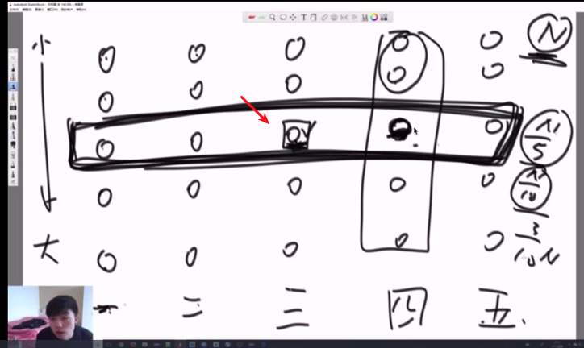

### BFPRT算法

通常我们需要在一大堆数中求前 ![[公式]](https://www.zhihu.com/equation?tex=k) 大的数。比如在搜索引擎中求当天用户点击次数排名前10000的热词，在文本特征选择中求 ![[公式]](https://www.zhihu.com/equation?tex=tf-idf) 值按从大到小排名前 ![[公式]](https://www.zhihu.com/equation?tex=k) 等问题，都涉及到一个核心问题，即**TOP-K问题**。

求TOP-K问题最简单的方式为快速排序后取前K大的即可。但是这样做有两个问题

\1. 快速排序的平均复杂度为$0(nlog(n))$,最坏复杂度为$0(n^2)$

\2. 我们只需要前 ![[公式]](https://www.zhihu.com/equation?tex=k) 大的，而对其余不需要的数也进行了排序，浪费了大量排序时间。

而堆排序也是一个较好的方法，维护一个大小为 ![[公式]](https://www.zhihu.com/equation?tex=k) 的堆，时间复杂度为 ![[公式]](https://www.zhihu.com/equation?tex=O%28n%5Clog%28k%29%29) 。

这里介绍一个比较好的算法，叫做**BFPTR算法**，又称为**中位数的中位数算法**，它的最坏时间复杂度为 ![[公式]](https://www.zhihu.com/equation?tex=O%28n%29) ，它是由**Blum、Floyd、Pratt、Rivest、Tarjan**提出。该算法的思想是**修改快速选择算法的主元选取方法**，提高算法在最坏情况下的时间复杂度。

**BFPRT算法原理**

在BFPTR算法中，仅仅是改变了快速排序**Partion**中的**pivot**值的选取，在快速排序中，我们始终选择第一个元素或者最后一个元素作为**pivot**，而在BFPTR算法中，每次选择五分中位数的中位数作为**pivot**，这样做的目的就是使得划分比较合理，从而避免了最坏情况的发生。算法步骤如下

**1. 将 ![[公式]](https://www.zhihu.com/equation?tex=n) 个元素划为 ![[公式]](https://www.zhihu.com/equation?tex=%5Clfloor+n%2F5%5Crfloor) 组，每组5个，至多只有一组由 ![[公式]](https://www.zhihu.com/equation?tex=n%5Cbmod5) 个元素组成。** 
**2. 寻找这 ![[公式]](https://www.zhihu.com/equation?tex=%5Clceil+n%2F5%5Crceil) 个组中每一个组的中位数，这个过程可以用插入排序。** 
**3. 对步骤2中的 ![[公式]](https://www.zhihu.com/equation?tex=%5Clceil+n%2F5%5Crceil) 个中位数，重复步骤1和步骤2，递归下去，直到剩下一个数字。**
**4. 最终剩下的数字即为pivot，把大于它的数全放左边，小于等于它的数全放右边。** 
**5. 判断pivot的位置与k的大小，有选择的对左边或右边递归。**

**三. 时间复杂度分析**

BFPRT算法的最坏时间复杂度为 ![[公式]](https://www.zhihu.com/equation?tex=O%28n%29) 。设 ![[公式]](https://www.zhihu.com/equation?tex=T%28n%29) 为时间复杂度，那么很容易有如下公式

![[公式]](https://www.zhihu.com/equation?tex=%5C+%5C+%5C+%5C+%5C+%5C+%5C+%5C+%5C+%5C+%5C+%5C+%5C+%5C+%5C+%5C+%5C+%5C+%5C+%5C+%5C+%5C+%5C+%5C+%5C+%5C+T%28n%29%5Cleq+T%28%5Cfrac%7Bn%7D%7B5%7D%29%2BT%28%5Cfrac%7B7n%7D%7B10%7D%29%2Bc%5Ccdot+n)

- ![[公式]](https://www.zhihu.com/equation?tex=T%28%5Cfrac%7Bn%7D%7B5%7D%29) 来自FindMid()， ![[公式]](https://www.zhihu.com/equation?tex=n) 个元素，5个一组，共有 ![[公式]](https://www.zhihu.com/equation?tex=%5Clceil+%5Cfrac%7Bn%7D%7B5%7D%5Crceil) 个中位数。
- ![[公式]](https://www.zhihu.com/equation?tex=T%28%5Cfrac%7B7n%7D%7B10%7D%29) 来自BFPRT()，在 ![[公式]](https://www.zhihu.com/equation?tex=%5Clceil+%5Cfrac%7Bn%7D%7B5%7D%5Crceil) 个中位数中，主元pivot大于其中 ![[公式]](https://www.zhihu.com/equation?tex=%5Cfrac%7B1%7D%7B2%7D%5Ccdot+%5Cfrac%7Bn%7D%7B5%7D%3D%5Cfrac%7Bn%7D%7B10%7D) 个中位数，而每个中位数在本来5个数的小组中又大于或等于其中的3个数，所以主元pivot至少大于所有数中的 ![[公式]](https://www.zhihu.com/equation?tex=%5Cfrac%7Bn%7D%7B10%7D%5Ccdot+3%3D%5Cfrac%7B3n%7D%7B10%7D)个。即划分之后任意一边的长度至少为 ![[公式]](https://www.zhihu.com/equation?tex=%5Cfrac%7B3%7D%7B10%7D) ，在最坏情况下，每次选择都选到了 ![[公式]](https://www.zhihu.com/equation?tex=%5Cfrac%7B7%7D%7B10%7D) 的那一部分。
- ![[公式]](https://www.zhihu.com/equation?tex=c%5Ccdot+n) 来自其它地方，例如插入排序等其它的额外操作。

**证明：**设 ![[公式]](https://www.zhihu.com/equation?tex=T%28n%29%3Dt%5Ccdot+n) ，其中 ![[公式]](https://www.zhihu.com/equation?tex=t) 可能是一个常数，也可能是关于 ![[公式]](https://www.zhihu.com/equation?tex=n) 的函数。带入上式

![[公式]](https://www.zhihu.com/equation?tex=%5C+%5C+%5C+%5C+%5C+%5C+%5C+%5C+%5C+%5C+%5C+%5C+%5C+%5C+%5C+%5C+%5C+%5C+%5C+%5C+%5C+%5C+%5C+%5C+%5C+%5C+t%5Ccdot+n%5Cleq+t%5Ccdot%5Cfrac%7Bn%7D%7B5%7D%2Bt%5Ccdot%5Cfrac%7B7n%7D%7B10%7D%2Bc%5Ccdot+n%5C+%5C+%5CRightarrow+%5C+%5C+t%5Cleq+10c)

其中 ![[公式]](https://www.zhihu.com/equation?tex=c) 是常数，所以 ![[公式]](https://www.zhihu.com/equation?tex=t) 也是常数，即 ![[公式]](https://www.zhihu.com/equation?tex=T%28n%29%5Cleq+10c%5Ccdot+n) ，所以 ![[公式]](https://www.zhihu.com/equation?tex=T%28n%29%3DO%28n%29) 。

**四. 为什么是5？**

在BFPRT算法中，为什么是选5个作为分组？

首先，偶数排除，因为对于奇数来说，中位数更容易计算。

如果选用3，有 ![[公式]](https://www.zhihu.com/equation?tex=T%28n%29%3DT%28n%2F3%29%2BT%282n%2F3%29%2Bc%5Ccdot+n) ，其操作元素个数还是 ![[公式]](https://www.zhihu.com/equation?tex=n) 。

如果选取7，9或者更大，在插入排序时耗时增加，常数 ![[公式]](https://www.zhihu.com/equation?tex=c) 会很大，有些得不偿失。

