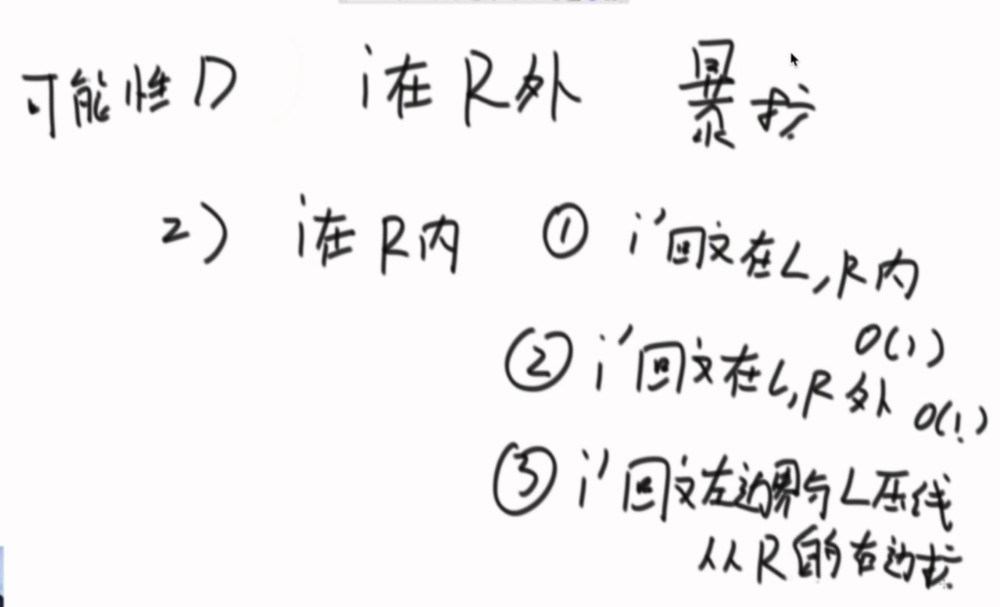

**相关概念**

1. 回文直径

   ​	在字符串中给定一个位置，从该位置向两边扩展出来的回文串的长度.如字符串'aabaa'，以b为中心，向两边扩展，那么回文直径为5.

2. 回文半径数

   - 将字符串每个位置的回文半径记录在一个数组中，这个数组就叫做回文半径数组
   
3. 回文半径右边界，所有位置的最右回文右边界

4. 最早到达最右回文右边界对应的中心C 

   1. 如下图所示，index为3其最右回文右边界R来到了index为6的位置，此时记录C为3，对应index为4的字符，因为其无法向两边扩，所以最右回文右边界还是停留在index为6的位置，此时c不更新

   
   
   


 如上图所示,1标记处为未开始位置也就是index为-1处最右边界为-1，index为0位置最右边界为标记2,index为1最右边界为标记3，index为2位置，因为无法向左右两边扩展，所以最右边界还是标记为3位置，在index为3的位置，其最右边界为标记为4的位置，依次类推。

**Manacher**加速求解**P数组**的几种情况，对于字符串的某个位置i

1. 如果i不在回文右边界中，那么暴力往两边扩展
2. 如果i位置在回文右边界内，对应三种情况，如下所示





**情况2**


**情况1**


**C是R第一次到达最后一个字符串对应的C**


### 图示说明

首先我们解决下奇数和偶数的问题，在每个字符间插入"#"，并且为了使得扩展的过程中，到边界后自动结束，在两端分别插入 "^" 和 "$"，两个不可能在字符串中出现的字符，这样中心扩展的时候，判断两端字符是否相等的时候，如果到了边界就一定会不相等，从而出了循环。经过处理，字符串的长度永远都是奇数了。


首先我们用一个数组 P 保存从中心扩展的最大个数，而它刚好也是去掉 "#" 的原字符串的总长度。例如下图中下标是 6 的地方。可以看到 P[ 6 ] 等于 5，所以它是从左边扩展 5 个字符，相应的右边也是扩展 5 个字符，也就是 "#c#b#c#b#c#"。而去掉 # 恢复到原来的字符串，变成 "cbcbc"，它的长度刚好也就是 5。


### 求原字符串下标

用 P 的下标 i 减去 P [ i ]，再除以 2 ，就是原字符串的开头下标了。

例如我们找到 P[ i ] 的最大值为 5 ，也就是回文串的最大长度是 5 ，对应的下标是 6 ，所以原字符串的开头下标是 （6 - 5 ）/ 2 = 0 。所以我们只需要返回原字符串的第 0 到 第 （5 - 1）位就可以了。

###  求每个 P [ i ]

接下来是算法的关键了，它充分利用了回文串的对称性。

我们用 C 表示回文串的中心，用 R 表示回文串的右边半径。所以 R = C + P[ i ] 。C 和 R 所对应的回文串是当前循环中 R 最靠右的回文串。

让我们考虑求 P [ i ] 的时候，如下图,此时i在回文右边界R的内部。

用 i_mirror 表示当前需要求的第 i 个字符关于 C 对应的下标。


我们现在要求 P [ i ]， 如果是用中心扩展法，那就向两边扩展比对就行了。但是我们其实可以利用回文串 C 的对称性。i 关于 C 的对称点是 i_mirror ，P [ i_mirror ] = 3，所以 P [ i ] 也等于 3 。

但是有三种情况将会造成直接赋值为 P [ i_mirror ] 是不正确的，下边一一讨论。

### 1. 超出了 R


当我们要求 P [ i ] 的时候，P [ mirror ] = 7，而此时 P [ i ] 并不等于 7 ，为什么呢，因为我们从 i 开始往后数 7 个，等于 22 ，已经超过了最右的 R ，此时不能利用对称性了，但我们一定可以扩展到 R 的，所以 P [ i ] 至少等于 R - i = 20 - 15 = 5，会不会更大呢，我们只需要比较 T [ R+1 ] 和 T [ R+1 ]关于 i 的对称点就行了，就像中心扩展法一样一个个扩展。

### 2. P [ i_mirror ] 遇到了原字符串的左边界


此时P [ i_mirror ] = 1，但是 P [ i ] 赋值成 1 是不正确的，出现这种情况的原因是 P [ i_mirror ] 在扩展的时候首先是 "#" == "#" ，之后遇到了 "^"和另一个字符比较，也就是到了边界，才终止循环的。而 P [ i ] 并没有遇到边界，所以我们可以继续通过中心扩展法一步一步向两边扩展就行了。

### 3. i 等于了 R

此时我们先把 P [ i ] 赋值为 0 ，然后通过中心扩展法一步一步扩展就行了。

## 考虑 C 和 R 的更新

就这样一步一步的求出每个 P [ i ]，当求出的 P [ i ] 的右边界大于当前的 R 时，我们就需要更新 C 和 R 为当前的回文串了。因为我们必须保证 i 在 R 里面，所以一旦有更右边的 R 就要更新 R。


此时的 P [ i ] 求出来将会是 3 ，P [ i ] 对应的右边界将是 10 + 3 = 13，所以大于当前的 R ，我们需要把 C 更新成 i 的值，也就是 10 ，R 更新成 13。继续下边的循环。


```python
## 0(n^2)
def maxhuiwen(string):
	"""
	暴力扩展
	:param string:
	:return:
	"""

	string = list(map(lambda x: "#" + x, list(string)))
	string = ''.join(string) + "#"
	tmp_array = [1] * len(string)
	tmp_array[0], tmp_array[-1] = 1, 1
	for i in range(1, len(string) - 1):
		a = i - 1
		b = i + 1
		while a >= 0 and b < len(string):
			if string[a] == string[b]:
				tmp_array[i] += 1
				a -= 1
				b += 1
			else:
				break
	return max(tmp_array)-1

##马拉车算法 0(n)
def manLcpsLength(string):
	string = list(map(lambda x: '#'+x,list(string)))
	string = ''.join(string)+'#'
	pArr = [0]*len(string)
	index=-1
	pR=-1
	result = -9999
	for i in range(len(string)):
		if i<pR:
			pArr[i] = min(pArr[2*index-i],pR-i)
		else:
			pArr[i]=1

		##一共有4中情况
		# 1)i在pR外面时，暴力扩展
		# 2)i关于index的对称点i'的回文半径在L,R内部时，可以直接确定
		# 3)i关于index的对称点i'的回文半径在L,R外部时，可以直接确定
		# 4)i关于index的对称点i'的回文半径与LR压线，暴力扩展

		#对于2,3两种情况，按照中心扩展法往外面扩展的时候是不能继续扩充的，所以会直接跳到break语句，
		#这样就不需要分出4中if-else语句
		while (i+pArr[i]<len(string) and i-pArr[i]>-1):
			if string[i+pArr[i]]==string[i-pArr[i]]:
				pArr[i]+=1
			else:
				break
		if i+pArr[i]>pR:
			pR=i+pArr[i]
			index=i
		result =max(result,pArr[i])
	# PArr[i]对应回文半径-1就是回文串的长度
	return  result -1

```


**头条题目**

```
给定一个字符串'abc12321',在字符串最后添加字符使得原字符串变为回文串，且添加的字符最短，输出添加的字符串
```

**思路:先找到字符串中最长的回文串，然后将非回文部分逆序添加到字符串后面，如’abc12321‘,最长回文串为’12321‘,将非回文部分'abc'逆序输出**

```python
def shortestEnd(string):
	"""
	在一个字串符后面加上字符，使得该字符串变为回文串，同时添加的字符最少
	:param string:
	:return:
	"""
	# tmp_string = string
	if string is None or len(string) == 0:
		return None
    ##处理成奇回文
	string = list(map(lambda x: "#" + x, list(string)))
	string = ''.join(string) + '#'
	pArr = [0] * len(string)
	pR = -1
	index = -1
	for i in range(len(string)):
		if pR > i:
			pArr[i] = min(pArr[2 * index - i], pR - i)
		else:
			pArr[i] = 1
		while (i + pArr[i] < len(string) and (i - pArr[i] > -1)):
			if (string[i + pArr[i]] == string[i - pArr[i]]):
				pArr[i] += 1
			else:
				break
		##更新
		if i + pArr[i] > pR:
			pR = i + pArr[i]
			index = i

		# 如果回文右边界来到了最后一个位置
		if pR == len(string):
			C = i
			##对称点坐标
			i_ = 2*C-pR+1
			break
	return  string[:i_].replace('#','')[::-1]
```

