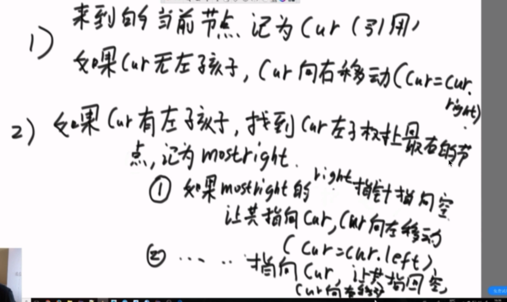

**Morris遍历**

```
利用Morris遍历实现二叉树的先序，中序，后序遍历，时间复杂度0(N),额外空间复杂度0（1） 
```



**Morris遍历的标准**

1. 如果cur无左孩子，cur向右移动cur = cur.right
2. 如果cur有左孩子，找到cur左子树上最右的节点，记为mostright
   1. 如果mostright右指针指向空，让其指向cur，cur向左移动cur= cur.left
   2. 如果mostright右指针指向cur，让其指回空，cur向右移动cur = cur.right 


### AVL树 

是一个二叉搜索树，同时左右子树高度差严格不超过1

