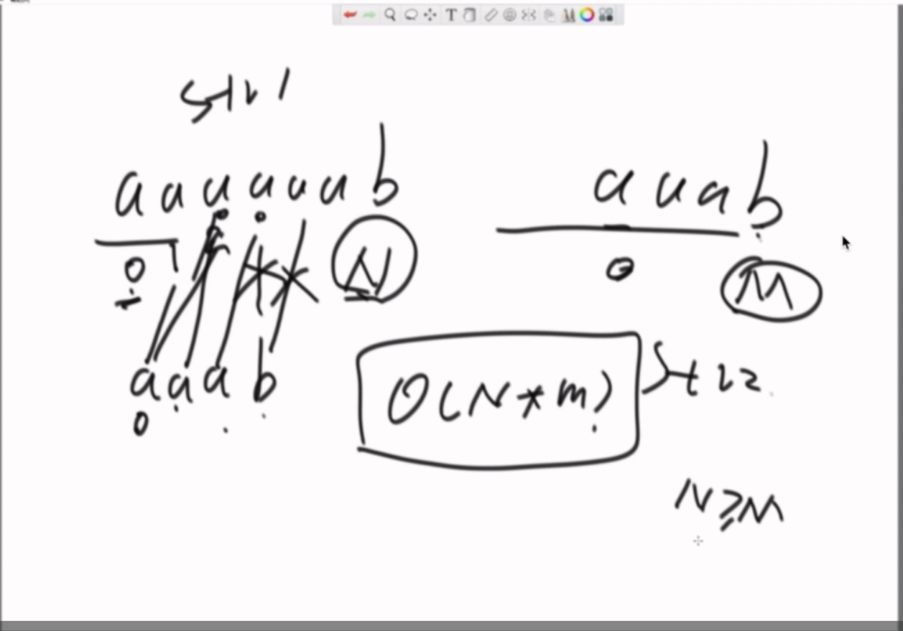
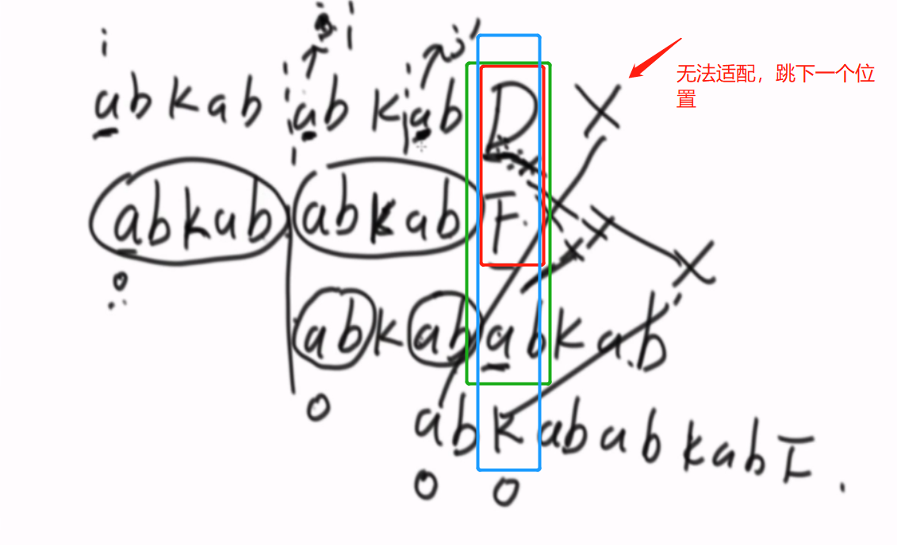
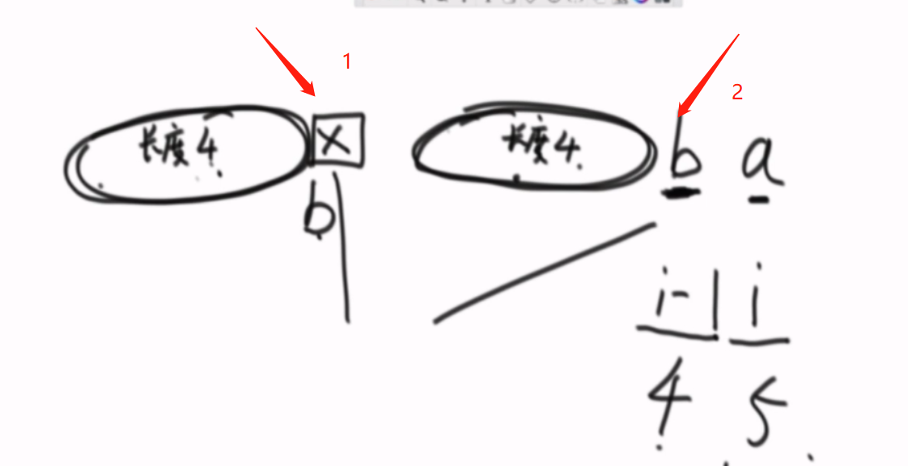
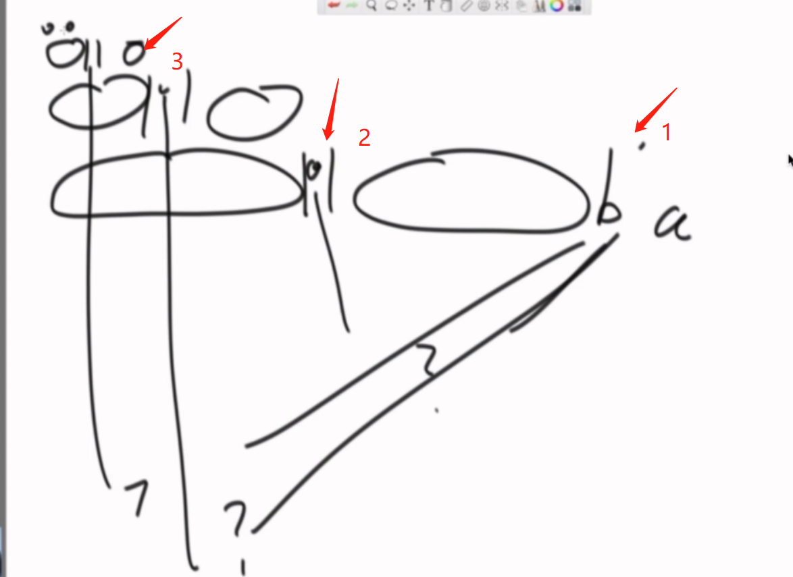

#### KMP算法详解与应用

**主要是用来解决包含问题**

题：给你两个字符串str1和str2，如果str1中包括str2，那么返回str1中str2开始的位置



如上图所示，暴力方法是从str1和str2的开始位置配对，如果没有配对上那么str1从接下来一个位置继续和str2的头部位置进行配对。时间复杂度为$o(N*M)$

```python
def getIndexOf(str1, str2):
    if str1 is None or str2 is None or len(str1) < len(str2):
        return -1
    i = 0
    j = 0
    while i < len(str1) and j < len(str2):
        if str1[i] == str2[j]:
            i += 1
            j += 1
        else:
            i += 1
            j = 0
        if j == len(str2):
            return i - j
    return -1

```


**KMP算法相关概念**

1.前缀与后缀

如这个字符串"abcdef"

``` 	
abcdef的前缀：a,ab,abc,abcd,abcde(前缀不包含最后一个字符)
abcdef的后缀：f,ef,def,cdef,bcdef(后缀不包含第一个字符)
abcdef的最大公共前缀：0,因为前缀和后缀不包含相同的字符串
```

求解KMP算法的步骤

1. 利用相同前缀后缀的最大长度对匹配过程进行优化
2. next数组的求解

首先对str2进行next数组的求解,得到每一个位置的**公共最大长**，假设str1为abaabaabbabaaabaabbabaab,str2为abaabbabaab,首先对**str2**求解next数组记录各个位置的信息

| index | 0    | 1    | 2    | 3    | 4    | 5    | 6    | 7    | 8    | 9    | 10   |
| ----- | ---- | ---- | ---- | ---- | ---- | ---- | ---- | ---- | ---- | ---- | ---- |
| str2  | a    | b    | a    | a    | b    | b    | a    | b    | a    | a    | b    |
| next  | -1   | 0    | 0    | 1    | 1    | 2    | 0    | 1    | 2    | 3    | 4    |

next数值中记录的是每一个位置的公共最大长。


从上图我们可以看到,str1和str2在index为5的时候匹配失败了，那么这时候我们需要查index之前位置的最大公共长是多少,通过查next数组我们知道index为4的位置最大公共长为2，那么在下一次匹配的时候指针的位置就如下图所示：


蓝色的部分就是通过公共最大长直接配置的位置，红色部分是重新开始配置的位置(coding上也就是两个指针直接指向的位置)，相比于BF算法，我们在这一步跳过了str1的第二个字符以及第三个字符，直接将str2头部对齐了第四个字符，并从str2的第三个字符开始重新匹配。那么为什么直接跳过‘ba’两个字符呢？**现在我们假设是从第三个字符“a”开始重新匹配的，如果要与B一直匹配成功到第五个字符“b”，也就是匹配成功了三个字符，这意味着什么？意味着第五个字符位对应的公共最大长应该是3，这显然是和事实的公共最大长为2是不符合的，以此类推，重新开始匹配时参考公共最大长是合理的最优解。**




上图中第一个红框表示第一次适配失败的位置，'d'不等于'f',因此根据最大公共长5,'abkababkabf'这个字符串就直接和'abkababkabd'的第6个字符开始配置。

**next数组的求解**

首先给定一个字符串'abaabbabaab',其next数组求解如下

| index | 0    | 1    | 2    | 3    | 4    | 5    | 6    | 7    | 8    | 9    | 10   |
| ----- | ---- | ---- | ---- | ---- | ---- | ---- | ---- | ---- | ---- | ---- | ---- |
| str2  | a    | b    | a    | a    | b    | b    | a    | b    | a    | a    | b    |
| next  | -1   | 0    | 0    | 1    | 1    | 2    | 0    | 1    | 2    | 3    | 4    |

对于第一个位置，因为其前面没有字符串，所以人为的标记为-1,对于第二个位置前面只有一个字符，所以最大公共前缀为0，接下来从2位置开始，我们看它前一个位置的最大公共长的值a,然后找到最大前缀的后一个字符b,如果字符b等于前一个位置的值，那么当前位置最大公共长为前一个位置的最大公共长+1。



如上图所示，对于当前位置i，前一个位置i-1的最大公共长为4，找到最大前缀后面一个位置，如上图假如是b，那么b=b，i位置的最大公共长为i-1位置的最大公共长4再加上1，那么最大前缀后面一个值的索引怎么确定呢？**i-1位置的最大公共长就是其后面一个位置的索引**，那么如果最大前缀后面一个值的索引不等于i-1位置的值应该怎么办呢？



如果1位置和2位置的值不相等，那么找到2位置的最大公共长的后面一个位置的字符和1位置的比较，如果相等，那么a位置的最大公共长为2位置的最大公共长加1,直到遇到最大公共长为0，那么当前位置的最大公共为0

```python
def getIndexOf(str1, str2):
    if len(str1) < len(str2) or str1 is None or str2 is None or len(str2) < 1:
        return -1
    i = 0
    j = 0
    next_array = getNextArray(str2)
    while i < len(str1) and j < len(str2):
        # 如果字符匹配上了,那么两个指针同时++
        if str1[i] == str2[j]:
            i += 1
            j += 1
        # 如果一开始头部就无法匹配，i往后移一位
        elif next_array[j] == -1:
            i += 1
        # 否则找到当前匹配失败位置的最大公共长，
        else:
            j = next_array[j]
    if j == len(str2):
        return i - j
    else:
        return -1
    
#求next数组
def getNextArray(string):
    length = len(string)
    if length == 1:
        return [-1]
    dp = [0] * length
    dp[0] = -1
    dp[1] = 0
    i = 2
    # 初始化最大公共长
    cn = 0
    while i < length:
        ##相等
        if string[i - 1] == string[cn]:
            dp[i] = cn + 1
            cn += 1
            i += 1
        ## 不相等 有两种情况，一种是能够继续往前走，还有一种是不能跳
        elif cn > 0:
            # 往前找
            cn = dp[cn]
        else:
            dp[i] = 0
            i += 1
    return dp

```


**京东原题**

```
将一个字符串变为一个大的字符串，使得变大的字符串包含两个原始串，添加的字符只能在最后添加，并且添加的字符是最短的，且开头位置不能相同。

如 原始字符串为'abcabc'，添加字符后为'abcabcabc'
```

```python
def addString(string: str) -> list:
    # 如果str2长度只是为1
    if len(string) == 1:
        return string + string
    dp = [0] * (len(string) + 1)
    dp[0] = -1
    dp[1] = 0
    i = 2
    cn = 0
    # 多求一个终止时刻的整个字符串的最大公共长
    while i <= len(string):
        # 如果i-1位置的最大公共长的后面一个字符等于i-1位置的字符
        if string[i - 1] == string[cn]:
            dp[i] = cn + 1
            i += 1
            # 更新当前
            cn += 1
        elif cn > 0:
            cn = dp[cn]
        else:
            dp[i] = 0
            i += 1
    # 如果整个字符串的最大公共长为0，那么在最后位置添加整个字符串
    if dp[-1] == 0:
        return string + string
    else:
        # 在最大后缀后面从最大前缀中补上缺失的部分
        add_ = string[:(len(string) - dp[-1])]
        return string + add_

```


