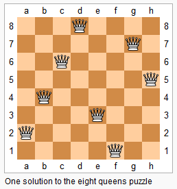

**1.两数之和**

```python
给定一个整数数组 nums 和一个目标值 target，请你在该数组中找出和为目标值的那 两个 整数，并返回他们的数组下标

给定 nums = [2, 7, 11, 15], target = 9

因为 nums[0] + nums[1] = 2 + 7 = 9
所以返回 [0, 1]

"""
暴力解，通过两层for循环。时间复杂度为0(n2).第二遍查找target-num[i]的时间复杂度为0(n),对于这部分查找可以通过空间换时间，使用hashmap来代替。hashmap的查找时间复杂度是0(1)的
"""

def twosum(nums,target):
	hepler_map = {}
	for index, value in enumerate(nums):
		hepler_map[value] = index
	for index, value in enumerate(nums):
		other_ = target - value
		if other_ in hepler_map.keys() and hepler_map.get(other_) != index:
			other_index = hepler_map.get(other_)
			return [index, other_index]

```

**2.两数相加**

```python
给出两个 非空 的链表用来表示两个非负的整数。其中，它们各自的位数是按照 逆序 的方式存储的，并且它们的每个节点只能存储 一位 数字。

如果，我们将这两个数相加起来，则会返回一个新的链表来表示它们的和。
您可以假设除了数字 0 之外，这两个数都不会以 0 开头。

输入：(2 -> 4 -> 3) + (5 -> 6 -> 4)
输出：7 -> 0 -> 8
原因：342 + 465 = 807

"""
思路：模拟加法的过程
"""
#时间复杂度0(max(m,n))空间复杂度0(max(m,n))
class ListNode:
	def __init__(self, x):
		self.val = x
		self.next = None

class Solution:
	def addTwoNumbers(self, l1: ListNode, l2: ListNode) -> ListNode:
		dumpy = ListNode(0)
		pre = dumpy
		carry = 0
		while l1 or l2:
			if l1 is not None:
				x1 = l1.val
			else:
				x1 = 0
			if l2 is not None:
				x2 = l2.val
			else:
				x2 = 0
			_sum = x1 + x2 + carry
			carry = _sum // 10
			pre.next = ListNode(_sum % 10)
			pre = pre.next
			if l1 is not None:
				l1 = l1.next
			if l2 is not None:
				l2 = l2.next
		if carry > 0:
			pre.next = ListNode(1)
		return dumpy.next

```


**3.无重复字符的最长子串**

```python
给定一个字符串，请你找出其中不含有重复字符的 最长子串 的长度。

示例 1:

输入: "abcabcbb"
输出: 3 
解释: 因为无重复字符的最长子串是 "abc"，所以其长度为 3

"""
思路：如果使用暴力解法，那么需要检验所有的字符串并别检查字符串中是否有重复值，枚举出所有的子字符串的时间复杂度为0(n^2),同时检查子字符中是否存在重复值的时间复杂度为0(n)。那么总共的时间复杂度为0(n^3)。
如果使用双指针的滑动窗口，并且窗口使用hashset，那么时间复杂度能降低到0(n)。因为hashset查找的时间复杂度为0(1)。
1.首先左右指针都在0位置，right指针开始移动，如果s[right]不在hashset中，那么s[right]加入到窗口中，更新最大长度right-left+1，right右移。否则s[right]存在hashset中，那么就要移除窗口左边的值。同时left右移

"""
class Solution:
	def lengthOfLongestSubstring(self, s: str) -> int:
		if s is None or len(s)==0:
			return 0
		left = 0
		right = 0
		hashset = set()
		result = float('-inf')
		while left< len(s) and right < len(s):
			if s[right] not in  hashset:
				hashset.add(s[right])
				result = max(result,right-left+1)
				right+=1
			else:
				hashset.remove(s[left])
				left+=1
		return result

```

**4.有序数组的中位数**

```python
给定两个大小为 m 和 n 的有序数组 nums1 和 nums2。
请你找出这两个有序数组的中位数，并且要求算法的时间复杂度为 O(log(m + n))。
你可以假设 nums1 和 nums2 不会同时为空。

nums1 = [1, 3]
nums2 = [2]
则中位数是 2.0

"""
思路:类似与文件排序，我们
"""
```

**5.旋转数组**

```python
给定一个数组，将数组中的元素向右移动 k 个位置，其中 k 是非负数

输入: [1,2,3,4,5,6,7] 和 k = 3
输出: [5,6,7,1,2,3,4]
解释:
向右旋转 1 步: [7,1,2,3,4,5,6]
向右旋转 2 步: [6,7,1,2,3,4,5]
向右旋转 3 步: [5,6,7,1,2,3,4]
要求使用空间复杂度为 O(1) 的 原地 算法。

"""
题目要求空间复杂度为0(1)的原地算法，说明只能使用交换的方法来求解
我们可以首先将原数组翻转一下，然后根据K来将原数组分为两段分别翻转

边界情况:当数组长度小于K时，k = k%len(nums)
"""
from  typing import  List
class Solution:
	def rotate(self, nums: List[int], k: int) -> None:
		"""
		Do not return anything, modify nums in-place instead.
		"""
		if len(nums)<k:
			k = k%len(nums)
		nums = self.swap(nums,0,len(nums)-1)
		nums = self.swap(nums,0,k-1)
		nums = self.swap(nums,k,len(nums)-1)
		
	def swap(self,array,left,right):
		while left <right:
			array[left],array[right] = array[right],array[left]
			left+=1
			right-=1
		return  array
    ##方法2
    def rotate1(self, nums, k):
        length = len(nums)
        k %= length

        while k:
            pop_num = nums.pop()
            nums.insert(0, pop_num)
            k -= 1

```

**6.存在重复的元素**

```python
给定一个整数数组，判断是否存在重复元素。
如果任何值在数组中出现至少两次，函数返回 true。如果数组中每个元素都不相同，则返回 false。

"""
思路：如果不能使用set来出重然后比较和原数组长度是否一致的话，可以使用hashmap。遍历一遍整个数组，记录下每个数出现的次数，时间复杂度为0(n),然后再遍历一遍数组，通过key拿到value，判断是否有出现超过2次的。因为hashmap的查询时间复杂度为0(1)的，所以总的时间复杂度为0(n).,同时需要一个0(n)的空间复杂度
"""

class Solution:
	def containsDuplicate(self, nums: List[int]) -> bool:
		helper_hash = {}
		for value in nums:
			if value not in helper_hash.keys():
				helper_hash[value] = 1
			else:
				helper_hash[value] += 1
		# 在遍历一遍，如果key对应的value有大于2的，那么就返回True,否则返回False
		for key in nums:
			if helper_hash[key] >= 2:
				return True
		return False
```

**7.两个数组求交集**

```python
输入: nums1 = [1,2,2,1], nums2 = [2,2]
输出: [2,2]

1.输出结果中每个元素出现的次数，应与元素在两个数组中出现的次数一致。

优化
如果给定的数组已经排好序呢？你将如何优化你的算法？
双指针法。如果相等，将相等元素加入到返回的列表中，两个指针同时向前走，如果不等，那么小的那个指针向前走

"""
方法一：hashmap，时间复杂为min(0(m,n)),空间复杂度为max(0(m,n))
"""
class Solution:
	def intersect(self, nums1: List[int], nums2: List[int]) -> List[int]:
		# 方法一：hashmap
		length1 = len(nums1)
		length2 = len(nums2)
		helper_hash = {}
		result = []
		if length1>length2:
			for value in nums1:
				if value not in helper_hash.keys():
					helper_hash[value]=1
				else:
					helper_hash[value]+=1
			for value in nums2:
				if value in helper_hash.keys():
					if helper_hash[value]>0:
						result.append(value)
					helper_hash[value]-=1
		else:
			for value in nums2:
				if value not in helper_hash.keys():
					helper_hash[value]=1
				else:
					helper_hash[value]+=1
			for value in nums1:
				if value in helper_hash.keys():
					if helper_hash[value]>0:
						result.append(value)
					helper_hash[value]-=1

		return  result

    


```

**8.加1**

```python
给定一个由整数组成的非空数组所表示的非负整数，在该数的基础上加一。

最高位数字存放在数组的首位， 数组中每个元素只存储单个数字。

你可以假设除了整数 0 之外，这个整数不会以零开头

输入: [1,2,3]
输出: [1,2,4]
解释: 输入数组表示数字 123。

"""
模拟加法 当遍历完数组后如果进位carry大于0，那么要在开头插入1

"""
class Solution:
	def plusOne(self, digits: List[int]) -> List[int]:
		carry = (digits[-1] + 1) // 10
		digits[-1] = (digits[-1] + 1) % 10
		for i in range(len(digits) - 1)[::-1]:
			tmp = (digits[i]+carry)%10
			carry = (digits[i]+carry)//10
			digits[i] = tmp
		if carry>0:
			digits.insert(0,1)
		return digits
```

**9.移动0**

```python
给定一个数组 nums，编写一个函数将所有 0 移动到数组的末尾，同时保持非零元素的相对顺序。

输入: [0,1,0,3,12]
输出: [1,3,12,0,0]
说明:

必须在原数组上操作，不能拷贝额外的数组。
尽量减少操作次数

思路 双指针

class Solution:
	def moveZeroes(self, nums: List[int]) -> None:
		"""
		Do not return anything, modify nums in-place instead.
		"""
		length = len(nums)
		i = 0
		j = 1
		while j <length:
			if nums[i]==0 and nums[j]!=0:
				nums[i],nums[j] = nums[j],nums[i]
				i+=1
				j+=1
			elif nums[i]==0 and nums[j]==0:
				j+=1
			else:
				i+=1
				j+=1
		return  nums
   
```

**10.有效的数独**

```
判断一个 9x9 的数独是否有效。只需要根据以下规则，验证已经填入的数字是否有效即可。

数字 1-9 在每一行只能出现一次。
数字 1-9 在每一列只能出现一次。
数字 1-9 在每一个以粗实线分隔的 3x3 宫内只能出现一次。

数独部分空格内已填入了数字，空白格用 '.' 表示

"""
思路，在遍历的时候我们只需要判断单前值是否符合题目要求的三个条件，如果使用暴力解的话，遍历三次array总是能求解的，但是如果我们在遍历的过程中可以记录下以及遍历过的值，在继续遍历的过程中，如果遇到当前值之前以及遍历过了，那么就返回false。遍历完整个array，如果都符合条件那么久返回True。

在遍历的过程中可以使用hashmap来存储已经遍历过的值。
时间复杂度0(n^2)
"""
```


```python
class Solution:
	def isValidSudoku(self, board: List[List[str]]) -> bool:
		row_dict = [{} for i in range(9)]
		col_dict = [{} for i in range(9)]
		box_dict = [{} for i in range(9)]

		for i in range(9):
			for j in range(9):
				if board[i][j]!='.':
					nums = int(board[i][j])
					row_dict[i][nums] = row_dict[i].get(nums,0)+1
					col_dict[j][nums] = col_dict[j].get(nums,0)+1
					_index = (i//3)*3+(j//3)
					box_dict[_index][nums] = box_dict[_index].get(nums,0)+1

					if row_dict[i][nums]>1 or col_dict[j][nums]>1 or box_dict[_index][nums]>1:
						return False
				else:
					continue
		return True

```

**11.旋转图像**

```python
给定一个 n × n 的二维矩阵表示一个图像。

将图像顺时针旋转 90 度。

说明：

你必须在原地旋转图像，这意味着你需要直接修改输入的二维矩阵。请不要使用另一个矩阵来旋转图像。

给定 matrix = 
[
  [1,2,3],
  [4,5,6],
  [7,8,9]
],

原地旋转输入矩阵，使其变为:
[
  [7,4,1],
  [8,5,2],
  [9,6,3]
]


"""
题目要求原地旋转图像，所以只能通过交换来做。可以一层一层的交换，关键是要找到需要交换的四个位置的坐标
。没一层交换完毕之后，然后交换内层，直到无法交换
"""
class Solution:
	def rotate(self, matrix: List[List[int]]) -> None:
		"""
		Do not return anything, modify matrix in-place instead.
		"""
		t_row = 0
		t_col = 0
		b_row =len(matrix)-1
		b_col = len(matrix[0])-1
		#外圈交换完毕之后，交换内圈
		while t_row<b_row:
			self.rotateMatrix(matrix,t_row,t_col,b_row,b_col)
			t_row+=1
			t_col+=1
			b_row-=1
			b_col-=1
		return  matrix
	def rotateMatrix(self,matrix,t_row,t_col,b_row,b_col):
		"""

		:param matrix:
		:param t_row: 左上角横坐标
		:param t_col: 左上角纵坐标
		:param b_row: 右下角横坐标
		:param b_col: 右下角纵坐标
		:return:
		"""
		_times = b_row - t_row
		for i in range(_times):
			#顶上一行作为临时值
			tmp = matrix[t_row][t_col+i]
			matrix[t_row][t_col+i] = matrix[b_col-i][t_row]
			matrix[b_col-i][t_row] = matrix[b_row][b_col-i]
			matrix[b_row][b_col-i] = matrix[t_row+i][b_col]
			matrix[t_row+i][b_col] = tmp

```

**12.翻转整数**

```python
给出一个 32 位的有符号整数，你需要将这个整数中每位上的数字进行反转。

输入: -123
输出: -321
    
输入: 120
输出: 21

假设我们的环境只能存储得下 32 位的有符号整数，则其数值范围为 [−231,  231 − 1]。请根据这个假设，如果反转后整数溢出那么就返回 0。
"""
思路:将整数每位进位翻转，首先我们就要知道每一位上的数字是什么，可以通过x%10拿到每一位上的数字，然后将数累成想加起来，判断一下翻转后的数是否会溢出，如果溢出的话那么久返回0，否则返回本身。
"""
class Solution:
	def reverse(self, x: int) -> int:
		tmp = abs(x)
		_sum = 0
		while tmp:
			num = tmp%10
			_sum=10*_sum+num
			tmp = tmp//10
		if x>0 and _sum <(pow(2,31)-1):
			return _sum
		if x<0 and _sum>-pow(2,31):
			return -_sum
		return 0

```

**13.字符串中的第一个唯一字符**

```python
给定一个字符串，找到它的第一个不重复的字符，并返回它的索引。如果不存在，则返回 -1。
s = "leetcode"
返回 0.

s = "loveleetcode",
返回 2.

"""
思路，要知道字符在整个字符串中是不是唯一的，必须要遍历一遍字符串才能知道，所以最优解的时间复杂度就是0(n)的，同时我们在遍历的过程中可以用hashmap来记录每一个字符在字符串中出现的次数。找到第一个value为1的字符，然后返回
"""
class Solution:
	def firstUniqChar(self, s: str) -> int:
		if len(s) == 0 or s is None:
			return -1
		helper_map = {}
		for value in s:
			if value not in helper_map:
				helper_map[value] = 1
			else:
				helper_map[value]+=1

		for value in s:
			if helper_map.get(value)==1:
				return s.index(value)
		return -1
```

**14.有效的字母异位词**

```python
给定两个字符串 s 和 t ，编写一个函数来判断 t 是否是 s 的字母异位词。
输入: s = "anagram", t = "nagaram"
输出: true
"""
如果是字母异位词的话，那么组成字符串的单词肯定是一样的，只不过字符之间相对位置发生了变化，所以可以使用两个hashmap来存字符串中每一位字符出现的次数，然后进行比较
"""
class Solution:
    def isAnagram(self, s: str, t: str) -> bool:
        if len(s)!=len(t):
            return False
        helper_1 = {}
        helper_2 = {}
        for value in s:
            if value not in helper_1:
                helper_1[value] = 1
            else:
                helper_1[value]+=1

        for value in t :
            if value not in helper_2:
                helper_2[value] = 1
            else:
                helper_2[value]+=1
        for key in helper_1:
            if key not in helper_2 or helper_1.get(key)!=helper_2.get(key):
                return False
        return True

```

**15.验证回文串**

```python
给定一个字符串，验证它是否是回文串，只考虑字母和数字字符，可以忽略字母的大小写。

说明：本题中，我们将空字符串定义为有效的回文串。

class Solution:
    def isPalindrome(self, s: str) -> bool:
        s = ''.join(filter(lambda x:x.isalnum(),s)).lower()
        return s ==s[::-1]
        
```

**16实现strStr**

```Python
给定一个 haystack 字符串和一个 needle 字符串，在 haystack 字符串中找出 needle 字符串出现的第一个位置 (从0开始)。如果不存在，则返回  -1。

输入: haystack = "hello", needle = "ll"
输出: 2
    
当 needle 是空字符串时，我们应当返回什么值呢？这是一个在面试中很好的问题。
对于本题而言，当 needle 是空字符串时我们应当返回 0 。这与C语言的 strstr() 以及 Java的 indexOf() 定义相符。

"""
思路：这是一个典型的包含问题，可以使用KMP算法来进行求解。时间复杂度为0(n)
kmp关键的地方要求出待求字符串的的nextarray数组，利用当前字符的最大公共长来加速求解的过程
"""

class Solution:
    def strStr(self, haystack: str, needle: str) -> int:
        if len(needle) == 0:
            return 0
        if len(haystack) < len(needle):
            return -1
        nextarray = self.getNextarray(needle)
        len1 = len(haystack)
        len2 = len(needle)
        ##设置双指针
        i = 0
        j = 0
        while i < len1 and j < len2:
            if haystack[i] == needle[j]:
                i += 1
                j += 1
            # 已经无法匹配了,那么前一个字符往后走
            elif nextarray[j] == -1:
                i += 1
            # 使用nextarray来加速求解
            else:
                j = nextarray[j]
        ##如果j已经走到底了
        if j == len(needle):
            return i - j
        return -1
	#求nextarray数组
    def getNextarray(self, string):
        if len(string) == 1:
            return [-1]
        length = len(string)
        dp = [0] * length
        dp[0] = -1
        dp[1] = 0
        i = 2
        cn = 0
        while i < length:
        # 如果前一个位置的字符和其最大前缀的下一个字符想等，那么当前字符的最大公共长加1
            if string[i - 1] == string[cn]:
                dp[i] = cn + 1
                cn += 1
                i += 1
            # 如果cn>0说明还能继续往前找
            elif cn > 0:
                cn = dp[cn]
            # 否则当前位置最大公共长就为0
            else:
                dp[i] = 0
                i += 1
        return dp
```

**17最长公共前缀**

```Python
编写一个函数来查找字符串数组中的最长公共前缀。
如果不存在公共前缀，返回空字符串 ""
输入: ["flower","flow","flight"]
输出: "fl"
"""
解法1：以第一个字符串作为前缀，依次去和其它字符串进行比较,如果遇到无法匹配的那么前缀就要缩短，如果所有字符串都比较过一遍了并且前缀不为空，那么返回，否则前缀为空返回空字符串.时间复杂度为O(s)，s为所有字符串中字符的总和
"""
class Solution:
	def longestCommonPrefix(self, strs: List[str]) -> str:
		if len(strs)==0:
			return ""
		if len(strs)==1:
			return strs[0]
		prefix = strs[0]
		for i in range(len(strs)):
			while strs[i].find(prefix)!=0:
				prefix = prefix[0:len(prefix)-1]
			if len(prefix)==0:
				return ""
		return prefix
    
class Solution:
	def longestCommonPrefix(self, strs: List[str]) -> str:
		#解法2,使用二分查找,最长公共前缀受限于最短的字符串,如果存在
		#对于最短字符串可以使用二分的方式来进行查找，如果最短字符串的
		#前半部分符合要求的话，那么在继续查找的过程中只需要验证后半段字符串

		min_str = sorted(strs,key=len)[0]
		left = 0
		right = len(min_str)-1
		while left<=right:
			middle = left+(right-left)//2
			if self.is_prefix(strs,min_str[:middle+1]):
				left = middle+1
			else:
				right = middle-1
		return min_str[:(left+right)//2+1]

	def is_prefix(self,strs:List[str],prefix:str) -> bool:
		for str in strs:
			if  not str.startswith(prefix):
				return False
		return True


```

**18买卖股票的最佳时机**

```Python
给定一个数组，它的第 i 个元素是一支给定股票第 i 天的价格。

如果你最多只允许完成一笔交易（即买入和卖出一支股票），设计一个算法来计算你所能获取的最大利润。

注意你不能在买入股票前卖出股票

输入: [7,1,5,3,6,4]
输出: 5
解释: 在第 2 天（股票价格 = 1）的时候买入，在第 5 天（股票价格 = 6）的时候卖出，最大利润 = 6-1 = 5 。
注意利润不能是 7-1 = 6, 因为卖出价格需要大于买入价格。

"""
思路：动态规划，维护一个一维的dp表，每个位置表示能获取到的最大利润.返回max(dp)，时间复杂度0(n)

"""
class Solution:
	def maxProfit(self, prices: List[int]) -> int:
		dp= [0]*len(prices)
		dp[0] = 0
		res = 0
		min_num = prices[0]
		for i in range(1,len(prices)):
			if prices[i]>=min_num:
				dp[i] = prices[i]-min_num
			else:
				min_num = prices[i]
				dp[i] = 0
		return max(dp)

```

**19打家劫舍**

```python
你是一个专业的小偷，计划偷窃沿街的房屋。每间房内都藏有一定的现金，影响你偷窃的唯一制约因素就是相邻的房屋装有相互连通的防盗系统，如果两间相邻的房屋在同一晚上被小偷闯入，系统会自动报警。

给定一个代表每个房屋存放金额的非负整数数组，计算你在不触动警报装置的情况下，能够偷窃到的最高金额。

示例 1:
    输入: [1,2,3,1]
输出: 4
解释: 偷窃 1 号房屋 (金额 = 1) ，然后偷窃 3 号房屋 (金额 = 3)。
     偷窃到的最高金额 = 1 + 3 = 4 。
"""
思路：使用一维的dp表，每一个位置表示当前位置能够偷窃到的最高金额,那么对于第i个房间，因为不能偷取想邻屋子，所以dp[i] = max(dp[i-2]+num[i],dp[i-1]),也就是要么是第i-2个房子偷取的金额加上当前房子偷取的金额，要不就是前一个房子偷取的金额，然后两者取最大
"""
class Solution:
	def rob(self, nums: List[int]) -> int:
		if len(nums) == 1:
			return nums[0]
		dp = [0] * len(nums)
		dp[0] = 0
		dp[1] = nums[0]
		for i in range(2, len(nums)):
			dp[i] = max(dp[i - 1], dp[i - 2] + nums[i])
		return dp[-1]

```

**20设计最小栈**

```Python
设计一个支持 push，pop，top 操作，并能在常数时间内检索到最小元素的栈。

push(x) -- 将元素 x 推入栈中。
pop() -- 删除栈顶的元素。
top() -- 获取栈顶元素。
getMin() -- 检索栈中的最小元素。

MinStack minStack = new MinStack();
minStack.push(-2);
minStack.push(0);
minStack.push(-3);
minStack.getMin();   --> 返回 -3.
minStack.pop();
minStack.top();      --> 返回 0.
minStack.getMin();   --> 返回 -2.

"""
思路，设计两个栈，一个栈正常的push和pop，另外一个栈存最小值，每次push进来值的时候，如果当前push进来的值大于最小栈栈顶元素，最小栈复制其栈顶元素的值，否则正常压值进来，在pop的时候，正常栈和minstack同时pop
"""

class MinStack:

	def __init__(self):
		"""
		initialize your data structure here.
		"""
		self.minstack = []
		self.stack  =[]

	def push(self, x: int) -> None:
		#设置一个辅助栈
		self.stack.append(x)
		if len(self.minstack)==0:
			self.minstack.append(x)
		else:
			if self.minstack[-1]<x:
				self.minstack.append(self.minstack[-1])
			else:
				self.minstack.append(x)

	def pop(self) -> None:
		if len(self.stack)!=0:
			self.minstack.pop()
			return self.stack.pop()

	def top(self) -> int:
		return self.stack[-1]

	def getMin(self) -> int:
		return self.minstack[-1]
```


**21有效的括号**

```python
给定一个只包括 '('，')'，'{'，'}'，'['，']' 的字符串，判断字符串是否有效。

有效字符串需满足：

左括号必须用相同类型的右括号闭合。
左括号必须以正确的顺序闭合。
注意空字符串可被认为是有效字符串。


class Solution:
	def isValid(self, s: str) -> bool:
		if len(s)==1:
			return False
		if len(s)==0:
			return True
		valid_str = {'(': ')', '[': ']', '{': '}'}
		helper_stack = []
		for i in s:
			if i in valid_str.keys():
				helper_stack.append(i)
			elif len(helper_stack)==0 and i not in valid_str.keys():
				return False
			elif valid_str[helper_stack.pop()]!=i:
				return False
		if len(helper_stack)==0:
			return True
		return False
```

**N皇后**

```Python
n 皇后问题研究的是如何将 n 个皇后放置在 n×n 的棋盘上，并且使皇后彼此之间不能相互攻击。

上图为 8 皇后问题的一种解法。

给定一个整数 n，返回所有不同的 n 皇后问题的解决方案。

每一种解法包含一个明确的 n 皇后问题的棋子放置方案，该方案中 'Q' 和 '.' 分别代表了皇后和空位。

示例:

输入: 4
输出: [
 [".Q..",  // 解法 1
  "...Q",
  "Q...",
  "..Q."],

 ["..Q.",  // 解法 2
  "Q...",
  "...Q",
  ".Q.."]
]
解释: 4 皇后问题存在两个不同的解法。

```



```python
# -*- coding: utf-8 -*-
# @Time : 2019/8/29 9:24 
# @Author : XuYingHao
# @File : leetcode_test.py
from typing import List


class Solution:
	def solveNQueens(self, n: int) -> List[List[str]]:
		if n <= 3:
			return -1
		# 记录没一行皇后的位置
		used = [0] * n
		res = []
		self.__dfs(0, used,res)
		return res

	def __dfs(self, index, used,res):
		##递归终止位置
		if index >= len(used):
			self.printres(used,res)
			return
		else:
		# 遍历当前节点所有位置
			for i in range(len(used)):
				if self.judge(index,i,used):
					used[index] = i
					self.__dfs(index+1,used,res)

	# 判断是否能放置皇后
	def judge(self, row, col, used):
		j = 0
		while j < row:
			if (col == used[j]) or (abs(row - j) == abs(col - used[j])):
				return False
			j+=1
		return True

	def printres(self,used,res):
		tmp_list = []
		for i in used:
			tmp = ''
			for j in range(len(used)):
				if i==j:
					tmp+='Q'
				else:
					tmp+='.'
			tmp_list.append(tmp)
		res.append(tmp_list)


if __name__ =="__main__":
	s =Solution()
	print(s.sloveNQueens(4))

```

**验证二叉搜索树**

```Python
给定一个二叉树，判断其是否是一个有效的二叉搜索树。

假设一个二叉搜索树具有如下特征：

节点的左子树只包含小于当前节点的数。
节点的右子树只包含大于当前节点的数。
所有左子树和右子树自身必须也是二叉搜索树。
示例 1:

输入:
    2
   / \
  1   3
输出: true
示例 2:

输入:
    5
   / \
  1   4
     / \
    3   6
输出: false
解释: 输入为: [5,1,4,null,null,3,6]。
     根节点的值为 5 ，但是其右子节点值为 4 。

"""
思路:BST的的根节点大于左子树的所有值，同时根节点要大于右子树的所有值，但是直接比较root.val>root.left.val 以及root.val < root.right.val并不能保证就是BST，因为还要保证root.val还要小于root.right所有值，和root.val大于root.left的所有值，因此这意味着我们需要在遍历树的同时保留结点的上界与下界，在比较时不仅比较子结点的值，也要与上下界比较。

"""

class Solution:
	def isValidBST(self, root: TreeNode) -> bool:
		def isBst(node,lower,upper):
			if node is None:
				return True
			val = node.val
			if val<= lower or val>=upper:
				return False
			return isBst(node.left,lower,val) and isBst(node.right,val,upper)

		return isBst(root,float('-inf'),float('inf'))

```

