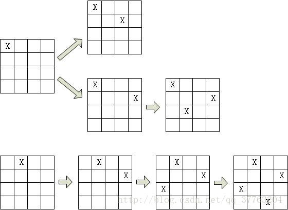
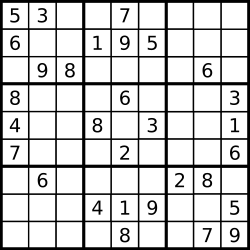

**算法定义**

1. 回溯算法就是一种有组织的系统最优化搜索技术，可以看作蛮力法穷举搜索的改进。回溯法常常可以避免搜索所有可能的解，所以它适用于求解组织数量较大的问题。

2. 首先我们先了解一下一个基本概念“解空间树”：问题的解空间一般使用解空间树的方式来组织，树的根节点位于第1层，表示搜索的初始状态，依次向下排列。

3. 解空间树的动态搜索：在搜索至树中任一节点时，先判断该节点对应的部分是否是满足约束条件，或者是否超出目标函数的界，也就是判断该节点是否包含问题的最优解。如果肯定不包含，则跳过对该节点为根的子树的搜索，即所谓的剪枝；否则，进入该节点为根的子树，继续按照深度优先策略搜索。（这也是为什么回溯可以避免搜索所有的解）

4. 在搜索过程中，通常采用两种策略避免无效搜索：

   - 用约束条件剪除得不到的可行解的子树

   -  用目标函数剪取得不到的最优解的子树

   （这两种方式统称为：剪枝函数）

5. 在用回溯法求解问题时，常常遇到两种典型的解空间树：

   - 子集树：但所有的问题是从n个元素的集合中找出满足某种性质的子集时，相应的解空间树成为子集树
   -  排列树：当所给出问题是确定n个元素满足某种性质的排列时，相应的解空间称为排列树。   

6. 回溯法的一般步骤：

　　（1）设置初始化的方案（给变量赋初始值，读入已知数据等）

　　（2）变换方式去试探，若全部试完侧转（7）

　　（3）判断此法是否成功（通过约束函数），不成功则转（2）

　　（4）试探成功则前进一步再试探

　　（5）正确方案还是未找到则转（2）

　　（6）以找到一种方案则记录并打印

　　（7）退回一步（回溯），若未退到头则转（2）

　　（8）已退到头则结束或打印无解


**N皇后问题**

N皇后问题是指在N*N的棋盘上放置N个皇后，使得N个皇后无法吃掉对方(也就是两两不在一行，不在一列，也不再对角线上)

首先利用回溯算法，首先第安排一个皇后位置（1,1)，然后安排第二个皇后(2,3)，然后安排第三个皇后位置(3,2),在安排第四个皇后的位置时，无论怎么放都不符合要求，因此产生了冲突。那么就要回溯到第三个皇后的位置,由图可知，第三个皇后也就一个位置符合要求无法更改，因此回退到第二个皇后位置，然后第二个皇后还能放到（2,4）,此时第三个皇后只能放到（3,2），此时放置第四个皇后时又产生了冲突，因此又往上回退，此时只能回退到第一个皇后.然后将第一个皇后放置到(1,2)位置，第二个皇后放置到(2,4)位置,第三个皇后放置到(3,2)位置，第四个皇后放置到(4,3)位置。此时满足要求打印




**针对N叉树的递归回溯算法**

```c++
#子集树模板
void backtrack(int t)
{
    if (t>n)
    {
        output(x);//叶子节点，输出结果，x是可行解
    }
    else
    {
        for i =1 to k //遍历当前节点的所有子节点
        {
            x[t] =value(i);//每个子节点的值都赋值给x
            //满足约束条件和限界条件
            if (constraint(t)&&bound(t))
                backtrack(t+1)//递归下一层
        }
    }
    
}
#排列数模板

public void backTrack(int n) {
        if (t > n) {
            outPut(x)
        } else {
            for (int i = t; i < n; i++) {
                swap(x[t], x[i]);
                if (约束条件 && 边界条件) {
                    backTrack(t + 1);
                }
                swap(x[t], x[i]);
            }
        }
    }

```

**针对N叉树的迭代回溯方法**

```c++
//针对N叉树的迭代回溯方法
void iterativeBacktrack ()  
{  
    int t=1;  
    while (t>0)
    {  
        if(ExistSubNode(t)) //当前节点的存在子节点  
        {  
            for i = 1 to k  //遍历当前节点的所有子节点  
            {  
                x[t]=value(i);//每个子节点的值赋值给x  
                if (constraint(t)&&bound(t))//满足约束条件和限界条件   
                {  
                    //solution表示在节点t处得到了一个解  
                    if (solution(t))
                        output(x);//得到问题的一个可行解，输出  
                    else
                        t++;//没有得到解，继续向下搜索  
                }  
            }  
        }  
        else //不存在子节点，返回上一层  
            t--;  
    }  
}
```

```python
# -*- coding: utf-8 -*-
# @Time : 2019/8/29 9:24 
# @Author : XuYingHao
# @File : leetcode_test.py
from typing import List


class Solution:
	def solveNQueens(self, n: int) -> List[List[str]]:
		if n <= 3:
			return -1
		# 记录没一行皇后的位置
		used = [0] * n
		res = []
		self.__dfs(0, used,res)
		return res

	def __dfs(self, index, used,res):
		##递归终止位置
		if index >= len(used):
			self.printres(used,res)
			return
		else:
		# 遍历当前节点所有位置
			for i in range(len(used)):
				if self.judge(index,i,used):
					used[index] = i
					self.__dfs(index+1,used,res)

	# 判断是否能放置皇后
	def judge(self, row, col, used):
		j = 0
		while j < row:
			if (col == used[j]) or (abs(row - j) == abs(col - used[j])):
				return False
			j+=1
		return True

	def printres(self,used,res):
		tmp_list = []
		for i in used:
			tmp = ''
			for j in range(len(used)):
				if i==j:
					tmp+='Q'
				else:
					tmp+='.'
			tmp_list.append(tmp)
		res.append(tmp_list)


if __name__ =="__main__":
	s =Solution()
	print(s.sloveNQueens(4))
    
    
    
##写法2
class Solution:
	def solveNQueens(self, n: int) -> List[List[str]]:
		"""
		皇后不能位于同一列上，同时不能位于对角线上
		:param n:
		:return:
		"""
		if n<4:
			return -1

		res =[]
		pres =[]
		used=[0]*n

		self.__dfs(0,used,pres,res)
		return  res

	def __dfs(self,row,used,pres,res):
		if row >=len(used):
			res.append(pres.copy())
			return  res

		for j in range(len(used)):
			#当前位置可以放置皇后
			if self.judge(row,j,used):
				#记录当前行的皇后位置
				used[row] = j
				queen = '.'*j+'Q'+(len(used)-1-j)*'.'
				pres.append(queen)
				self.__dfs(row+1,used,pres,res)
				#回搠，状态重置
				used[row]=0
				pres.pop()

	def judge(self,row,col,used):
		#判断当前所在皇后位置和之前所有皇后位置是否能满足要求
		j = 0
		while j< row:
			if col ==used[j] or abs(row-j)==abs(col-used[j]):
				return False
			j+=1
		return True


if __name__ =="__main__":
	s =Solution()
	print(s.sloveNQueens(4))

```


**全排列**

以示例输入: [1, 2, 3] 为例，如果让我们手写，要做到不重不漏，我们书写的策略可能是这样：“一位一位确定”，这样说比较笼统，具体是这样的：

1、先写以 1 开始的两个排列：`[1, 2, 3]、[1, 3, 2]`；
2、再写以 2 开始的两个排列：`[2, 1, 3]、[2, 3, 1]`；
3、最后写以 3 开始的两个排列：`[3, 1, 2]、[3, 2, 1]`。

如果数组元素多一点的话，也不怕，我们写的时候遵循下面的原则即可：

1、按数组的顺序来（不要求排序，但我们选取元素的顺序是从左到右的），每次排定 1 个元素；
说明：只有按照顺序才能做到不重不漏。

2、新排定的元素一定不能在之前排定的元素中出现。
说明：如果违反了这一条，就不符合“全排列”的定义。

其实让程序帮你找到所有的全排列也是这样的思路。如果不是这样的话，我们要写数组长度这么多层的循环，编码极其困难，代码写出来也非常不好看

### 方法：“回溯搜索”算法即“深度优先遍历 + 状态重置 + 剪枝”（这道题没有剪枝）

以示例输入:` [1, 2, 3] `为例，因为是排列问题，只要我们按照顺序选取数字，保证上一层选过的数字不在下一层出现，就能够得到不重不漏的所有排列。

说明：这里“保证上一层选过的数字不在下一层出现”的意思是我们手写的时候，后面选的数字一定不能是前面已经出现过的。为了做到这一点，我们得使用一个数组长度这么长的额外空间，记为数组 used ，只要“上一层”选了一个元素，我们就得“标记一下”，“表示占位”。


这里我们介绍什么是“状态”。

> 在递归树里，辅助数组 `used` 记录的情况和当前已经选出数组成的一个排序，我们统称为当前的“状态”。

下面解释“状态重置”。

在程序执行到上面这棵树的叶子结点的时候，此时递归到底，当前根结点到叶子结点走过的路径就构成一个全排列，把它加入结果集，我把这一步称之为“结算”。此时递归方法要返回了，对于方法返回以后，要做两件事情：

（1）释放对最后一个数的占用；
（2）将最后一个数从当前选取的排列中弹出。

事实上在每一层的方法执行完毕，即将要返回的时候都需要这么做。这棵树上的每一个结点都会被访问 2 次，绕一圈回到第 1 次来到的那个结点，第 2 次回到结点的“状态”要和第 1 次来到这个结点时候的“状态”相同，这种程序员赋予程序的操作叫做“状态重置”。

> “状态重置”是“回溯”的重要操作，“回溯搜索”是有方向的搜索，否则我们要写多重循环，代码量不可控。

说明：

1、数组 used 记录了索引 i 在递归过程中是否被使用过，还可以用哈希表、位图来代替，在下面的参考代码 2 和参考代码 3 分别提供了 Java 的代码；

2、当程序第 1 次走到一个结点的时候，表示考虑一个数，要把它加入列表，经过更深层的递归又回到这个结点的时候，需要“状态重置”、“恢复现场”，需要把之前考虑的那个数从末尾弹出，这都是在一个列表的末尾操作，最合适的数据结构是栈（Stack）。

```python
class Solution:
	def permute(self, nums: List[int]) -> List[List[int]]:
		if len(nums) == 0:
			return []
		# used数组,记录i位置的值是否可用
		used = [True] * len(nums)
		res = []
		pre = []
		self.__dfs(nums, 0,pre,used,res)
		return  res

	def __dfs(self, array, index, pre, used, res):
		# 递归终止条件
		if index == len(used):
			res.append(pre.copy())
			return
		# 遍历递归树当前层的节点
		for i in range(len(used)):
			if used[i]:
				pre.append(array[i])
				#当前位置用过之后，之后的位置就不能使用了
				used[i]=False
				self.__dfs(array,index+1,pre,used,res)
				#状态重置,
				#释放对最后一个数的占用
				#将最后一个数从当前选取的排列中弹出
				used[i]=True
				pre.pop()
```


**解数独**

```
编写一个程序，通过已填充的空格来解决数独问题。

一个数独的解法需遵循如下规则：

数字 1-9 在每一行只能出现一次。
数字 1-9 在每一列只能出现一次。
数字 1-9 在每一个以粗实线分隔的 3x3 宫内只能出现一次。
空白格用 '.' 表示。


```




**思路**

回朔求解

首先根据人的思路是一行一行的去填空格，因为填的数只能在1-9之间，所以再填每一个空格的时候都枚举一遍然后判断当前数是否可以填充.这里的*限界条件*就是：

> 1. 每一行不能有重复的数
 	2. 没一列不能有重复的数
 	3. 每一个3*3的九宫格不能有重复的数

步骤

- 数独首先行，列，还有 3*3 的方格内数字是 1~9 不能重复。

- 声明布尔数组或者hashmap，表明行列中某个数字是否被使用了， 被用过视为 true，没用过为 false。

- 初始化布尔数组或者hashmap，表明哪些数字已经被使用过了。

- 尝试去填充数组，只要行，列， 还有 3*3 的方格内 出现已经被使用过的数字，我们就不填充，否则尝试填充。如果填充失败，那么我们需要回溯。将原来尝试填充的地方改回来。

- 递归直到数独被填充完成。


```Python
# -*- coding: utf-8 -*-
# @Time : 2019/8/29 9:24 
# @Author : XuYingHao
# @File : leetcode_test.py
from typing import List
from itertools import permutations


# Definition for a binary tree node.

class Solution:
	def solveSudoku(self, board: List[List[str]]) -> None:
		"""
		Do not return anything, modify board in-place instead.
		"""
		rows = len(board)
		cols = len(board[0])

		# 设定三个used数组
		row = [{} for i in range(rows)]
		col = [{} for j in range(cols)]
		boxe = [{} for i in range(9)]
		for i in range(9):
			for j in range(9):
				if board[i][j] != '.':
					nums = int(board[i][j])
					row[i][nums] = row[i].get(nums, 0) + 1
					col[j][nums] = col[j].get(nums, 0) + 1
					_index = (i // 3) * 3 + (j // 3)
					boxe[_index][nums] = boxe[_index].get(nums, 0) + 1

		# 开始dfs
		self.__dfs(board, 0, 0, row, col, boxe)
    return board
		

	def __dfs(self, array, i, j, row, col, boxe):
		# 递归终止条件，如果走到最后一个位置了,那么就要放回了
		if j == 9:
			j = 0
			i += 1
		if i == 9:
			return True
		boxe_index = (i // 3) * 3 + (j // 3)
		if array[i][j] == '.':
			for num in range(1, 10):
				if self.judege(row, col, boxe, i, j, boxe_index, num):
					array[i][j] = str(num)
					# 记录状态
					row[i][num] = row[i].get(num, 0) + 1
					col[j][num] = col[j].get(num, 0) + 1
					boxe[boxe_index][num] = boxe[boxe_index].get(num, 0) + 1
					if self.__dfs(array, i, j + 1, row, col, boxe):
						return True
					else:
						# 回朔
						array[i][j] = '.'
						row[i][num] -= 1
						col[j][num] -= 1
						boxe[boxe_index][num] -= 1

		else:
			return self.__dfs(array, i, j + 1, row, col, boxe)
		return  False

	def judege(self, row_used, col_used, boxe_used, row_index, col_index, boxe_index, num):
		if row_used[row_index].get(num, 0) == 0 and col_used[col_index].get(num, 0) == 0 and boxe_used[boxe_index].get(num,
                                                                                                      0) == 0:
			return True
		return False

if __name__ == "__main__":
	s = Solution()
	arr = [["5", "3", ".", ".", "7", ".", ".", ".", "."], ["6", ".", ".", "1", "9", "5", ".", ".", "."],
	       [".", "9", "8", ".", ".", ".", ".", "6", "."], ["8", ".", ".", ".", "6", ".", ".", ".", "3"],
	       ["4", ".", ".", "8", ".", "3", ".", ".", "1"], ["7", ".", ".", ".", "2", ".", ".", ".", "6"],
	       [".", "6", ".", ".", ".", ".", "2", "8", "."], [".", ".", ".", "4", "1", "9", ".", ".", "5"],
	       [".", ".", ".", ".", "8", ".", ".", "7", "9"]]
	print(s.solveSudoku(arr))

```

**电话号码的组合**


> 和全排列的思路是一样的，首先画出递归树，然后就可以求解


```python
class Solution:
	def letterCombinations(self, digits: str) -> List[str]:
		phone = {'2': ['a', 'b', 'c'],
		         '3': ['d', 'e', 'f'],
		         '4': ['g', 'h', 'i'],
		         '5': ['j', 'k', 'l'],
		         '6': ['m', 'n', 'o'],
		         '7': ['p', 'q', 'r', 's'],
		         '8': ['t', 'u', 'v'],
		         '9': ['w', 'x', 'y', 'z']}
		res = []
		pres =[]
		self._dfs(phone,digits,0,pres,res)
		return  res

	def _dfs(self,phone,digits,index,pres,res):
		if index>= len(digits):
			res.append(''.join(pres))
			return  res
		nums = phone[digits[index]]
		for i in range(len(nums)):
			pres.append(nums[i])
			self._dfs(phone,digits,index+1,pres,res)
			pres.pop()

```

** 子集**

```python
给定一组不含重复元素的整数数组 nums，返回该数组所有可能的子集（幂集）。

说明：解集不能包含重复的子集。

示例:

输入: nums = [1,2,3]
输出:
[
  [3],
  [1],
  [2],
  [1,2,3],
  [1,3],
  [2,3],
  [1,2],
  []
]

```


> 从递归树中可以看到，在每一个叶子节点以及非叶子节点以及头节点都要结算一次。并且在搜索的过程中，每个元素只能使用一次.

```python
class Solution:
    def subsets(self, nums: List[int]) -> List[List[int]]:
        size = len(nums)
        if size == 0:
            return []

        res = []
        self.__dfs(nums, 0, [], res)
        return res

    def __dfs(self, nums, start, path, res):
        res.append(path[:])
        for i in range(start, len(nums)):
            path.append(nums[i])
            # 因为 nums 不包含重复元素，并且每一个元素只能使用一次
            # 所以下一次搜索从 i + 1 开始
            self.__dfs(nums, i + 1, path, res)
            path.pop()
```

**单词搜索**

```Python
给定一个二维网格和一个单词，找出该单词是否存在于网格中。

单词必须按照字母顺序，通过相邻的单元格内的字母构成，其中“相邻”单元格是那些水平相邻或垂直相邻的单元格。同一个单元格内的字母不允许被重复使用。

示例:

board =
[
  ['A','B','C','E'],
  ['S','F','C','S'],
  ['A','D','E','E']
]

给定 word = "ABCCED", 返回 true.
给定 word = "SEE", 返回 true.
给定 word = "ABCB", 返回 false.

```


> 说明：
>
> 1. 偏移数组的使用,设置当前位置为(x,y)，那么1位置的坐标为(x-1,y),2位置的坐标为(x,y+1),3位置的坐标为(x+1,y),4位置的坐标为(x,y-1),因此可以设置一个偏移量的数组[(-1,0),(0,1),(1,0),(0,-1)]


```Python
class Solution:
	#         (x-1,y)
	# (x,y-1) (x,y) (x,y+1)
	#         (x+1,y)
	#上右下左四个方位
	directions = [(-1,0),(0,1),(1,0),(0,-1)]

	def exist(self, board: List[List[str]], word: str) -> bool:
		if len(board)==0:
			return False
		rows = len(board)
		cols = len(board[0])
		#used数组
		used = [[True]*cols for _ in range(rows)]
		#从左上角位置(0,0)处开始搜索
		for i in range(rows):
			for j in range(cols):
				if self.__dfs(board,word,0,used,i,j):
					return True
		return False

	def __dfs(self,board,word,index,used,x,y) -> bool:
		"""
		:param board: 网格字符
		:param word: 要寻找的单词
		:param index: 以及配上的位置
		:param used: 状态数组
		:param x: 网格中的x位置
		:param y: 网格中的y位置
		:return: bool
		"""
		#递归终止条件,word指针到了最后一个位置了
		if index==len(word)-1:
			return board[x][y]==word[index]

		#如果当前位置匹配的话，对下一个位置从四个方向进行匹配
		if board[x][y]==word[index]:
			#当前位置标记为不可用
			used[x][y]=False
			#开始搜索，从上右下左四个位置开始
			for direct in self.directions:
				new_x=x+direct[0]
				new_y=y+direct[1]
				#判断限界条件是否符合
				if 0<=new_x<len(board) and 0<=new_y<len(board[0]) and used[new_x][new_y] and self.__dfs(board,word,index+1,used,new_x,new_y):
					return True
			#四个方向都匹配，释放当前状态，开始回溯
			used[x][y]=True
		return False


if __name__ =='__main__':
	s= Solution()
	board = [
		['A', 'B', 'C', 'E'],
		['S', 'F', 'C', 'S'],
		['A', 'D', 'E', 'E']
	]
	word = 'AC'
	print(s.exist(board,word))

```

**岛屿数量**

> 给定一个由 `'1'`（陆地）和 `'0'`（水）组成的的二维网格，计算岛屿的数量。一个岛被水包围，并且它是通过水平方向或垂直方向上相邻的陆地连接而成的。你可以假设网格的四个边均被水包围。
>
> **示例 1:**
>
> ```
> 输入:
> 11110
> 11010
> 11000
> 00000
> 
> 输出: 1
> ```
>
> **示例 2:**
>
> ```
> 输入:
> 11000
> 11000
> 00100
> 00011
> 
> 输出: 3
> ```

> 思路:从网格顶部开始，如果该位置是岛屿，那么从这个位置开始向四周搜索岛屿，如果发现了一个新的岛屿，那么就标记该岛屿，如果到了某个位置走过了四个方向都不符合条件，那就要回溯了。**注意：此时不需要重置该位置的状态，因为该位置已经被记录为岛屿的一部分了，下次遇到该位置的时候，就不要在算另外一个岛屿的一部分**

```python
from typing import List


class Solution:
	#        x-1,y
	# x,y-1    x,y      x,y+1
	#        x+1,y
	# 方向数组，它表示了相对于当前位置的 4 个方向的横、纵坐标的偏移量，这是一个常见的技巧
	directions = [(-1, 0), (0, 1), (1, 0), (0, -1)]

	def numIslands(self, grid: List[List[str]]) -> int:
		rows = len(grid)
		if rows == 0:
			return 0
		cols = len(grid[0])
		used = [[False] * cols for _ in range(rows)]
		count=0
		# 开始遍历各个位置
		for i in range(rows):
			for j in range(cols):
				# 如果当前位置没有被访问过，并且该位置是陆地,那么开始搜索连通区域
				if not used[i][j] and grid[i][j] == '1':
					self.__dfs(grid, i, j, used)
					count+=1
		return count

	def __dfs(self, grid, i, j, used):
		used[i][j] = True
		for direct in self.directions:
			new_x = i+direct[0]
			new_y = j+direct[1]
			if 0<=new_x<len(grid) and  0<=new_y<len(grid[0]) and not used[new_x][new_y] and grid[new_x][new_y]=='1':
				self.__dfs(grid,new_x,new_y,used)
```

**被围绕的矩阵**

> 给定一个二维的矩阵，包含 'X' 和 'O'（字母 O）。
>
> 找到所有被 'X' 围绕的区域，并将这些区域里所有的 'O' 用 'X' 填充。
>
> 示例:
>
> X X X X
> X O O X
> X X O X
> X O X X
> 运行你的函数后，矩阵变为：
>
> X X X X
> X X X X
> X X X X
> X O X X
>
> **被围绕的区间不会存在于边界上，换句话说，任何边界上的 'O' 都不会被填充为 'X'。 任何不在边界上，或不与边界上的 'O' 相连的 'O' 最终都会被填充为 'X'。如果两个元素在水平或垂直方向相邻，则称它们是“相连”的。**
>
> 

> 思路: 对于边界上的O以及与边界上的O连通的O都不会被填充为x,对于这些位置，我们要将它于其他被x围绕的o区别开来。对于这部分0我们可以用#先替换0，然后在第二遍的遍历过程中，遇到O将其填充为X，遇到#将其替换为0

```python
##BFS
class Solution:
	direction = [(-1,0),(0,1),(1,0),(0,-1)]
	def solve(self, board: List[List[str]]) -> None:
		if len(board)==0:
			return

		row = len(board)
		col = len(board[0])

		for i in range(row):
			for j in range(col):
				if (i==0 or i==row-1 or j==0 or j==col-1) and board[i][j]=='O':
					self.__bfs(board,i,j)

		for i in range(row):
			for j in range(col):
				if board[i][j]=='#':
					board[i][j]='O'
				elif board[i][j]=='O':
					board[i][j]='X'
		return board

	def __bfs(self,board,x,y):
		helper = deque()
		helper.appendleft((x,y))
		while len(helper)!=0:
			#先进要先先出
			x,y = helper.pop()
			if 0<=x<len(board) and 0<=y<len(board[0]) and board[x][y]=='O':
				board[x][y]='#'
				for direct in self.direction:
					new_x = x+direct[0]
					new_y = y+direct[1]
					helper.appendleft((new_x,new_y))
                    
                            
#dfs
class Solution:
    direction =[(-1,0),(0,1),(1,0),(0,-1)]
    def solve(self, board: List[List[str]]) -> None:
        """
        Do not return anything, modify board in-place instead.
        """		
        if len(board)==0:
            return
        row = len(board)
        col = len(board[0])
        #找到和边界0连通的非
        for i in range(0,row):
            for j in range(col):
                if (i==0 or i==row-1 or j==0 or j==col-1) and board[i][j]=='O':
                    self.__dfs(board,i,j)

        for i in range(row):
            for j in range(col):
                if board[i][j]=='#':
                    board[i][j]='O'
                elif board[i][j]=='O':
                    board[i][j]='X'


    def __dfs(self,board,x,y):
        #只要占住当前位置就好了
        board[x][y]='#'
        for direct in self.direction:
            new_x = x+direct[0]
            new_y = y+direct[1]
            if 0<=new_x<len(board) and 0<=new_y<len(board[0]) and board[new_x][new_y]=='O':
                self.__dfs(board,new_x,new_y)
              
```


**填充水井**

>给你一个m*n的格子，在i,j处有一个水源c，水源可以向四周流动，且水量减少一个。依次进行上次步骤直到水量为0
>
>如 [[1, 2, 3, 2], [2, 3, 4, 3], [1, 2, 3, 2], [0, 1, 2, 1]]

```python
from typing import List
from  collections import deque

class Solution:
	direction = [(-1,0),(0,1),(1,0),(0,-1)]
	def solve(self,m,n,i,j,c):
		res =[[0]*n for _ in range(m)]
		res[i][j]=c
		used =[[False]*n for _ in range(m)]
		self.__bfs(res,i,j,used,c)
		return  res


	def __bfs(self,res,x,y,used,c):
		helper = deque()
		helper.appendleft((x,y))
		used[x][y]=True
		while len(helper)!=0:
			i,j = helper.pop()
			for direct in self.direction:
				new_x= i+direct[0]
				new_y= j+direct[1]
				#入队列了马上标记,否则会出现节点重复入队列的现象
				if 0<=new_x<len(res) and 0<=new_y<len(res[0]) and not used[new_x][new_y]:
					helper.appendleft((new_x,new_y))
					used[new_x][new_y]=True
					if res[i][j]!=0:
						res[new_x][new_y]=res[i][j]-1
```

**给定数字n和k，从1-n中选出k个组合数字**


> n=4,k=2
>
> [[1,2],[1,3],[1,4],[2,3],[2,4],[3,4]]

```python


class Solution:
	def funciton(self,array,k):
		if len(array)==0:
			return
		res =[]
		pre =[]

		self.__dfs(array,0,pre,res,k)
		return  res

	def __dfs(self,array,index,pre,res,k):
		if len(pre)==k:
			res.append(pre.copy())
			return

		for i in range(index,len(array)):
			pre.append(array[i])
			self.__dfs(array,i+1,pre,res,k)
			pre.pop()
```

**图的遍历**


```python

from collections import defaultdict


class Solution:
	def graph(self, graph):
		pre = []
		used = [False] * 6
		tmp = []
		for i in range(1,6):
			res =[]
			self.__dfs(graph,0,i,used,pre,res)
			min_ = min((res))
			tmp.append(min_)

		return  tmp

	def __dfs(self, graph, node, end, used, pre, res):
		if node == end:
			res.append([sum(pre.copy())])
			return
		edge = graph[node]
		for tmp in edge:
			key = list(tmp.keys())[0]
			value = list(tmp.values())[0]
			if not used[key] and value != -1 and key!=node:
				used[key] = True
				pre.append(value)
				self.__dfs(graph,key,end,used,pre,res)
				used[key]=False
				pre.pop()


if __name__ == "__main__":
	graph = defaultdict(list)

	for i in range(6):
		tmp = list(map(int, input().split(' ')))
		for node, weight in enumerate(tmp):
			graph[i].append({node: weight})

	s=Solution()
	res = s.graph(graph)
	for i in res:
		print(i[0])

```

**组合总数**

> 给定一个无重复元素的数组 candidates 和一个目标数 target ，找出 candidates 中所有可以使数字和为 target 的组合。
>
> candidates 中的数字可以无限制重复被选取。
>
> 说明：
>
> 所有数字（包括 target）都是正整数。
> 解集不能包含重复的组合。 
> 示例 1:
>
> 输入: candidates = [2,3,6,7], target = 7,
> 所求解集为:
> [
>   [7],
>   [2,2,3]
> ]
> 示例 2:
>
> 输入: candidates = [2,3,5], target = 8,
> 所求解集为:
> [
>   [2,2,2,2],
>   [2,3,3],
>   [3,5]
> ]

> 思路：使用回溯来处理。注意解集中不能包含重复的组合，所以在遍历递归树中的节点时要注意遍历的开始位置。

```python
from typing import List

class Solution:
	def combinationSum(self, candidates: List[int], target: int) -> List[List[int]]:
		if len(candidates) == 0 or target is None:
			return []

		res = []
		pre = []
		index=0
		self.__dfs(candidates,index, pre, res, target)
		return res

	def __dfs(self, array, index,pre, res, target):
		if sum(pre.copy()) > target:
			return
		elif sum(pre.copy()) == target:
			res.append(pre.copy())
			return
		for i in range(index,len(array)):
			pre.append(array[i])
			self.__dfs(array, i,pre, res, target)
			pre.pop()

if __name__ =="__main__":
	s=Solution()
	print(s.combinationSum([2,3,5],8))
```

**括号生成**

```python
数字 n 代表生成括号的对数，请你设计一个函数，用于能够生成所有可能的并且有效的括号组合。
输入：n = 3
输出：[
       "((()))",
       "(()())",
       "(())()",
       "()(())",
       "()()()"
]
```

这种让你生成所有可能xx的问题基本都可以通过dfs来处理。题目说n表示生成括号的对数。同时括号是由'('和')'这两种字符表示的，所以在递归树的每一层就只有两种选择，要么选择左括号，要么选择右括号。但是题目还要求我们生成的括号是要有效的。因此在生成的过程中需要一些剪枝的操作

也就是最终左括号的数量要和右括号的数量相等。同时在选择的过程中，左括号的选择数量一定要大于右括号。

同时左右括号使用的数量不能超过n，也就是不能超过一半

```python
from  typing import  *
class Solution:
    def generateParenthesis(self, n: int) -> List[str]:
        if n==1:
            return ['()']
        length = 2*n
        res =[]
        temp =[]
        used ={'(':0,')':0}
        self.__dfs(used,temp,0,length,res)
        return res
    def __dfs(self,used,temp,index,lens,res):
      	#右括号数量不能大于左括号数量，左右括号使用数量不能超过n
        if used[')']>used['('] or used['(']>lens/2:
            return
        if index==lens and used['(']==used[')']:
            res.append(''.join(temp))
            return
        for select in ['(',')']:
            if used['(']==used[')'] and select==')':
                continue
            else:
                used[select]+=1
                temp.append(select)
                self.__dfs(used,temp,index+1,lens,res)
                used[select]-=1
                temp.pop()
```


