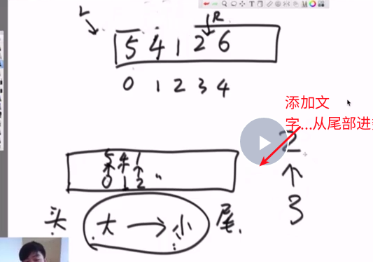
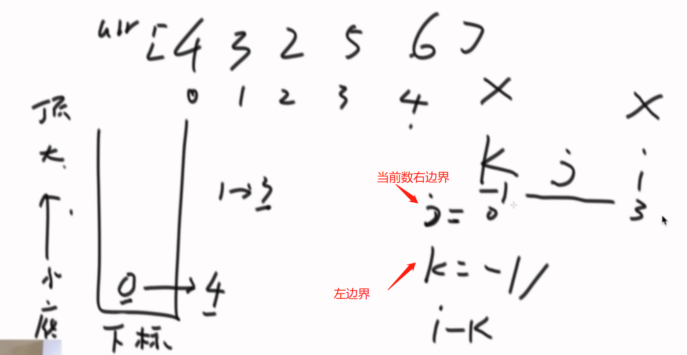

### 单调栈结构

```
窗口内的最大值和最小值更新结构
使用双端队列结构(双向链表)

```




**窗口加数的更新逻辑**，那么准备一个双端队列，还有两个指针L和R，双端队列中保证数从大到小排序，双端队列中加数的操作是由R指针向右移动的。在加数的过程中，如果R指针指向的数a小于双端队列的尾部数，那么a进队列，否则将双端队列中小于a的数从队列中弹出直到双端队列尾部的数大于a。

**窗口减数的更新逻辑**

如果L往右边走的时候，检查 L所在数的index，然后从双端队列的头部弹出index

```python
def getmaxWindow(array,w):
	"""

	:param array:
	:param w: 窗口的大小
	:return: 各个窗口的最大值
	"""
	if array is None or len(array)<w or w<1:
		return None
	length = len(array)
	#一共有n-w+1个窗口值
	res = [0]*(length-w+1)
	#准备一个双端队列
	qmax = []
	#左指针
	index=0
	for i in range(length):
		#当前数如果大于双端队列尾部的数时，双端队列尾部值弹出,直到尾部数不小于当前数为止
		while len(qmax)!=0 and array[qmax[-1]]<=array[i]:
			qmax.pop()
		qmax.append(i)
		#减数逻辑
		if qmax[0] ==i-w:
			qmax.pop(0)
		if i>=w-1:
			res[index] = array[qmax[0]]
			index+=1
	return  res

```

**构造数组的MaxTree**

```
一个数组的MaxTree定义如下.
数组必须没有重复元素，MaxTree是一颗二叉树，数组的每一个值对应一个二叉树节点。包括MaxTree树在内且在其中的每一课子树上，值最大的节点都是树的头。
```


**求矩阵的面积**

```python
给定一个arrar[4,3,2,5,6]，其中每个值表示以该值作为长方形的高，1作为长方形长的矩形。求该数组能构成的最大面积
"""
思路，使用单调栈来解决，找到每个位置离该位置最近且比该位置小的数。在单调栈中，小的在栈底，大的在栈顶
"""
```




```python
def maxReFromBottom(array):
    if array is None and len(array) == 0:
        return 0
    # 初始化一个栈，小的在栈底部，大的在栈顶。
    stack = []
    # 最局最大值
    max_area = float('-inf')
    for i in range(len(array)):
        while len(stack) != 0 and array[i] <= array[stack[-1]]:
            r = stack.pop()
            # 如果栈空了，左边界为-1
            if len(stack) == 0:
                l = -1
            # 否则为栈顶下面一个元素
            else:
                l = stack[-1]
            curArea = (i - l - 1) * array[r]
            max_area = max(max_area, curArea)
        stack.append(i)
    # 当所有的数都遍历一遍后，栈还没有空，那么依次弹出来
    while len(stack) != 0:
        r = stack.pop()
        if len(stack) == 0:
            l = -1
        else:
            l = stack[-1]
        curArea = (len(array) - l - 1) * array[r]
        max_area = max(max_area, curArea)
    return max_area
```

**最大子矩阵的大小**

```python
给定一个整形矩阵map，其中的值只有0和1两种，求其中全是1的书友矩形区域中，最大的矩形矩形区域为1的数量。
例如：
1 1 1 0
其中，最大的矩形区域有3个1，所以返回3.
再如：
1 0 1 1 
1 1 1 1 
1 1 1 0
其中，最大的矩形区域有6个1，所以返回6.

```


```python
def maxReFromBottom(array):
    if array is None and len(array) == 0:
        return 0
    # 初始化一个栈，小的在栈底部，大的在栈顶。
    stack = []
    # 最局最大值
    max_area = float('-inf')
    for i in range(len(array)):
        while len(stack) != 0 and array[i] <= array[stack[-1]]:
            r = stack.pop()
            # 如果栈空了，左边界为-1
            if len(stack) == 0:
                l = -1
            # 否则为栈顶下面一个元素
            else:
                l = stack[-1]
            curArea = (i - l - 1) * array[r]
            max_area = max(max_area, curArea)
        stack.append(i)
    # 当所有的数都遍历一遍后，栈还没有空，那么依次弹出来
    while len(stack) != 0:
        r = stack.pop()
        if len(stack) == 0:
            l = -1
        else:
            l = stack[-1]
        curArea = (len(array) - l - 1) * array[r]
        max_area = max(max_area, curArea)
    return max_area

##
def maxmatrix(array_list):
    if len(array_list) == 0 or array_list is None or len(array_list[0]) == 0:
        return 0
    helper = [0] * len(array_list[0])
    max_area = float('-inf')
    # 每一行作为一个array
    for i in range(len(array_list)):
        for j in range(len(array_list[0])):
            if array_list[i][j] == 0:
                helper[j] = 0
            else:
                helper[j] += 1
        max_area = max(maxReFromBottom(helper), max_area)
    return max_area
```

