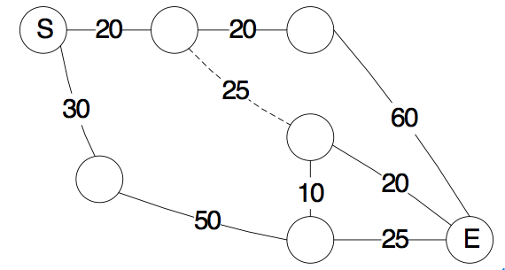

**1.开箱子**


> 思路：因为只有两数之和为奇数的时候宝箱才能被打开，因此分别求出宝箱数组中偶数的数量a1，奇数的数量b1，钥匙数组中偶数的数量a2，奇数的数量b2，求min(a1,b2)+min(b1,a2)之和就是答案

```python
def num1(b_array,y_array):
	a1 = 0
	b1 = 0
	a2 = 0
	b2 = 0
	for  i in b_array:
		if i&1 ==0:
			a1+=1
		else:
			b1+=1
	for j in y_array:
		if j & 1==0:
			a2+=1
		else:
			b2+=1
	res = min(a1,b2)+min(b1,a2)

	return  res

```

**车辆分组**


> 因为要求同一目的地的车辆必须出现在同一组中，因此我们可以从头开始遍历，记录当前车辆第一次出现的位置以及最后一次出现的位置，然后在这个区间中，我们去看看其它位置的最后一次出现的位置lastindex,直到遍历整个区间。最坏的时间复杂度为0(n^2)

```Python

def split_group(string:str):
	res =[]
	length = len(string)
	cur = 0
	last_index = 0
	while cur<length-1:
		last_index = string.rindex(string[cur])
		if last_index==length-1:
			res.append(last_index-cur+1)
			break
		for i in range(cur,last_index+1):
			last_index = max(last_index,string.rindex(string[i]))
		res.append(last_index-cur+1)
		cur =last_index+1
	return res

```


**图的遍历**

> 给定一张包含N个点、N-1条边的无向连通图，节点从1到N编号，每条边的长度均为1。假设你从1号节点出发并打算遍历所有节点，那么总路程至少是多少
>
> ```
> 
> 输入描述:
> 第一行包含一个整数N，1≤N≤10^5。
> 
> 接下来N-1行，每行包含两个整数X和Y，表示X号节点和Y号节点之间有一条边，1≤X，Y≤N。
> 
> 
> 输出描述:
> 输出总路程的最小值。
> 示例1
> 输入
> 4
> 1 2
> 1 3
> 3 4
> 输出
> 4
> ```

> 思路:因为是无向连通图，从1号节点出发遍历所有节点也就是从根节点开始遍历所有节点。因为每条路径都会经过两次，要求总的路径最短，那么就要求最长的那条路径只经过一次。因此问题就转换为求树中的最深深度。因为一共有N-1条边，每条边都会经过两次，所以总的路径长度为2*(n-1)-最深深度

```python
from  collections import defaultdict
class Solution:
	def minpath(self,graph,n):
		visited = defaultdict(bool)
		visited[1]=True
		res =0
		stack =[1]
		while len(stack)>0:
			tmp = []
			while len(stack)>0:
				node = stack.pop()
				for t in graph[node]:
					if not visited[t]:
						visited[t]=True
						tmp.append(t)
			stack = tmp
			res+=1
		return (2*(n-1)-res+1)
if __name__ =="__main__":
	n = int(input())
	graph = defaultdict(list)
	for i in range(n-1):
		a,b = map(int,input().split(' '))
		graph[a].append(b)
		graph[b].append(a)
	s= Solution()	
	print(s.minpath(graph,n))
```

**使用回朔**

```Python
from  collections import defaultdict

#构建图数据，
class Solution:
	def minpath(self,graph,n):
		res =[]

		node_list =graph[1]
		used = [False]*(n+1)
		used[1]=True

		self.__dfs(graph,1,used,0,res)
		max_depth = max(res)
		return  2*(n-1)-max_depth
	def __dfs(self,graph,node,used,depth,res):
		res.append(depth)
		tmp = graph[node]
		for node in tmp:
			if not used[node]:
				depth+=1
				used[node]=True
				self.__dfs(graph,node,used,depth,res)
				used[node]=False
				depth-=1

if __name__ =="__main__":
	n = int(input())
	graph = defaultdict(list)
	for i in range(n-1):
		a,b = map(int,input().split(' '))
		graph[a].append(b)
		graph[b].append(a)
	s= Solution()	
	print(s.minpath(graph,n))

```

**机器人移动**

```python

def function(string):
	res = [0]*len(string)
	length = len(string)
	i =0
	number = pow(10,100)
	while i<= length-1:
		if string[i]=='R':
			j = i+1
			while j<=length-1:
				if string[j]=='R':
					j+=1
				else:
					next = (number -(j-i))%2
					if next==0:
						res[j]+=1
					else:
						res[j-1]+=1
					break
		else:
			j = i-1
			while j>=0:
				if string[j]=='L':
					j-=1
				else:
					next = (number - (i-j))%2
					if next==0:
						res[i-1]+=1
					else:
						res[i]+=1
					break
		i+=1

	return  res

if __name__=='__main__':
	s = input().strip()
	res = function(s)
	for i in res:
		print(i,end=' ')
```

**龟兔赛跑**



> S表示比赛起点，E表示比赛终点。实线表示陆路，虚线表示水路。兔子只能走陆路，乌龟既可以走陆路也可以走水路。每条路径的长度在图中给出。假定兔子和乌龟足够聪明，问谁先到达终点。
>
> ```
> 第1行输入v1，v2。v1是兔子的速度，v2是乌龟的速度（水路、陆路速度相同）。第2行输入n,m，点的编号是1~n,然后是m行，其中1是起点，n是终点（路径本身不限定方向）。下面m行4个数 a, b, d, c，表示a和b之间有一条边，且其长度为d，类型是c（0表示陆路，1表示水路）。最后一行是end，表示输入结束。输入保证1和n之间至少有一条路径联通。(1<n<=10000, 0<m<=1000000)。
> 
> 
> 输出-1,0,1中的一个数。-1表示乌龟获胜，1表示兔子获胜，0表示同时到达终点。
> ```

```python
from typing import List
import random

from collections import defaultdict


class Solution:
	def saipao(self, graph, n):
		"""

		:param graph:构建的图
		:param n: 顶点数
		:return:
		"""
		res = defaultdict(list)
		pres = []
		used = [False] * (n + 1)
		used[1] = True
		flag = True
		self.__dfs(graph, 1, used, flag, pres, res)
		return res

	def __dfs(self, graph: defaultdict(List[dict]), node: int, used, flag, pre, res):
		if node == len(used) - 1 and flag == True:
			res['lu'].append(sum(pre.copy()))
			return
		elif node == len(used) - 1 and not flag:
			res['shui'].append(sum(pre.copy()))
			return
		edge = graph[node]
		for tmp in edge:
			key = list(tmp.keys())[0]
			values = list(tmp.values())[0]
			if not used[key] and values[1] != 1:
				used[key] = True
				pre.append(values[0])
				self.__dfs(graph, key, used, flag, pre, res)
				used[key] = False
				pre.pop()
			elif not used[key] and values[1] == 1:
				flag = not flag
				used[key] = True
				pre.append(values[0])
				self.__dfs(graph, key, used, flag, pre, res)
				used[key] = False
				pre.pop()
				flag = not flag


if __name__ == '__main__':
	graph = defaultdict(list)
	v1, v2 = map(int, input().split(' '))
	n, m = map(int, input().split(' '))
	for i in range(m):
		a, b, weight, flag = list(map(int, input().split(' ')))
		graph[a].append({b: [weight, flag]})
		graph[b].append({a: [weight, flag]})

	s = Solution()
	res = s.saipao(graph, n)
	lu = min(res['lu'])
	shui = min(res['shui'])

	if (lu / v1) > (shui / v2):
		print(-1)
	elif (lu / v1) < (shui / v2):
		print(1)
	else:
		print(0)

```

**最长的有效括号**

> 给定一个只包含 '(' 和 ')' 的字符串，找出最长的包含有效括号的子串的长度。
>
> 示例 1:
>
> 输入: "(()"
> 输出: 2
> 解释: 最长有效括号子串为 "()"
> 示例 2:
>
> 输入: ")()())"
> 输出: 4
> 解释: 最长有效括号子串为 "()()"

> 思路:
>
> 使用一维dp,每个位置表示以当前字符结尾的最长的有效括号长度。
>
> 分类讨论：
>
> 1. 如果当前字符为')':
>    1. 如果s[i-1]=='(':那么dp[i] = dp[i-2]+2
>    2. 否则如果s[i-1]==')' 并且 i-dp[i-1]-1>=0 并且s[i-dp[i-1]-1]=='(',那么dp[i] = dp[i-1]+2+dp[i-dp[i-1]-2]

```python
class Solution:
	def longestValidParentheses(self, s: str) -> int:
		if len(s)==1 or s is None:
			return 0
		length = len(s)
		dp =[0]*length
		helper =[]
		valid_str = {'(':')'}
		for i in range(length):
			if i>0 and s[i]==')':
				if s[i-1]=='(':
					dp[i] = dp[i-2]+2
				elif s[i-1]==')' and i-dp[i-1]-1>=0 and s[i-dp[i-1]-1]=='(':
					dp[i] = dp[i-1]+2 +dp[i-dp[i-1]-2]
		return max(dp)

```

