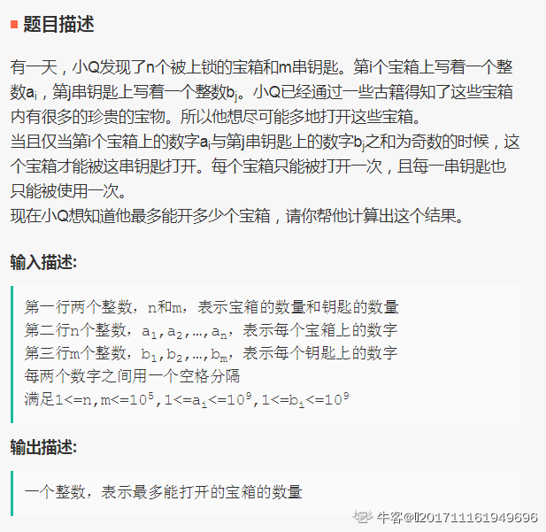

**1.开箱子**



> 思路：因为只有两数之和为奇数的时候宝箱才能被打开，因此分别求出宝箱数组中偶数的数量a1，奇数的数量b1，钥匙数组中偶数的数量a2，奇数的数量b2，求min(a1,b2)+min(b1,a2)之和就是答案

```python
def num1(b_array,y_array):
	a1 = 0
	b1 = 0
	a2 = 0
	b2 = 0
	for  i in b_array:
		if i&1 ==0:
			a1+=1
		else:
			b1+=1
	for j in y_array:
		if j & 1==0:
			a2+=1
		else:
			b2+=1
	res = min(a1,b2)+min(b1,a2)

	return  res

```

