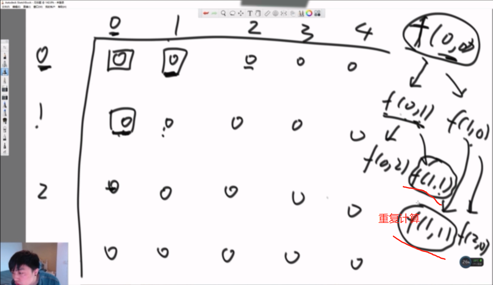
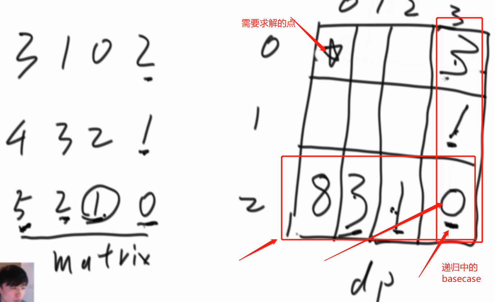

 暴力递归

1. 把问题转化为规模缩小了的同类问题的子问题
2. 有明确的不需要继续进行递归的条件(base case)
3. 有当得到了子问题的结果之后的决策过程
4. 不记录每一个子问题的解

### 动态规划

1. 从暴力递归中来
2. 将每一个子问题的解记录下来，**避免重复计算**
3. 把暴力递归的过程，抽象成了状态表达
4. 并且存在化简状态表达，使其更加简洁的可能


**题1**

```
打印字符串的全部子序列
```


**思路**

每个位置都有两个决策，打印以及不打印。当前位置传递给下一个位置时，都有两条路可以走，每一次递归的时候都走两条路。


**题2**

```
母牛每年生一只母牛， 新出生的母牛成长三年后也能每年生一只
母牛， 假设不会死。 求N年后， 母牛的数量
```


**思路**

列出前几年的牛出生的个数，然后找出规律。从上图中发现，从第5年开始当年母牛总的数量为$F(n)=F(n-1)+F(n-3)$

对上式的解释:因为牛不会死，所以今年的牛包含**去年的牛**以及**三年前在今年成熟的牛新生的牛**

**题目3**

```
给你一个二维数组， 二维数组中的每个数都是正数， 要求从左上角走到右下角， 每一步只能向右或者向下。 沿途经过的数字要累加起来。 返回最小的路径和。
```

**递归版本**



从上图我们可以知道，从(0,0)位置处有两条路径可以走，向右以及向下,那么计算(0,0)位置的最短路径就需要比较(0,1)以及(1,0)处的最小路径，计算(0,1)位置的最小路径又需要知道(0,2)以及(1,1)的最小路径，计算(1,0)位置又需要知道(1,1)以及(2,0)的最小路径,从图上我们可以看到(1,1)处重复计算了，这样的重复计算是很多的，所以暴力递归很消耗时间。

```python
def minweigthsum(array,i,j):
	#如果已经到了右下角了,那么返回
	if i== len(array)-1 and j== len(array[0])-1:
		return array[i][j]
	#如果在右边界上,那么只能往下走
	elif j==len(array[0])-1:
		return array[i][j]+minweigthsum(array,i+1,j)
	#如果在最下边界，那么只能往右走了
	elif i==len(array)-1 :
		return array[i][j] + minweigthsum(array,i,j+1)
	#如果当前位置左右都能走
	else:
		right = minweigthsum(array,i,j+1)
		down = minweigthsum(array,i+1,j)
		return  array[i][j]+min(right,down)

if __name__ == '__main__':
    matrix =[[1,2,3,4],[5,6,7,8],[9,10,11,12],[13,14,15,16]]
    print(minweigthsum(matrix,0,0))
```

**改为动态规划**




转换步骤如下：

假如递归函数中可变参数是二维的,那么dp表就是一个二维的表，将递归改为动态规划

1. 首先要在dp表中找到需要求解的点如上图坐上角的点，然后确定递归函数中basecase，也就是右下角的点。
2. 根据递归函数确定dp表中不被依赖的位置,上图中的下边界和右边界
3. 回到递归中，分析一个普遍位置的依赖关系。


```python
def minweightsum2(array):
	if len(array) == 0 or len(array[0]) == 0:
		return 0
	rows = len(array)
	cols = len(array[0])
	# 构建一个dp二维表
	dp = [[0] * cols for i in range(rows)]
	# 首先将dp表中不被依赖的位置填好
	dp[rows - 1][cols - 1] = array[rows - 1][cols - 1]
	for i in range(rows - 1)[::-1]:
		dp[i][cols - 1] = array[i][cols - 1] + dp[i + 1][cols - 1]
	# 最下面一列
	for j in range(cols - 1)[::-1]:
		dp[rows - 1][j] = array[rows - 1][j] + dp[rows - 1][j + 1]
	#对于普遍位置
	for i in range(rows-1)[::-1]:
		for j in range(cols-1)[::-1]:
			dp[i][j]=array[i][j] + min(dp[i+1][j],dp[i][j+1])
	return  dp[0][0]
```


**题目4**

```
给你一个数组arr， 和一个整数aim。 如果可以任意选择arr中的数字， 能不能累加得到aim， 返回true或者false
```

**递归版本**


对于数组中任意一个位置，去往下个位置都有两种选择，累加当前位置数字以及不累加当前数字，若当前位置已经在终止位置的时候，若出现过累加和等于aim,那么返回True,否则返回False

```python
def isSum(array,i,sum,aim):
	if len(array)==0 or aim is None:
		return False
	length = len(array)
    ##basecase
	if i==length:
		return sum==aim
	return  isSum(array,i+1,sum,aim) or isSum(array,i+1,sum+array[i],aim)

```

**改为动态规划**


从递归函数中我们可以知道，在终止位置时候只有sum==aim才会返回True，其它都是False,最后一行的我们可以填充进去值，然后对于图中的**普遍位置L**，从递归函数中可以清楚L依赖两个位置的结果,(i+1,sum)以及(i+1,sum+array[i])处的状态.

```python
def isSum(array, aim):
    if len(array) == 0 or aim is None:
        return False
    # 创建一个二维表
    #累加和肯定不会大于array中所有数相加
    array_sum = sum(array)
    length = len(array)
    dp = [[False] * array_sum for i in range(length + 1)]
    dp[length][aim] = True
    for i in range(length)[::-1]:
        for j in range(array_sum)[:-1]:
            dp[i][j] = dp[i + 1][j]
            if j + array[i] <= aim:
                dp[i][j] = dp[i + 1][j] | dp[i + 1][j + array[i]]
    return dp[0][0]

```

