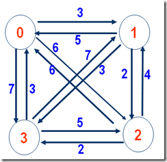
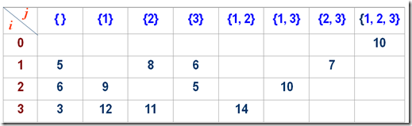
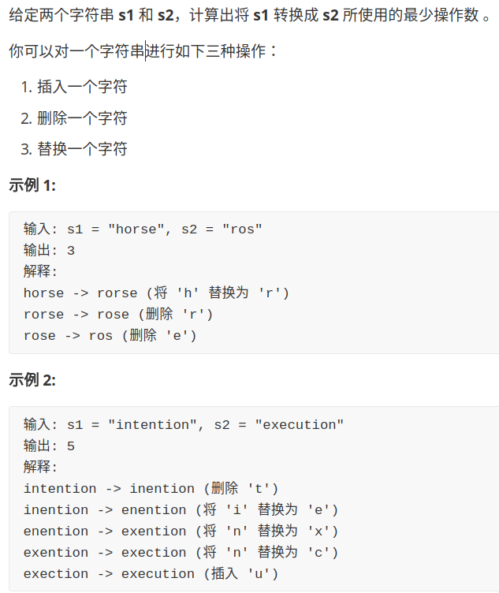

 暴力递归

1. 把问题转化为规模缩小了的同类问题的子问题
2. 有明确的不需要继续进行递归的条件(base case)
3. 有当得到了子问题的结果之后的决策过程
4. 不记录每一个子问题的解

### 动态规划

1. 从暴力递归中来
2. 将每一个子问题的解记录下来，**避免重复计算**
3. 把暴力递归的过程，抽象成了状态表达
4. 并且存在化简状态表达，使其更加简洁的可能


**题1**

```
打印字符串的全部子序列
```


**思路**

每个位置都有两个决策，打印以及不打印。当前位置传递给下一个位置时，都有两条路可以走，每一次递归的时候都走两条路。


**题2**

```
母牛每年生一只母牛， 新出生的母牛成长三年后也能每年生一只
母牛， 假设不会死。 求N年后， 母牛的数量
```


**思路**

列出前几年的牛出生的个数，然后找出规律。从上图中发现，从第5年开始当年母牛总的数量为$F(n)=F(n-1)+F(n-3)$

对上式的解释:因为牛不会死，所以今年的牛包含**去年的牛**以及**三年前在今年成熟的牛新生的牛**

**题目3**

```
给你一个二维数组， 二维数组中的每个数都是正数， 要求从左上角走到右下角， 每一步只能向右或者向下。 沿途经过的数字要累加起来。 返回最小的路径和。
```

**递归版本**


从上图我们可以知道，从(0,0)位置处有两条路径可以走，向右以及向下,那么计算(0,0)位置的最短路径就需要比较(0,1)以及(1,0)处的最小路径，计算(0,1)位置的最小路径又需要知道(0,2)以及(1,1)的最小路径，计算(1,0)位置又需要知道(1,1)以及(2,0)的最小路径,从图上我们可以看到(1,1)处重复计算了，这样的重复计算是很多的，所以暴力递归很消耗时间。

```python
def minweigthsum(array,i,j):
	#如果已经到了右下角了,那么返回
	if i== len(array)-1 and j== len(array[0])-1:
		return array[i][j]
	#如果在右边界上,那么只能往下走
	elif j==len(array[0])-1:
		return arra	y[i][j]+minweigthsum(array,i+1,j)
	#如果在最下边界，那么只能往右走了
	elif i==len(array)-1 :
		return array[i][j] + minweigthsum(array,i,j+1)
	#如果当前位置左右都能走
	else:
		right = minweigthsum(array,i,j+1)
		down = minweigthsum(array,i+1,j)
		return  array[i][j]+min(right,down)

if __name__ == '__main__':
    matrix =[[1,2,3,4],[5,6,7,8],[9,10,11,12],[13,14,15,16]]
    print(minweigthsum(matrix,0,0))
```

**改为动态规划**


转换步骤如下：

假如递归函数中可变参数是二维的,那么dp表就是一个二维的表，将递归改为动态规划

1. 首先要在dp表中找到需要求解的点如上图坐上角的点，然后确定递归函数中basecase，也就是右下角的点。
2. 根据递归函数确定dp表中不被依赖的位置,上图中的下边界和右边界
3. 回到递归中，分析一个普遍位置的依赖关系。


```python
def minweightsum2(array):
	if len(array) == 0 or len(array[0]) == 0:
		return 0
	rows = len(array)
	cols = len(array[0])
	# 构建一个dp二维表
	dp = [[0] * cols for i in range(rows)]
	# 首先将dp表中不被依赖的位置填好
	dp[rows - 1][cols - 1] = array[rows - 1][cols - 1]
	for i in range(rows - 1)[::-1]:
		dp[i][cols - 1] = array[i][cols - 1] + dp[i + 1][cols - 1]
	# 最下面一列
	for j in range(cols - 1)[::-1]:
		dp[rows - 1][j] = array[rows - 1][j] + dp[rows - 1][j + 1]
	#对于普遍位置
	for i in range(rows-1)[::-1]:
		for j in range(cols-1)[::-1]:
			dp[i][j]=array[i][j] + min(dp[i+1][j],dp[i][j+1])
	return  dp[0][0]
```


**题目4**

```
给你一个数组arr， 和一个整数aim。 如果可以任意选择arr中的数字， 能不能累加得到aim， 返回true或者false
```

**递归版本**


对于数组中任意一个位置，去往下个位置都有两种选择，累加当前位置数字以及不累加当前数字，若当前位置已经在终止位置的时候，若出现过累加和等于aim,那么返回True,否则返回False

```python
def isSum(array,i,sum,aim):
	if len(array)==0 or aim is None:
		return False
	length = len(array)
    ##basecase
	if i==length:
		return sum==aim
	return  isSum(array,i+1,sum,aim) or isSum(array,i+1,sum+array[i],aim)

```

**改为动态规划**


从递归函数中我们可以知道，在终止位置时候只有sum==aim才会返回True，其它都是False,最后一行的我们可以填充进去值，然后对于图中的**普遍位置L**，从递归函数中可以清楚L依赖两个位置的结果,(i+1,sum)以及(i+1,sum+array[i])处的状态.·`dp[i][j]`表示i位置之前的数能否累加到j

```python
def isSum(array, aim):
    if len(array) == 0 or aim is None:
        return False
    # 创建一个二维表
    #累加和肯定不会大于array中所有数相加
    array_sum = sum(array)
    length = len(array)
    dp = [[False] * (array_sum+1) for i in range(length + 1)]
    dp[length][aim] = True
    for i in range(length)[::-1]:
        for j in range(array_sum+1)[:-1]:
            dp[i][j] = dp[i + 1][j]
            if j + array[i] <= aim:
                dp[i][j] = dp[i + 1][j] | dp[i + 1][j + array[i]]
    return dp[0][0]

```


**题目5**

```
给定两个数组w和v， 两个数组长度相等， w[i]表示第i件商品的重量， v[i]表示第i件商品的价值。 再给定一个整数bag，要求你挑选商品的重量加起来一定不能超 过bag，返回满足这个条件下,你能获得的最大价值。
```

**递归版本**

```python
def maxValue(weight, value, i, now, bag):
    """
    weight重量数组
    value数组
    i当前位置
    now当前已有的重量
    边界条件bag
    """
    # basecase
    if now > bag:
        return -99999
    length = len(weight)
    now > bag
    if i == length:
        return 0
    return max(maxValue(weight, value, i + 1, now, bag), (value[i] + maxValue(weight, value, i + 1, now + weight[i], bag)))

```

**动态规划**

```python
def maxValue2(weight, value, bag):
    rows = len(weight)
    cols = sum(weight)
    dp = [[0] * cols for i in range(rows + 1)]
    # 当i==rows或者j==cols
    for i in range(rows)[::-1]:
        for j in range(cols)[::-1]:
            dp[i][j] = dp[i + 1][j]
            if j + weight[i] <= bag:
                dp[i][j] = max(dp[i + 1][j], value[i] +
                               dp[i + 1][j + weight[i]])
    return dp[0][0]


# 0-1背包问题
def beibao(weight,value,bag):
	if bag==0:
		return 0
	total_weight = sum(weight)
	row= len(value)
	dp=[[0]*(total_weight+1) for _ in range(row+1)]
	for i in range(row+1):
		dp[i][0]=0
	for i in range(1,row+1):
		for j in range(1,total_weight+1):
			dp[i][j] = dp[i-1][j]
			if j>=weight[i-1]:
				dp[i][j] = max(dp[i-1][j],dp[i-1][j-weight[i-1]]+value[i-1])
	return  dp[row][bag]
```


**题目**

```
给定一个整数n,求以1,2,3...n为节点组成的二叉搜索树(BST)有几种
```

```

输入: 3
输出: 5
解释:
给定 n = 3, 一共有 5 种不同结构的二叉搜索树:

   1         3     3      2      1
    \       /     /      / \      \
     3     2     1      1   3      2
    /     /       \                 \
   2     1         2                 3

```

**递归思路**

如果n==0 或者n==1，那么返回的以0或者1为根节点构成的二叉搜索树的个数为1，现在我们定义一个函数$f(n)$，n表示以n为输入的能构成的二叉搜索树的个数，那么根的左边有$i-1$个数，根的右边有$n-i$个数，那么左边的二叉树的个数为$f(i-1)$,右边二叉树的个数为$f(n-i)$,那么以n为根节点的树个数为$f(i-1)*f(n-i)$.
$$
f(0)=1 \\
f(1)=1 \\
f(n) =\sum_{i=1}^{n}{f(i-1)*f(n-i)}
$$

```python
def numTrees( n):
	"""
	:type n: int
	:rtype: int
	"""
	if n == 0 or n == 1:
		return 1
	res = 0

	for j in range(1, n + 1):
		res += numTrees(j - 1) * numTrees(n - j)

	return res

def numTrees1(n):
	dp = [0 for i in range(n+1)]
	dp[0]=1
	dp[1] = 1
	for i in range(2,n+1):
		for j in range(1,i+1):
			dp[i] += dp[j-1]*dp[i-j]
	return  dp[-1]

```


考虑根的范围$(1<=i<=n)$,假设当前根为$i$,那么根左边有$i-1$个数，根右边有$n-i$个数，那么左子树个数为$f(i-1)$,右子树个数为$f(n-i)$,那么此时以$i$为根节点的数有$f(n-i)*f(i-1)$


**题目**

```
将一个二维数组排列成金字塔的形状，找到一条从塔顶到塔底的路径，使路径上的所有点的和最小，从上一层到下一层只能挑相邻的两个点中的一个
输入数组如下所示
    [2],
    [3,4],
   [6,5,7],
  [4,1,8,3]
```

```python
## 暴力递归
def minweightsum(array,i,j):
	#如果到到达最后最后一行,那么就返回
	# rows = len(array)
	# cols = max([len(i) for i in array])
	if i == len(array)-1:
		return  array[i][j]
	#只能往下走以及往斜下方走
	res = array[i][j]
	return res+ min(minweightsum(array,i+1,j),minweightsum(array,i+1,j+1))


###动态规划
class Solution:
    def minimumTotal(self, triangle: List[List[int]]) -> int:
        if len(triangle) == 0:
            return
        length = len(triangle)
        max_col = len(triangle[-1])
        dp = [[0] * max_col for _ in range(length)]
        for i in range(max_col):
            dp[-1][i] = triangle[-1][i]
        for i in range(length-1)[::-1]:
            for j in range(i+1)[::-1]:
                dp[i][j] = triangle[i][j]+min(dp[i+1][j],dp[i+1][j+1])
        return dp[0][0]
        


```

**连续子数组的最大和**

```python
"""
构建一个一维的dp表,i表示i位置的最大连续子数组和
"""

def maxSubArray( nums: list) -> int:
	if len(nums) == 0 or nums is None:
		return 0
	length = len(nums)
	dp = [0]*length
	dp[0] = nums[0]
	for i in range(1, length):
		if dp[i - 1] >= 0:
			dp[i] = dp[i - 1] + nums[i]
		else:
			dp[i] = nums[i]
	return  max(dp)

```


**路径问题**

```python
"""
一个机器人位于一个 m x n 网格的左上角 （起始点在下图中标记为“Start” ）。

机器人每 

"""
def uniquePaths(m,n):
	#构建一个二维的dp表
	dp = [[0]*n for i in range(m)]
	dp[m-1][n-1]=1
    #最后一行只能往右边走
	for i in range(n):
		dp[m-1][i] = 1
    #最后一列只能往下走
	for j in range(m):
		dp[j][n-1]=1
	for i in range(m-1)[::-1]:
		for j in range(n-1)[::-1]:
			dp[i][j] = dp[i+1][j]+dp[i][j+1]
	return  dp[0][0]

```


**路径问题2**

```python

"""一个机器人位于一个 m x n 网格的左上角 （起始点在下图中标记为“Start” ）。

机器人每次只能向下或者向右移动一步。机器人试图达到网格的右下角（在下图中标记为“Finish”）。

现在考虑网格中有障碍物。那么从左上角到右下角将会有多少条不同的路径？


输入:
[
  [0,0,0],
  [0,1,0],
  [0,0,0]
]
输出: 2
解释:
3x3 网格的正中间有一个障碍物。
从左上角到右下角一共有 2 条不同的路径：
1. 向右 -> 向右 -> 向下 -> 向下
2. 向下 -> 向下 -> 向右 -> 向右


"""
def uniquePathsWithObstacles( obstacleGrid) -> int:
        rows = len(obstacleGrid)
        cols = len(obstacleGrid[0])
        dp = [[0] * cols for _ in range(rows)]
        if dp[0][0] == 1 or dp[rows - 1][cols - 1] == 1:
            return 0
        dp[0][0]=1
        #对第一行
        for i in range(cols):
            if obstacleGrid[0][i]!=1:
                dp[0][i]=1
            else:
                dp[0][i]=0
                break
        for j in range(rows):
            if obstacleGrid[j][0]!=1:
                dp[j][0]=1
            else:
                dp[j][0]=0
                break
        for i in range(1,rows):
            for j in range(1,cols):
                if obstacleGrid[i][j]!=1:
                    dp[i][j]=dp[i-1][j]+dp[i][j-1]
                else:
                    dp[i][j]=0
        return dp[rows-1][cols-1]
```

**跳跃游戏**

> 给定一个非负整数数组，你最初位于数组的第一个位置。
>
> 数组中的每个元素代表你在该位置可以跳跃的最大长度。
>
> 判断你是否能够到达最后一个位置。
>
> 示例 1:
>
> 输入: [2,3,1,1,4]
> 输出: true
> 解释: 从位置 0 到 1 跳 1 步, 然后跳 3 步到达最后一个位置。
> 示例 2:
>
> 输入: [3,2,1,0,4]
> 输出: false
> 解释: 无论怎样，你总会到达索引为 3 的位置。但该位置的最大跳跃长度是 0 ， 所以你永远不可能到达最后一个位置。
>
> 

**思路1**

用一个一维dp表来表示每个位置可达的状态，i位置表示i位置是否可达，如果i位置可达，那么之前所有的位置都可达，如果i位置不可达，那么i位置之后的位置肯定是不可达的。判断i位置是否可达，就需要判断之前位置上能否跳到该位置。时间复杂度o(n^2)

```python
class Solution:
	def canJump(self, nums: List[int]) -> bool:
		if len(nums) == 1:
			return True
		dp = [0] * len(nums)
		dp[0] = 1
		for i in range(1, len(nums)):
			#如果前一个位置可达，并且前一个位置能到当前位置，当前位置可达,如果当前位置都不可达，那么后面的位置一定不可达
			for j in range(i-1,-1,-1):
				if nums[j]+j>=i:
					dp[i]=1
					break
			#如果当前位置都不可达直接返回False
			if not dp[i]:
				return False
		return True

```

**思路2**

> 换一个思路，题目是问能否达到最后一个位置，那么我们就从最后一个位置开始判断，如果之前有个点a能跳到最后一个位置，那么问题就变成是否有个位置能跳到a点。因此如果最后的跳跃位置是从0开始的，那么就能跳到该位置，否则不能到该位置。只要遍历一遍数组就可以。时间复杂度o(n)

```Python
class Solution:
	def canJump(self, nums: List[int]) -> bool:
		n = len(nums)
		last_position = n - 1
		for i in range(n - 1, -1, -1):
			if (nums[i] + i) >= last_position:
				last_position = i
		return last_position == 0
```


**凑硬币问题**

> 给定不同面额的硬币 coins 和一个总金额 amount 总金额所需的最少的硬币个数。如果没有任何一种硬币组合能组成总金额，返回 `-1`。
>
> 输入: coins = [1, 2, 5], amount = 11
> 输出: 3 
> 解释: 11 = 5 + 5 + 1
> 
> 输入: coins = [2], amount = 3
> 输出: -1

*思路*

首先应该想暴力解如何求，首先如果选择面额为1的硬币，那么总金额为`amount-1`等于10，那么问题就变为金额为总金额10的应该用这些硬币怎么凑。这个问题可以用递归来解，首先画出递归树。


> 递归的终止条件：如果总金额为0了，那么就需要返回了，这里题目要求的是硬币的数量，如果总金额为0，那么任意面额的硬币都无法做到，因此返回0

```python
class Solution:
	def coinChange(self, coins: List[int], amount: int) -> int:
		if amount == 0:
			return 0
		res = float('inf')
		for coin in coins:
			if coin > amount:
				continue
			sub = self.coinChange(coins, amount - coin)
			if sub!=-1:
				res = min(res,sub+1)
		if res!=-1:
			return res
		return -1
```

**改为动态规划**

> 从递归树中，可以看到有很多地方都是重复计算的，所以可以使用剪枝来减少子问题的数量，或者使用自底向上的动态规划来求解。对于原问题需要求解如果使用这些面额来凑成总金额为11最少的硬币数，如果我们知道凑成10元的最少硬币数的话，如果从给定的面额中能凑出11的话那么我们也就知道答案了。因此我们可以从金额为1的开始，求解凑出1需要使用的最少硬币数。


```python
class Solution:
	def coinChange(self, coins: List[int], amount: int) -> int:
		dp = [0]*(amount+1)
		for i in range(1,amount+1):
			cost = float('inf')
			for coin in coins:
				if coin<=i:
					cost = min(cost,dp[i-coin]+1)
			dp[i]=cost

		if dp[amount]==float('inf'):
			return -1
		return dp[amount]
```


**最长上升子序列**

> 给定一个无序的整数数组，找到其中最长上升子序列的长度。
>
> 输入: [10,9,2,5,3,7,101,18]
> 输出: 4 
> 解释: 最长的上升子序列是 [2,3,7,101]，它的长度是 4。

**思路**

首先想暴力解如何解，对于给定的数组，我们可以枚举出所有的子序列，然后找到所有递增的子序列的最大值。枚举的时间复杂度为$O(2^n)$,同时找到所有递增的子序列的时间复杂度为$(n^2)$,因为递归过程中有大量重叠的子问题，以及不满足最优解的序列。我们可以使用动态规划来求解这个问题，设定一个一维的dp数组，每个位置表示以num[i]结尾的最长上升子序列的长度，遍历该之前的所有位置j，如果num[i]>num[j],那么$dp[i]=max(dp[i],dp[j]+1)$

返回max(dp),时间复杂度为$0(n^2)$

```Python
class Solution:
	def lengthOfLIS(self, nums: List[int]) -> int:
		if len(nums) == 0:
			return 0
		if len(nums) == 1:
			return 1
		dp = [0] * len(nums)
		dp[0] = 1
		for i in range(1, len(nums)):
			for j in range(i):
				if nums[i] > nums[j]:
					dp[i] = max(dp[i], dp[j] + 1)
			if dp[i]==0:
				dp[i]=1
		return max(dp)
```


**旅行商问题**

> TSP问题(旅行商问题)是指旅行家要旅行n个城市，要求各个城市经历且仅经历一次然后回到出发城市，并要求所走的路程最短。假设现在有四个城市，0,1,2,3,4。他们之间的代价如图一，可以存成二维表的形式

​                                  

> 思路：设s，s1,s2,s3...sp,s是从s出发然后回到s的一条路径长度最短的简单回路，假设从s到下一个城市s1的路径以及求出来了，然后问题就变为求子问题从s1出发回到s的最短路径了。
>
> 假设从顶点s出发，令$d(i,V')$表示从顶点i出来经过$V'$中各个顶点一次，最后回到出发点s的最短路径。
>
> - 当V‘为空集的时候,$d(i,V')$表示从i不经过任何点回到出发点的最短路径，此时$d(i,V')$就是城市i到出发点s之间的距离了。
>
> - 如果V'不空，那么就是对子问题的最优求解，必须在V'这个城市集合中每次尝试一个，并求出最优解。
>
>   $d(i,V') = min(c_{ik}+d(k,V'-{k}))$

**递归树**


     我们要求的最终结果是d(0,{1,2,3}),它表示，从城市0开始，经过{1,2,3}之中的城市并且只有一次，求出最短路径.
    ②d(0,{1,2,3})是不能一下子求出来的，那么他的值是怎么得出的呢？看上图的第二层，第二层表明了d(0,{1,2,3})所需依赖的值。那么得出：
    
       d(0,{1,2,3})=min  {
    
                                    C01+d(1,{2,3})
    
                                    C02+d{2,{1,3}}
    
                                    C03+d{3,{1,2}}
    
                                  }
    
     ③d(1,{2,3})，d(2,{1,3})，d(3,{1,2})同样也不是一步就能求出来的，它们的解一样需要有依赖，就比如说d(1,{2,3})
    
       d(1,{2,3})=min{
    
                              C12+d(2,{3})                             
    
                              C13+d(3,{2})
    
                              }
    
       d(2,{1,3})，d(3,{1,2})同样需要这么求。
    
    ④按照上面的思路，只有最后一层的，当当V’为空集时，Cis的值才可以求，它的值是直接从路径的邻接表求出来的。

**dp填表**




**编辑距离**



> 思路：对于两个字符串的动态规划，可以使用双指针的思路。指针$i$,$j$分别指向字符串的尾部。如何当前字符不相同，那么有三种操作可以进行。1.替换$i$指针处的字符，2.删除$i$指针处的字符，3.在i指针后插入j指针指向的字符。
>
> 对于这三种操作，$i$,$j$指针都有着不同的操作。使用dp(i,j)这个递归函数来表示将word1变为Word2需要的最少的操作步数。
>
> 	1. 替换$i$指针处的字符，dp(i-1,j-1)+1,此时，$i,j$指向相同的字符，$i,j$同时向前移动
>  	2. $i$字符后插入$j$字符的字符，j向前移动
>  	3. 删除i字符处的字符，i向前移动。
>
> 使用二维dp表来处理重叠子问题。`dp[i][j]`表示word1前i个字符和word2前j个字母之间的编辑距离.


```python
class Solution:
    #递归
	def minDistance(self, word1: str, word2: str) -> int:
		# 对于两个字符串的动态规划，可以考虑
		def dp(i, j):
			#如果第一个字符串走到底了，那么返回字符串2剩下的还没有处理的长度
			if i == -1:
				return j + 1
			if j == -1:
				return i + 1

			if word1[i]==word2[j]:
				return dp(i-1,j-1)
			else:
				return min(dp(i-1,j)+1,dp(i,j-1)+1,dp(i-1,j-1)+1)

		return  dp(len(word1)-1,len(word2)-1)

    
 ##动态规划
 class Solution:
	def minDistance(self, word1: str, word2: str) -> int:
		if len(word1)==0:
			return len(word2)
		if len(word2)==0:
			return len(word1)

		length1 = len(word1)+1
		length2 = len(word2)+1
		dp = [[0]*(length2) for _ in range(length1)]
		for i in range(length1):
			dp[i][0] =i
		for j in range(length2):
			dp[j][0] = j

		for i in range(1,length1):
			for j in range(1,length2):
				if word1[i-1]==word2[j-1]:
					dp[i][j] = dp[i-1][j-1]
				else:
					dp[i][j] = min(dp[i-1][j]+1,dp[i-1][j-1]+1,dp[i][j-1]+1)
		return dp[len(word1)][len(word2)]  
    
```


**交错字符串**

> 给定三个字符串s1,s2,s3，验证s3是否是由s1和s2交错组成的。
>
> ```
> 输入: s1 = "aabcc", s2 = "dbbca", s3 = "aadbbcbcac"
> 输出: true
> 
> 输入: s1 = "aabcc", s2 = "dbbca", s3 = "aadbbbaccc"
> 输出: false
> ```


> 思路： 使用`dp[i][j]`来表示s1的前$i$个字符以及s2的前$j$个字符能否构成s3的前$i+j$个字符。首先填第一行和第一列。
>
> 1. `dp[i][0]= s1[i-1]==s3[i-1] 并且dp[i-1][0]=True ` 如果s1的第i个字符和s3的第i个字符相等，并且s3的前i-1个字符能由s1的前i-1个字符构成.
> 2. `dp[0][j]= s2[j-1]==s3[j-1] 并且dp[0][j-1]=True ` 如果s2的第j个字符和s3的第j个字符相等，并且s3的前j-1个字符能由s2的前j-1个字符构成.
> 3. `dp[i][j]=True if  （dp[i-1][j] and s1[i-1]==s3[i+j-1]） 或者（dp[i][j-1] and s2[j-1]==s3[i+j-1]） ` 如果s2的第j个字符和s3的第j个字符相等，并且s3的前j-1个字符能由s2的前j-1个字符构成.
> 4. 最后我们要得的状态是`dp[len(s1)][len(s2)]`

```python
class Solution:
	def isInterleave(self, s1: str, s2: str, s3: str) -> bool:
		length1 = len(s1)
		length2 = len(s2)
		length3 = len(s3)
		if length1 + length2 != length3:
			return False
		# dp[i][j]表示s1的前i个字符和s2的前j个字符能否构成s3的前i+j个字符
		dp = [[False] * (length2 + 1) for _ in range(length1 + 1)]
		dp[0][0] = True
		for i in range(1,length1+1):
			if s1[i-1]==s3[i-1] and dp[i-1][0]:
				dp[i][0] = True
		for j in range(1,length2+1):
			if s2[j-1]==s3[j-1] and dp[0][j-1]:
				dp[0][j]=True
		for i in range(1,length1+1):
			for j in range(1,length2+1):
				dp[i][j] = (dp[i-1][j] and (s1[i-1]==s3[i+j-1])) or (dp[i][j-1] and (s2[j-1]==s3[i+j-1]))

		return dp[length1][length2]
```

**不同的子序列**

```python
给定一个字符串 S 和一个字符串 T，计算在 S 的子序列中 T 出现的个数。

一个字符串的一个子序列是指，通过删除一些（也可以不删除）字符且不干扰剩余字符相对位置所组成的新字符串。（例如，"ACE" 是 "ABCDE" 的一个子序列，而 "AEC" 不是）

示例 1:

输入: S = "rabbbit", T = "rabbit"
输出: 3
解释:

如下图所示, 有 3 种可以从 S 中得到 "rabbit" 的方案。
(上箭头符号 ^ 表示选取的字母)

rabbbit
^^^^ ^^
rabbbit
^^ ^^^^
rabbbit
^^^ ^^^
```

> 暴力思路，枚举出s的所有子序列，然后统计在子序列中T出现的次数。

```python
class Solution:
	def numDistinct(self, s: str, t: str) -> int:
		res =[]
		self.series(s, 0, '', res)
		return  res.count(t)

	def series(self, s, index, cur, res):
		if index == len(s):
			res.append(cur)
			return
		return self.series(s, index + 1, cur, res) or self.series(s, index + 1, cur + s[index],res)
```

> 思路2：动态规划，因为是要求T在s的子序列中出现的次数，而s的子序列就是s的子集，所以我们要求的也就是T等同于s的那些子集，而s的子集的求法是s的每一个位置选择或者不选择。那我们就希望知道选择了s的那些位置可以组成T，因此我们可以将任务进行分解，如果我们知道了T的前i-1个字符可以由S的那些位置匹配的次数，我们就可以知道前i个字符由s的那些位置构成。
>
> 
>
> 使用`dp[i][j]`表示T中前i个字符可以由s前j个字符匹配上的次数。
>
> - if `T[i]=s[j]`，`dp[i][j]=dp[i-1][j-1]+dp[i][j-1]`
> - if `T[i]!=s[j]`,`dp[i][j]=dp[i][j-1]`

```python
class Solution:
	def numDistinct(self, s: str, t: str) -> int:
		length1 = len(s)
		length2 = len(t)
		dp=[[0]*(length1+1) for _ in range(length2+1)]
		dp[0][0]=1
		for i in range(1,length1+1):
			dp[0][i]=1
		for i in range(1,length2+1):
			for j in range(1,length1+1):
				if t[i-1]==s[j-1]:
					dp[i][j]=dp[i][j-1]+dp[i-1][j-1]
				else:
					dp[i][j]=dp[i][j-1]

		return dp[length2][length1]

if __name__=='__main__':
	s= Solution()
	print(s.numDistinct('rabbbit','rabbit'))
```

**最长的有效括号**

> 给定一个只包含 '(' 和 ')' 的字符串，找出最长的包含有效括号的子串的长度。
>
> 示例 1:
>
> 输入: "(()"
> 输出: 2
> 解释: 最长有效括号子串为 "()"
> 示例 2:
>
> 输入: ")()())"
> 输出: 4
> 解释: 最长有效括号子串为 "()()"

> 思路:
>
> 使用一维dp,每个位置表示以当前字符结尾的最长的有效括号长度。
>
> 分类讨论：
>
> 1. 如果当前字符为')':
>    1. 如果s[i-1]=='(':那么dp[i] = dp[i-2]+2
>    2. 否则如果s[i-1]==')' 并且 i-dp[i-1]-1>=0 并且s[i-dp[i-1]-1]=='(',那么dp[i] = dp[i-1]+2+dp[i-dp[i-1]-2]

```python
class Solution:
	def longestValidParentheses(self, s: str) -> int:
		if len(s)==1 or s is None:
			return 0
		length = len(s)
		dp =[0]*length
		helper =[]
		valid_str = {'(':')'}
		for i in range(length):
			if i>0 and s[i]==')':
				if s[i-1]=='(':
					dp[i] = dp[i-2]+2
				elif s[i-1]==')' and i-dp[i-1]-1>=0 and s[i-dp[i-1]-1]=='(':
					dp[i] = dp[i-1]+2 +dp[i-dp[i-1]-2]
		return max(dp)

```