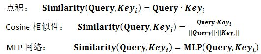
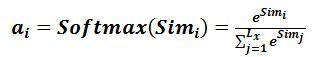
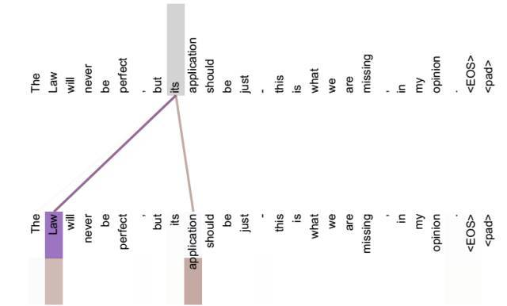

### Attention机制的本质思想

我们可以将Source语句中的每个元素抽象成一个个<key,value>对,此时给定Target中某个Query,Query依次和每个key计算相似性,得到了每个key对应的value的权重系数，然后对value进行加权求和，作为当前Query的attention数值。所以本质上Attenion机制是对Ｓource中value进行加权求和,Query和Key是用来计算权重系数的,在机器翻译中,key和value指的是相同的东西。

对Attention的计算过程可以抽象为两个阶段,一、根据key和query来计算相似性,二、对value进行加权求求和

在第一个阶段，可以引入不同的函数和计算机制，根据Query和某个Key_i，计算两者的相似性或者相关性，最常见的方法包括：求两者的向量点积、求两者的向量Cosine相似性或者通过再引入额外的神经网络来求值，即如下方式

第一阶段产生的分值根据具体产生的方法不同其数值取值范围也不一样，第二阶段引入类似SoftMax的计算方式对第一阶段的得分进行数值转换，一方面可以进行归一化，将原始计算分值整理成所有元素权重之和为1的概率分布；另一方面也可以通过SoftMax的内在机制更加突出重要元素的权重。即一般采用如下公式计算：

第二阶段的计算结果a_i即为value_i对应的权重系数，然后进行加权求和即可得到Attention数值：

### Self Attention

Self Attention 被称为内部attention,在一般的Encoder-Decoder框架中，输入Source和源Target内容是不一样的，比如中英翻译，attention发生在Target中的query和Source中所有元素之间，而self-attention就不是Source和Ｔarget之间的attention,而是source之间或Target之间的attention机制了。

从上图中我们看到通过self-attention，捕获了句子中的一些语义信息，比如its的指代对象Law,很明显通过引入self-attention后更加容易捕获句子中长距离的相互依赖的特征了。如果时rnn或者LSTM需要依次计算，对于远距离的相互依赖的特征，那么就要经过若干步的累加才能将两者联系起来，而距离越远，由于存在梯度消失的现象那么捕获的可能性也就越小了。但是self-attention会将句子中任意两个单词通过一个计算步骤就联系在一起了，所以远距离依赖的特征之间的距离就被缩短了，也就能比较好利用这些特征。

