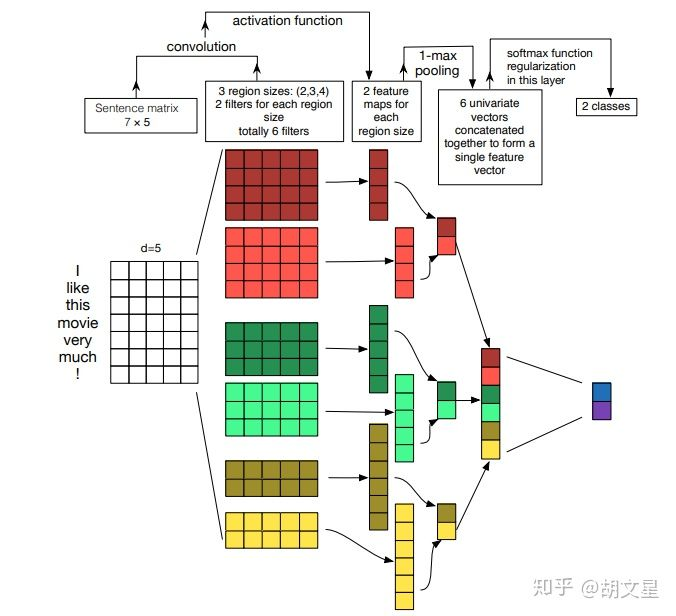
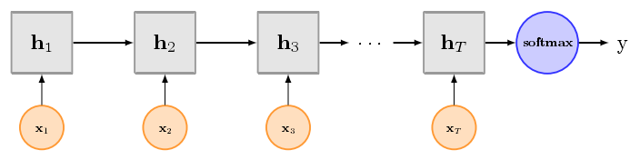
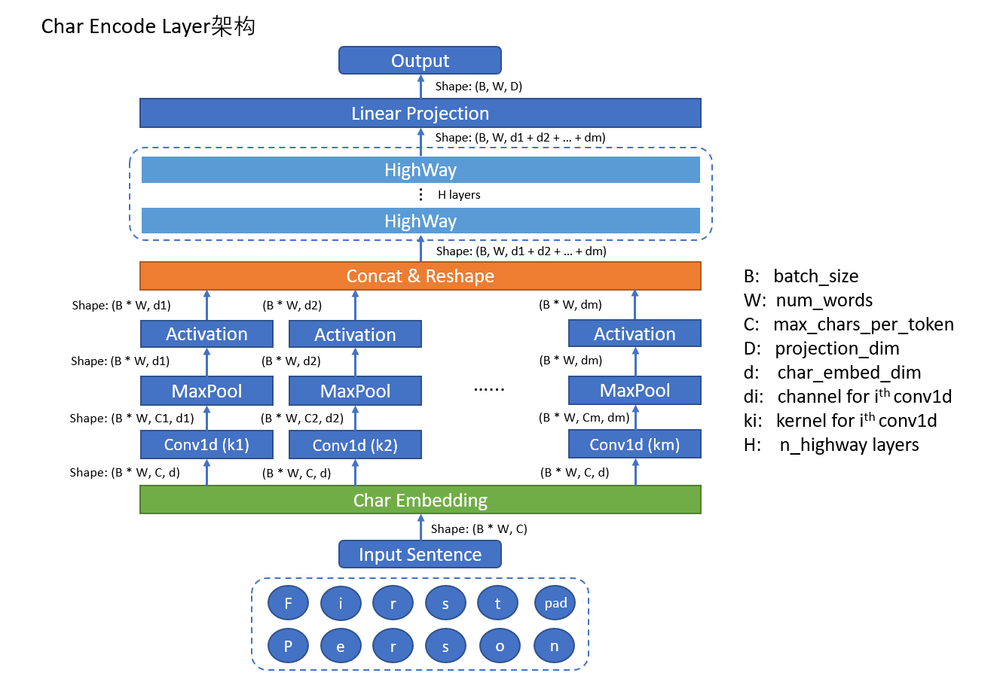
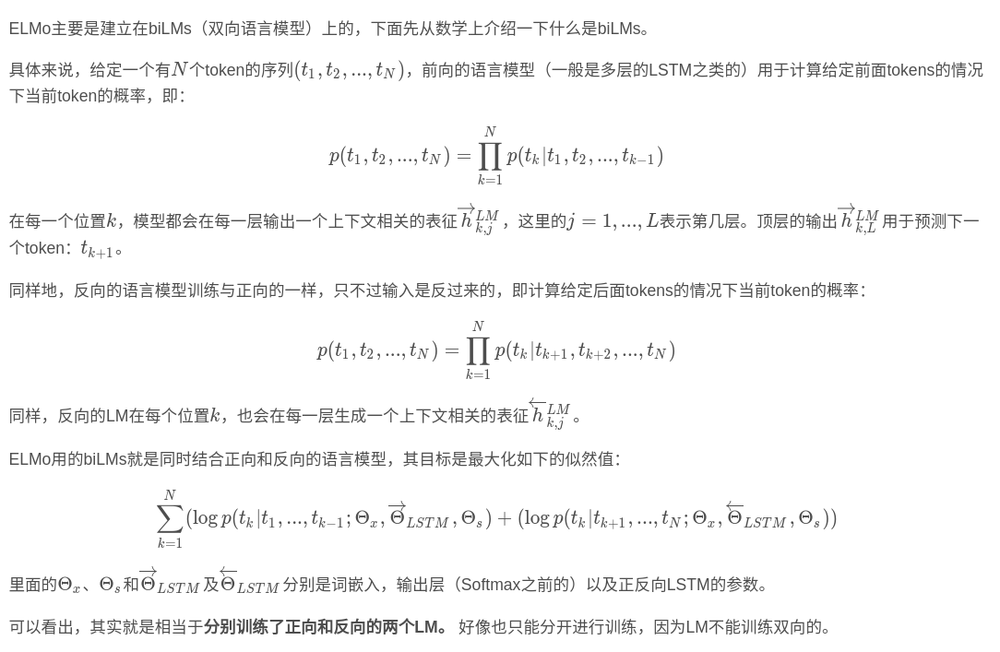

# FastText

fasttext的词向量其实也是衍生物，word2vec中对每一个单词都生成一个词向量，但是对于apple,apples，这种有较多公共字符，本质上相似的词，word2vec因为将其转换为不同的id而丢失了这种信息.

为了克服这种问题，fasttext使用字符级的n-gram来表示一个单词.对于'apple',其表示如下:

$"<ap","app","ppl","ple","le>"$

其中，<表示前缀，>表示后缀。于是，我们可以用这些trigram来表示“apple”这个单词，进一步，我们可以用这5个trigram的向量叠加来表示“apple”的词向量。

**使用字符级的n-graｍ表示一个单词的好处如下**:

1. 对于低频词生成的词向量效果会更好，因为他们的n-gram可以和其它词共享

2. 对于训练词之外的单词,仍然可以构建他们的词向量，我们可以在词汇表中找到他们的n-gram组成

对于第一点，低频词因为在语料中出现的次数较少，因此在给定当前词w，背景词出现在ｗ上下文窗口中的概率就比较小，因此在训练的过程中其对应的词向量学习就不太好。但是如果使用n-gram，因为一个单词最后的表示是其n-gram的累加,低频次的n-gram也很大可能时其它词的n-graｍ,也就是可以和其它词共享.

**注意**:对没一个单词计算其n-graｍ,然后送入embedding层去学习词向量是什么消耗内存的，因为n-gram出来的字符是在太多,因此原作者为了节省内存空间，将n-gram进行hash，hash到同一个位置的n-gram共享同一个词向量.

第二点就比较好理解了，在词汇表比较大的情况下,未登录词的n-gram总是可以在词汇表中找到的.


##　模型架构

    

注意：此架构图没有展示词向量的训练过程。可以看到，和CBOW一样，fastText模型也只有三层：输入层、隐含层、输出层（Hierarchical Softmax），输入都是多个经向量表示的单词，输出都是一个特定的target，隐含层都是对多个词向量的叠加平均。不同的是，CBOW的输入是目标单词的上下文，fastText的输入是多个单词及其n-gram特征，这些特征用来表示单个文档；CBOW的输入单词被onehot编码过，fastText的输入特征是被embedding过；CBOW的输出是目标词汇，fastText的输出是文档对应的类标。


##　模型数据流向

1. 用哈希算法将2-gram、３-gram信息进行映射
2. 模型输入[batch_size,seq_len]
3. embedding层:随机初始化,词向量维度为embed_size,2-gram,3-gram维度同样为embed_size
    1. word :[batch_size,seq_len,embed_size]
    2. 2-gram:[batch_size,seq_len,embed_size]
    3. 3-gram:[batch_size,seq_len,embed_size]
4. 求所有seq_len个词的均值 []batch_size,embed_size]
5. 全连接层＋softmax归一化

注意:对于N-Gram，我们设定一个词表，词表大小自己定，当然越大效果越好，但是你得结合实际情况，对于2-Gram，5000个字(字表大小)的两两组合有多少种你算算，3-Gram的组合有多少种，组合太多了，词表设大效果是好了，但是机器它受不了啊。
所以N-Gram词表大小的设定是要适中的，那么适中的词表就放不下所有N-Gram了，不同的N-Gram用哈希算法可能会映射到词表同一位置，这确实是个弊端，但是问题不大：5000个字不可能每两个字都两两组合出现，很多两个字是永远不会组成2-Gram的，所以真正出现的N-Gram不会特别多，映射到同一词表位置的N-Gram也就不多了。


###　模型结构

```python
import torch
import torch.nn as nn
import torch.nn.functional as F


##fasttext 模型结构

class FastText(nn.Module):
	def __init__(self, n_vocab, embed_dim, hidden_size, n_class):
		super(FastText, self).__init__()
		self.n_vacab = n_vocab
		self.embed_dim = embed_dim
		self.n_class = n_class
		self.hidden_size = hidden_size
		# padding_idx=0表示将填充为０的id全部初始化为0
		self.Embedding = nn.Embedding(self.n_vacab, self.embed_dim, padding_idx=0)
		self.fc1 = nn.Linear(in_features=self.embed_dim, out_features=self.hidden_size)
		self.fc2 = nn.Linear(in_features=self.hidden_size,out_features=self.n_class)


	def forward(self, x):
		out= self.Embedding(x) ## [seq_len,batch_size,embed_dim]
		out = torch.mean(out,dim=0) ## [batch_size,embed_dim]
		out = self.fc1(out)
		out = F.relu(out)
		out = self.fc1(out)
		return out
```

# TextCNN

##  1.嵌入层

textcnn使用预先训练好的词向量作embedding layer。对于数据集里的所有词，因为每个词都可以表征成一个向量，因此我们可以得到一个嵌入矩阵M, M里的每一行都是词向量。这个M可以是静态(static)的，也就是固定不变。可以是非静态(non-static)的，也就是可以根据反向传播更新.

## 2. 卷积池化层

输入一个句子，首先对这个句子进行切词，假设有$s$个单词。对每个词根据嵌入矩阵M, 可以得到词向量。假设词向量一共有$d$维。那么对于这个句子，便可以得到s行d列的矩阵$A \in R^{s*d}$




从上图看,对输入句子embedding后的矩阵进行卷积以及池化操作,步骤如下

数据处理：所有句子padding成一个长度：seq_len

1.模型输入：
**[batch_size, seq_len]**

2.经过embedding层：加载预训练词向量或者随机初始化, 词向量维度为embed_size：
**[batch_size, seq_len, embed_size]**

3.卷积层：NLP中卷积核宽度与embed-size相同，相当于一维卷积。
3个尺寸的卷积核：(2, 3, 4)，每个尺寸的卷积核有100个。卷积后得到三个特征图：**[batch_size, 100, seq_len-1,1]**
**[batch_size, 100,** **seq_len-2,1]**
**[batch_size, 100,** **seq_len-3,1]**

4.池化层：对三个特征图做最大池化
**[batch_size, 100,1]**
**[batch_size, 100,1]**
**[batch_size, 100,1]**

5.拼接：
**[batch_size, 300]**

6.全连接：num_class是预测的类别数
**[batch_size, num_class]**

7.预测：softmax归一化，将num_class个数中最大的数对应的类作为最终预测
**[batch_size, 1]**

**分析：**
卷积操作相当于提取了句中的2-gram，3-gram，4-gram信息，多个卷积是为了提取多种特征，最大池化将提取到最重要的信息保留

```python
import torch
import torch.nn as nn
import torch.nn.functional as F

##fasttext 模型结构
class TextCNN(nn.Module):
	def __init__(self,n_vocab,embed_dim,n_class):
		super(TextCNN,self).__init__()
		self.n_vocal = n_vocab
		self.embed_dim = embed_dim
		self.n_class = n_class


		self.Embedding = nn.Embedding(self.n_vocal,self.embed_dim,padding_idx=0)
		##设置固定的100个卷积核
		self.conv1 = nn.Conv2d(1,100,(2,self.embed_dim),stride=1)
		self.conv2 = nn.Conv2d(1,100,(3,self.embed_dim),stride=1)
		self.conv3 = nn.Conv2d(1,100,(4,self.embed_dim),stride=1)
		self.dropout = nn.Dropout(p=0.5)
		self.fc =nn.Linear(100*3,self.n_class)


	def conv_and_pool(self,x,conv):
		#x= [batch_size,1,h,w]
		x = conv(x) ##[batch_size,kernel_num,h_out,1]
		x = F.relu(x.squeeze(3))
		x = F.max_pool1d(x,x.size(2)) ##[batch_size,kernel_num,1]
		x = x.squeeze(3) ##[batch_size,kernel_num]
		return x

	def forward(self,x):
		# x:[batch_size,max_length]
		out = self.Embedding(x) #[batch_size,max_length,embed_dim]
		out = out.unsqueeze(1) #[batch_size,1,max_length,embed_dim]
		x1 = self.conv_and_pool(out,self.conv1) #[batch_size,kernel_num]
		x2 = self.conv_and_pool(out,self.conv2) #[batch_size,kernel_num]
		x3 = self.conv_and_pool(out,self.conv3) #[batch_size,kernel_num]
		out = torch.cat([x1,x2,x3],dim=1) #[batch_size,kernel_num*3]
		out = self.dropout(out)
		out = self.fc(out) #[batch_size,num_class]
		out = F.log_softmax(out,dim=1) #[batch_size]
		return  out

```


# TextRNN




textRNN和普通的rnn没有什么不同，只不过将cell换成了双向LSTM，其结构为多对一的结构，在进行分类任务的时候取出最后一个隐藏层的状态送入最后的全连接层进行分类。

数据处理：所有句子padding成相同的长度

1. 模型输入:[batch_size,max_length]

2. 经过embedding层：加载预训练词向量或者随机初始化, 词向量维度为embed_size：

    **[batch_size,max_length,embed_dim]**

3. 双向LSTM：隐层大小为hidden_size，得到所有时刻的隐层状态(前向隐层和后向隐层拼接)

    **[batch_size,max_length,hidden_size*2]**

4. 拿出最后时刻的隐层值：
    **[batch_size, hidden_size \* 2]**

5. 全连接层：num_class是预测的类别数

6. 预测：softmax归一化，将num_class个数中最大的数对应的类作为最终预测
    **[batch_size, 1]**

分析：
LSTM能更好的捕捉长距离语义关系，但是由于其递归结构，不能并行计算，速度慢。

```python
#!/usr/bin/env python
# -*- coding: utf-8 -*-

# @Time : 2019/5/22 下午2:24
# @Author : Ethan
# @Site :
# @File : demo1.py
# @Software: PyCharm

import torch
import torch.nn as nn
import torch.nn.functional as F


##fasttext 模型结构

class TextRNN(nn.Module):
	def __init__(self,n_vocab,embed_dim,hidden_size,n_class):
		super(TextRNN,self).__init__()

		self.n_vocab = n_vocab
		self.embed_dim = embed_dim
		self.hidden_size = hidden_size
		self.n_class = n_class
		self.Embedding = nn.Embedding(self.n_vocab,self.embed_dim,padding_idx=0)
		self.lstm = nn.LSTM(input_size=self.embed_dim,hidden_size=self.hidden_size,num_layers=1,bidirectional=True,batch_first=True)
		self.fc = nn.Linear(self.hidden_size*2,self.n_class)

	def forward(self, x):
		##x [batch_size,max_length]
		out = self.Embedding(x) #[batch_size,max_length,embed_dim]
		out,(h,c) = self.lstm(out) #[batch_size,max_length,hidden_size]
		out = self.fc(out[:,-1,:]) #取出最后一个隐藏层的状态
		return  out

```


  

# ELMO

## 1. elmo整体架构

    

输入维度为[batch_size,seq_len,max_ characters_per_token],其中`max_characters_per_token`表示每个单词最大字符数，paper中使用固定的50,

**数据流向**

1. char Encoder Layer,因为elmo是基于char级别进行编码的，所以会对一个单词的所有char进行embedding得到一个表示，因此一个单词经过char encoder　Layer进行编码后其形状为[batch_size,seq_len,embed_dim]

2. 然后将char encoder layer的输出通过biLSTM层得到[L+1,batch_size,seq_len,2*embed_dim]
3. scalar mixer ,在得到lstm各个层的表征后会经过一个混合层,它会将前面这些层的表示进行线性融合，得到最终的ELMO向量,输出为[batch_size,seq_len,2*embed_dim]

## 2.字符编码层

输入维度为[batch_size,max_len,max_ characters_per_token],输出为[batch_size,max_len,embed_dim]



因为是对所有的char进行编码,所以首先会先将input reshap成[batch_size*seq_len,C],然后通过char Embedding成，每个char被编码为d维的向量

1. char Embedding层，对char进行编码,char词表的大小大概为262,其中0-255，实际上所有char的词表大概是262，其中0-255是char的unicode编码，256-261这6个分别是`<bow>`（单词的开始）、`<eow>`（单词的结束）、 `<bos>`（句子的开始）、`<eos>`（句子的结束）、`<pow>`（单词补齐符）和`<pos>`（句子补齐符）
2. 这里用的是不同scale的卷积层，注意是在宽度上扩展，而不是深度上，即输入都是一样的，卷积之间的不同在于其kernel_size和channel_size的大小不同，用于捕捉不同n-grams之间的信息，这点其实是仿照 TextCNN 的模型结构。假设有m个这样的卷积层，其kernel_size从  k1, k2, ..., km，比如1,2,3,4,5,6,7这种，其channel_size从 d1,d2,...,dm ，比如32,64,128,256,512,1024这种。注意：这里的卷积都是1维卷积，即只在序列长度上做卷积。与图像中的处理类似，在卷积之后，会经过MaxPooling进行池化，这里的目的主要在于经过前面卷积出的序列长度往往不一致，后期没办法进行合并，所以这里在序列维度上进行MaxPooling，其实就是取一个单词中最大的那个char的表示作为整个单词的表示。最后再经过激活层，这一步就算结束了。根据不同的channel_size的大小，这一步的输出维度分别为BW∗d1,BW∗d2,...,BW∗dm
3. concat层:上一层得到的是m个不同维度的矩阵,为了后期方便的处理，在最后一维上进行拼接然后reshape成[batch_size,seq_len,d1+d2+..+dm]
4. Highway层:Highway（参见：https://arxiv.org/abs/1505.00387 ）是仿照图像中residual的做法，在NLP领域中常有应用，看代码里面的实现，这一层实现的公式见下面：其实就是一种全连接+残差的实现方式，只不过这里还需要一个element-wise的gate矩阵对$x$和$f(A(x))$进行变换。这里需要经过H层这样的Highway层，输出维度仍为$B∗W∗(d1+d2+...+dm)$ 。
5. Linear层,经过前面的计算,得到的维度$d1+d2+d3+..+dm$其维度往往比较长,这里通过一个Linear层进行映射将其维度映射为D,这一层的输出为[batch_size,seq_len,embed_dim]


## blstm




**BiLSTM架构图**


$h$为LSTM隐藏层的`hidden_size`,可能比较大,比如Ｄ=512,h=4096这种,因此在每一层结束后需要一个线性层来将维度映射回去而后再输入到下一层中。最后的输出是将每一层的所有输出以及embedding的输出，进行stack，每一层的输出里面又是对每个timestep的正向和反向的输出进行concat，因而最后的输出维度为(L+1)∗B∗W∗2D ，这里的 L+1 中的 +1 就代表着那一层embedding输出，其会复制成两份，以与biLMs每层的输出维度保持一致。

