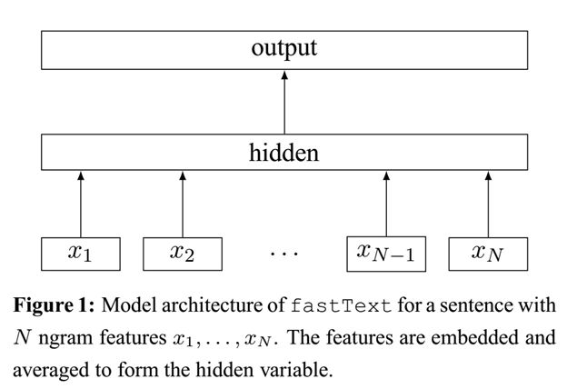

# FastText 

fasttext的词向量其实也是衍生物，word2vec中对每一个单词都生成一个词向量，但是对于apple,apples，这种有较多公共字符，本质上相似的词，word2vec因为将其转换为不同的id而丢失了这种信息.

为了克服这种问题，fasttext使用字符级的n-gram来表示一个单词.对于'apple',其表示如下:

$"<ap","app","ppl","ple","le>"$

其中，<表示前缀，>表示后缀。于是，我们可以用这些trigram来表示“apple”这个单词，进一步，我们可以用这5个trigram的向量叠加来表示“apple”的词向量。

**使用字符级的n-graｍ表示一个单词的好处如下**:

1. 对于低频词生成的词向量效果会更好，因为他们的n-gram可以和其它词共享

2. 对于训练词之外的单词,仍然可以构建他们的词向量，我们可以在词汇表中找到他们的n-gram组成

对于第一点，低频词因为在语料中出现的次数较少，因此在给定当前词w，背景词出现在ｗ上下文窗口中的概率就比较小，因此在训练的过程中其对应的词向量学习就不太好。但是如果使用n-gram，因为一个单词最后的表示是其n-gram的累加,低频次的n-gram也很大可能时其它词的n-graｍ,也就是可以和其它词共享.

**注意**:对没一个单词计算其n-graｍ,然后送入embedding层去学习词向量是什么消耗内存的，因为n-gram出来的字符是在太多,因此原作者为了节省内存空间，将n-gram进行hash，hash到同一个位置的n-gram共享同一个词向量.

第二点就比较好理解了，在词汇表比较大的情况下,未登录词的n-gram总是可以在词汇表中找到的.

##　模型架构

    

注意：此架构图没有展示词向量的训练过程。可以看到，和CBOW一样，fastText模型也只有三层：输入层、隐含层、输出层（Hierarchical Softmax），输入都是多个经向量表示的单词，输出都是一个特定的target，隐含层都是对多个词向量的叠加平均。不同的是，CBOW的输入是目标单词的上下文，fastText的输入是多个单词及其n-gram特征，这些特征用来表示单个文档；CBOW的输入单词被onehot编码过，fastText的输入特征是被embedding过；CBOW的输出是目标词汇，fastText的输出是文档对应的类标。

  