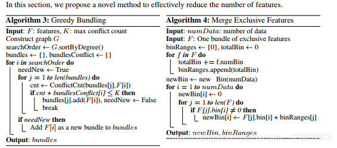
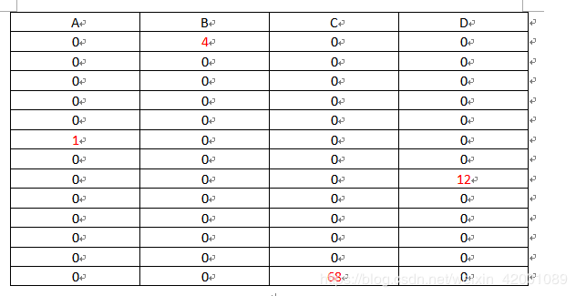

# Lightgbm

### Introduction

GBDT因为其的有效性、准确性、可解释性，成为了广泛使用的机器学习算法。GBDT在许多机器学习任务上取得了最好的效果（ state-of-the-art），例如多分类，点击预测，排序。但最近几年随着大数据的爆发（特征量和数据量），GBDT面临平衡准确率和效率的调整。

GBDT缺点：**对于每一个特征的每一个分裂点，都需要遍历全部数据来计算信息增益。因此，其计算复杂度将受到特征数量和数据量双重影响，造成处理大数据时十分耗时。**

解决这个问题的直接方法就是减少特征量和数据量而且不影响精确度，有部分工作根据数据权重采样来加速booisting的过程，但由于gbdt没有样本权重不能应用。而本文提出两种新方法实现此目标。

**Gradient-based One-Side Sampling (GOSS)**：GBDT虽然没有数据权重，但每个数据实例有不同的梯度，根据计算信息增益的定义，梯度大的实例对信息增益有更大的影响，因此在下采样时，我们应该尽量保留梯度大的样本（预先设定阈值，或者最高百分位间），随机去掉梯度小的样本。我们证明此措施在相同的采样率下比随机采样获得更准确的结果，尤其是在信息增益范围较大时。（样本的一阶梯度越大，说明其离最优解还比较远，这部分的增样本还没有训练好，因此这部分的样本应该要被保留下来）

**Exclusive Feature Bundling (EFB)**：通常真是应用中，虽然特征量比较多，但是由于特征空间十分稀疏，是否可以设计一种无损的方法来减少有效特征呢？特别在稀疏特征空间上，许多特征几乎是互斥的（例如许多特征不会同时为非零值，像one-hot），我们可以捆绑互斥的特征。最后，我们将捆绑问题归约到图着色问题，通过贪心算法求得近似


#### GOSS


goss对应的是上图中的算法２,其中a表示对大梯度样本的采样率，b是对小梯度样本的采样率.首先按照一阶梯度(实际上是按照一阶梯度以及二阶梯度的乘积)对样本进行排序,然后取前topN作为大梯度样本集合topSet（topN的个数是通过a确定的）,然后在剩下的里面随机抽取（RandomPick为随机抽取算法）randN个作为小梯度样本集合randSet,最后将两者合并作为采用后的样本usedSet，我们就拿这个样本取训练，同时呢为了尽可能不改变数据集的概率分布（因为这样抽的结果就是小梯度的样本被不断的减少再减少），所以还有给小样本一个补偿，那就是小梯度样本的一阶梯度以及二阶梯度乘以一个常数即（1-a）/b，可以看到当a=0时就变成了随机采用啦，这样抽的结果还是能保持准确率的，这里有详细的数学证明，请看论文的3.2部分。

**goss的核心代码**

```c++
  data_size_t BaggingHelper(Random& cur_rand, data_size_t start, data_size_t cnt, data_size_t* buffer, data_size_t* buffer_right) {
    if (cnt <= 0) {
      return 0;
    }
    std::vector<score_t> tmp_gradients(cnt, 0.0f);
    for (data_size_t i = 0; i < cnt; ++i) {
      for (int cur_tree_id = 0; cur_tree_id < num_tree_per_iteration_; ++cur_tree_id) {
        size_t idx = static_cast<size_t>(cur_tree_id) * num_data_ + start + i;
        tmp_gradients[i] += std::fabs(gradients_[idx] * hessians_[idx]);
      }
    }
      //tok_k为大梯度样本的采样个数
    data_size_t top_k = static_cast<data_size_t>(cnt * config_->top_rate);
      //other_k为小梯度样本的采样个数
    data_size_t other_k = static_cast<data_size_t>(cnt * config_->other_rate);
    top_k = std::max(1, top_k);
      //根据一阶梯度以及二阶梯度的乘积来对样本进行排序
    ArrayArgs<score_t>::ArgMaxAtK(&tmp_gradients, 0, static_cast<int>(tmp_gradients.size()), top_k - 1);
    score_t threshold = tmp_gradients[top_k - 1];
	//对小梯度样本的补偿
    score_t multiply = static_cast<score_t>(cnt - top_k) / other_k;
    data_size_t cur_left_cnt = 0;
    data_size_t cur_right_cnt = 0;
    data_size_t big_weight_cnt = 0;
    for (data_size_t i = 0; i < cnt; ++i) {
      score_t grad = 0.0f;
      for (int cur_tree_id = 0; cur_tree_id < num_tree_per_iteration_; ++cur_tree_id) {
        size_t idx = static_cast<size_t>(cur_tree_id) * num_data_ + start + i;
        grad += std::fabs(gradients_[idx] * hessians_[idx]);
      }
      if (grad >= threshold) {
        buffer[cur_left_cnt++] = start + i;
        ++big_weight_cnt;
      } else {
        data_size_t sampled = cur_left_cnt - big_weight_cnt;
          //还需要抽取的小样本数
        data_size_t rest_need = other_k - sampled;
          //总共需要抽取的小样本数
        data_size_t rest_all = (cnt - i) - (top_k - big_weight_cnt);
        double prob = (rest_need) / static_cast<double>(rest_all);
        if (cur_rand.NextFloat() < prob) {
          buffer[cur_left_cnt++] = start + i;
          for (int cur_tree_id = 0; cur_tree_id < num_tree_per_iteration_; ++cur_tree_id) {
            size_t idx = static_cast<size_t>(cur_tree_id) * num_data_ + start + i;
            gradients_[idx] *= multiply;
            hessians_[idx] *= multiply;
          }
        } else {
          buffer_right[cur_right_cnt++] = start + i;
        }
      }
    }
    return cur_left_cnt;
  }
```


#### EFB



伪代码如下:

1. 建立一个图，每个点代表特征，每个边有权重，其权重和总体冲突相关。
2. 按照图中的度数来排序图中的特征
3. 检查排序之后的特征，对它们进行捆绑使得捆绑后总冲突最小.


大部分高纬度的数据都是稀疏的，也就是大部分特征的取值都不能同时取到非０值，所以我们可以很放心的将多个特征捆绑为一个特征，所以复杂度就从（#data*#feature）降为（#data*#bundle）,其中bundle就是经过捆绑后的特征数，通常bundle远小于feature。

注:这其实就是一种变相的降维,且不用像pca那样假设特征之间存在冗余。

到此，EFB面临两个问题。

1. 什么样的特征可以捆绑到一起，也就是什么样的特征时互斥的
2. 这些特征怎么样捆绑到一起

假设现在有13个样本，每个样本有四个特征A,B,C,D,可以看到这很稀疏了吧（左图），那么怎么合并呢？很简单将ABCD捆绑为一个特征M就是右图：



知道了何谓排斥那么第一个问题就解决了，再来看第二个问题，具体怎么合并，上面是一种比较极端的情况，一般的情况是这样：假如A特征的范围是[0,10),B特征的范围是[0,20),那么就给B特征加一个偏值，比如10，那么B的范围就变为[10,30)，所以捆绑为一个特征后范围就是[0,30]。算法对应右图


### lightGbm直方图优化

不同于xgboost在寻找分裂点的时候遍历所有样本每个特征的每个取值,ligtm通过将连续特征进行离散化也就是将连续特征分桶，将某个区间的值映射成某个数字.统计每个bin中的一阶导和二阶导。对所有特征构建直方图。然后 遍历所有特征的每个bin，使用和xgboost相同的评分函数来寻找最优的分割点.
同时树的树的生长策略和xgboost的也不同。一般的gbdt树生成策略都是按层生长，就是对同一层的每个叶子节点都进行分裂。但是这种分裂方式，某些节点分裂的信息增益很低，这种一般是没必要分裂的。
lightgbm树生成策略是带有深度限制的leave-wise生成。就是对所有的叶子节点，只对分裂后信息增益最大的那个进行分裂。但是这样后造成树的深度过深，容易过拟合，所以可以对树的深度进行限制来减少过拟合.


### lightGBM的优势

- 速度和内存使用的优化
    * 减少分割增益的计算量(构建直方图)
    * 在分割节点的时候通过直方图做差加速(父节点-左子树)
    * 将连续值替换为离散值，如果bins较小，可以用较小的数据类型替换
    * 不需要存储pre-sorting特征值存储额外的信息
- 稀疏优化
    * 对于稀疏特征只需要o(2*#non_zero_data)来构建直方图
- 准确率的优化
    * Leaf-wise()的决策树生长策略
    * 类别特征值的最优分割
- 并行学习的优化
    * 特征并行
    * 数据并行
    * 投票并行


### 并行算法适用的场景

|            | data is small |  data is large     |
| ---------- | ---          |  ---  |
| feature is samll |  特征并行 | 数据并行|
| feature is large       |  特征并行 |投票并行|


### 使用one-hot的弊端

1. 使用one-hot编码后，意味着每一个节点分割的时候只能使用one vs many（例如是不是狗，是不是猫）的切分方式，当类别值很多的时候，每个类别的数据可能会很少，这时候就会产生不平衡的切分
2. 会影响决策树的学习。因为在切分后，是要统计每个叶节点里面的一阶梯度和二阶梯度的，但是切分出来的数据很不平衡，如果叶子节点上的数据量很小，统计信息也会不准确，会影响到树的学习。


### LightGBM处理类别型特征

分为两种情况：one-hot形式和非one-hot形式，ont-hot是一种一对多，非one-hot的是一种多对多的形式。


对于取值类型比较多的特征，如果使用one-hot后学习的树会非常深，树的生成会很不平衡，可能会很深，这样很容易就overfitting了。

**大致流程**

在枚举分割点前，计算每个bin中的一阶梯度和二阶梯度，根据sum(g)/sum(H)的值对bin进行排序，然后在选择最优的分割点。复杂度O(klogk)

A.离散特征建立直方图的过程:

统计该特征下每一种离散值出现的次数，并从高到低排序，过滤掉出现次数较少的特征值。然后为每个取值分配一个bin

B计算分裂阈值

- 如果bin的个数比较小的话，那么直接遍历bin，找到最佳的分裂。
- 如果bin较多的话，先进行过滤，只有bin中样本数量较大的bin参与划分阈值的计算，根据sum(g)/sum(H)的值对bin进行排序，然后从左到右，从右到左进行搜索。根据评分函数选择最优分割点。同时在遍历的时候也不是搜索所有的bin，而是会设置一个最大的max_bin。


```c++
//ont-hot情形 (one vs many),类别取值小于4
if (use_onehot) {
        // 遍历每一个bin
      for (int t = 0; t < used_bin; ++t) {
        // 如果按这个bin分割后，分割后叶子节点样本数太少，或者
        //二阶梯度sum太小，那么就跳过这个bin,在这里min_sum_hessian_in_leaf等同与min_child_weight.
        if (data_[t].cnt < meta_->config->min_data_in_leaf（叶子节点样本个数）
            || data_[t].sum_hessians < meta_->config->min_sum_hessian_in_leaf) 		          	continue;
          //直方图做差，只要左右节点样本个数其中一个不满足条件，当前候选分割点就不能作为
          //分割点
        data_size_t other_count = num_data - data_[t].cnt;
        // if data not enough
        if (other_count < meta_->config->min_data_in_leaf) continue;
 
        double sum_other_hessian = sum_hessian - data_[t].sum_hessians - kEpsilon;
        // if sum hessian too small
        if (sum_other_hessian < meta_->config->min_sum_hessian_in_leaf) continue;

```

```c++
非one-hot（many vs many）
//过滤bin，要求bin中有一定的样本数，根据配置文件中的cat_smooth,只在many_to_many的时候才会生效
for (int i = 0; i < used_bin; ++i) {
        if (data_[i].cnt >= meta_->config->cat_smooth) {
          sorted_idx.push_back(i);
        }
      }

//根据sum(g)/sum(h)进行排序.
auto ctr_fun = [this](double sum_grad, double sum_hess) {
        return (sum_grad) / (sum_hess + meta_->config->cat_smooth);
      };

//两层循环，从左到右，从右到左边
for (size_t out_i = 0; out_i < find_direction.size(); ++out_i) {
        auto dir = find_direction[out_i];
        auto start_pos = start_position[out_i];
        data_size_t min_data_per_group = meta_->config->min_data_per_group;
        data_size_t cnt_cur_group = 0;
        double sum_left_gradient = 0.0f;
        double sum_left_hessian = kEpsilon;
        data_size_t left_count = 0;
        for (int i = 0; i < used_bin && i < max_num_cat; ++i) {
          auto t = sorted_idx[start_pos];
          start_pos += dir;
 
          sum_left_gradient += data_[t].sum_gradients;
          sum_left_hessian += data_[t].sum_hessians;
          left_count += data_[t].cnt;
          cnt_cur_group += data_[t].cnt

```

`接下来是两个for循环，外面for循环代表的是方向即从左到右和从右到左两种遍历方式，为了便于理解这里举一个简单的例子，假设当前这一特征有4种类别：A,B,C,D,数学化后为0,1,2,3
那么我们先按照从左到右的顺序遍历，从0开始那么左树类别就是0，右树就是1,2,3,4计算增益比较更新，接着到1，那么左树就是0和1，右树就是2,3,4计算增益比较更新,接着到2，那么左树就是0,1,2右树就是3 `

**左右两遍遍历的意义，为的是处理缺失值，也就是稀疏感知算法。**

当从左到右时，我们记录不论是当前一阶导数和也好二阶导数也罢，都是针对有值的（缺省值就没有一阶导数和二阶导数），那么我们用差加速得到右子树，既然左子树没有包括缺省值，那么总的减去左子树自然就将缺省值归到右子树了，假如没有缺省值，其实这里进行两次方向的遍历并没有什么意义，为什么呢？假如最好的划分是样本1和样本3在一边，样本2和样本4在一边，那么两次方向遍历无非就是对应下图两种情况


有区别吗？其实并没有，因为下一次根据Leaf-wise原则无非就是选取左面和右面一个进行下去即可所以说1,3到底在左面还是右面并没有关系，可是当有缺省值时就完全不一样了，比如这里有一个缺省值5.于是上图就变为：


### 处理连续值特征(和类别型非one-hot一样)

### LightGBM并行学习

#### 特征并行
- 传统算法

1. 垂直划分数据（不同的机器有不同的特征集）
2. 在本地特征集寻找最佳划分点 {特征, 阈值}
3. 本地进行各个划分的通信整合并得到最佳划分
4. 以最佳划分方法对数据进行划分，并将数据划分结果传递给其他线程
5. 其他线程对接受到的数据进一步划分


**http://lightgbm.apachecn.org/#/docs/4[]()**

