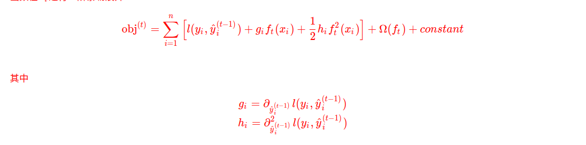

### xgboost　目标函数优化

原目标函数如下，其中第一项是bais，第二项为variance，控制模型复杂度
$$
obj^{(t)}=\sum_{i=1}^{n}l(y_i,\hat{y_i}^{(t)})+\sum_{t=1}^{T}Ω(f_{t}) \\
=\sum_{i=1}^n(y_i,\hat{y_i}^{(t-1)}+f_t(x_i))+Ω(f_t)+constant
$$
通过加法模型，我们的策略是每次只学习一个树,然后在前一颗树的基础上再次学习。那么一个很自然的想法就是每一步学习出来的树我们都可以来优化目标函数.其中$Ω(f_k)$是正则项，如果使用mse作为损失函数那么形式如下:

MSE损失函数包含一阶残差项和一个平方项，相比之下，其他的损失函数(如logistic损失)就不会得到这么漂亮的形式，所以，通常将损失函数在$x_i$处进行泰勒展开。**个人理解,使用泰勒展开的一个重要原因就是泰勒展开后不用担心使用了不同损失函数后目标函数过于复杂而不好优化，同时泰勒展开后其目标函数的优化只涉及到损失函数在当前模型的一阶梯度以及二阶梯度，和损失函数的具体形式无关，因此更加的灵活，可以使用自定义的损失函数**

注:对上式进行一个推导，泰勒展开公式为$f(a+h)=f(a)+f(a)^{’}h+\frac{1}{2}f(a)^{''}h^2$

那么对$L(y_i,y_i^{(t-1)}+f_k(x_i))$在$f_k(x_i)$处进行展开可以得到下式:
$$
L(y_i,y_i^{(t-1)}+f_k(x_i))\\
=L(y_i,y_i^{(t-1)})+L(y_i,y_i^{(t-1)})^{'}f_k(x_i)+\frac{1}{2}L(y_i,y_i^{(t-1)})^{''}f_k^{2}(x_i)
$$
其中将$L(y_i,y_i^{(t-1)})^{'}$记做$g_i$,将$\frac{1}{2}L(y_i,y_i^{(t-1)})^{''}$记做$h_i$,$L(y_i,y_i^{(t-1)})$记为a,对于当前的树$f_t(x_i)$来说，$g_i,h_i,a$都是常数，同理，对于正则项部分,对当前树$f_t(x_i)$来说,其前t-1颗树的loss之和也为常数.因此损失函数可以简化为如下所示:
$$
obj^{(t)}=\sum_{i=1}^n{a+g_i{f_t(x_i)}+\frac{1}{2}h_i{f_t^2(x_i)}}+\gamma{T}+\frac{1}{2}\lambda{\sum_{j=1}^T}{w_j}^2+constant
$$
将所有的constant去掉可以得到如下式子:
$$
obj^{(t)}=\sum_{i=1}^n{g_i{f_t(x_i)}+\frac{1}{2}h_i{f_t}^2(x_i)}+\gamma{T}+\frac{1}{2}\lambda{\sum_{j=1}^T}{w_j}^2
$$
注:$Ω(f) = \gamma{T}+\frac{1}{2}\lambda{\sum_{j=1}^T}{w_j}^2$表示模型复杂度.

### Model Complexity

在传统的boosting树模型只强调提升模型的纯度，而模型的复杂度采用一种启发式的方法,通过公式定义，我们能更了解学习树的训练过程。

**首先重新定义树f(x)**为$f_t(x)=w_{q(x)},w \in R^T,q:R^d　－>{1,2,3,4,..T}$,这里$w$是叶子节点上的得分向量,q是将每个样本非配到叶子节点上的函数,T是叶子节点总数.

### The Structure Score

通过下图来理解如何计算得分,对于给定的树结构,在每个叶子节点上推算统计量$g_i,h_i$，并求和。利用公式来计算出树的好坏程度。

### Learn the tree structure

现在我们有一种方法去度量树的好坏了，理想情况下，我们可以枚举出所有可能结构的树然后通过公式去计算得分然后选择得分最高的一颗树，但是这是一个np难问题,因此，通常我们会使用贪心策略，逐层的优化。

每层的优化策略和决策树中采取的策略是一致的，就是找到使得节点分裂后能获得最大增益的分裂点，我们可以使用下式来度量节点分裂后的增益

上述公式可以分解成(1)在新左叶节点上的分数 (2)在新右叶节点上的分数 (3)在原来叶节点上的分数 (4)新增的叶节点引入的正则化项。一个重要的事实：如果增益大于$\gamma$,加入分支会表现更好，这即是树模型里的剪枝技巧。

有了上面的计算方法就会构建树就很简单了，无非就是遍历每一个特征，然后在每一个特征下在遍历每一个值，看看究竟谁的增益值最大，最后就可以选取该特征且对应的分裂值,同时需要注意的是在使用xgboost模型的时候有一个超参数min_child_weight，**它的作用是：$min\_child\_weight<min(H_L,H_R)$，即左右子树区域的二阶导数的和值都必须大于min_child_weight。假设当前的特征对应的分裂值的增益是最大的，但是其不满足上述，那么模型是不会采用该分裂值作为分裂节点的，而是会考虑次增益是最大的裂值，同理也要检查是否满足上述约束。**

通常在寻找最优分割点的时候我们会将样本进行预排序，如下图:

从左向右遍历一遍就能找出所有可能的切分点以及相应的得分。

最后整体看一下其算法过程

​	

### Xgboost 近似算法

xgboost 的近似算法也是依据将连续特征离散化后构建直方图.xgboost这里**构建直方图采用的策略是通过特征分布的百分位数找到分割点然后构建直方图**,通过自定义的ranks函数(带权重的直方图)找到分割点的候选集合,将连续值映射到由分割点构建的bucket中,统计每个bucket中的梯度信息(一阶导数,二阶导数)来找到最佳的分割点.

#### rank function

$$
D_k = \lbrace (x_{1,k},h_1),(x_{2,k},h_2),(x_{3,k},h_3),...(x_{n,k},h_n) \rbrace
$$
$x_{n,k}$代表了第n个样本第K个特征值,$h_n$代表第n个样本的二阶导,定义以下rank function $r_k$: $R \to [0,+∞]$

$$
r_k(z) = \frac{1}{\sum_{(x,h)\in D_k}h}\sum_{(x,h)\in D_k,x \lt z}h
$$

表示了第k个特征值小于z的样本比例.

满足要求的特征百分位分割点需要满足以下要求

$$
 \left |r_k(s_{k,j})-r_k(s_{k,j+1}) \right| \lt \epsilon ,s_{k1} = \min_i{x_{ik}},s_{kl}=\max_i{x_{ik}}
$$

也就是相邻的特征分割点的rank 函数值小于eps, eps是一个近似因子,直观上看,每个特征大概有1/eps 个候选分割点,同时每一个样本都是带权重的. 为什么二阶导能代表权重呢? 通过对目标函数重新配方,得到如下公式.

$$
\sum_{i=1}^n{\frac{1}{2}h_i(f_{t}(x_i)-\frac{g_i}{h_i})^2}+ \Omega(f_t) +constant
$$

现在还没有能处理样本带有权重的近视算法,所以xgboost作者提出了一种新的带权重的直方图算法来解决这个问题.通常思路是通过一种支持合并和修改操作的数据结构,同时确保每次操作accuracy都能保持一定的准确度.

#### xgboost处理缺失值

xgboost的稀疏感知算法能处理大规模稀疏数据,相比较与没有考虑数据稀疏性的算法,其运行速度要快50倍.

算法首先统计当前节点中所有样本的梯度信息,**然后遍历每个特征没有缺失的样本**,分别将在特征上有缺失的样本分到左右两边.通过评分函数选出划分后取得gain最大的方向作为默认的方向,之后在改特征上遇到缺失,就会默认的将改特征划分到之前学出来的方向.

### xgboost特征重要性衡量

在我们Xgboost训练的过程中其会记录下每一个特征被用来当做划分节点的次数有多少次，假如我们一共训练了三棵树，第一棵树特征x被用了2次，第一棵树特征x被用了3次,第一棵树特征x被用了1次.那么我们统计的时候就是x一共被用了2+3+1=6次，其它特征值依次类推，最后我们看的是谁被用的次数多谁就重要性高。

**gain**是每个特征的平均增益，还是假设X1特征一共被选用了6次来作为分裂节点，依据我们上面介绍的方法计算出处其每次的增益分别是：1.2,3,5,6,4,7,那么该特征的平均增益就是（1.2+3+5+6+4+7）/6=4.5，同理该值越大，代表的该特征值越重要。

#### Column Block for Parallel Learning

树学习算法大多时间都花在树生成上面,其中每次选择划分点又要对特征值排序花费的时间占了很大比例,xgboost通过将特征按列预排序保存成一种叫block的数据结构,贪心算法是将数据集保存在一个block中,近似算法是将数据集保存在多个block结构中.确定某一列的分割点可以并行运行.

保存成block结构的时间复杂度分析.

**d表示树的最大深度,k表示树的颗数,对于贪心算法在原始稀疏空间中的时间复杂度为$O(kd||x||_{o}log_n)$,||x||表示在traindata中没有缺失值的样本.
使用block结构后时间复杂度变成了$kd||x||_{o} + ||x||_{o}log_n$,对于近似算法时间复杂度为$O(Kd||x||_{0}log_q).$,q表示的候选分割点数量,
通常在32-100之间**

