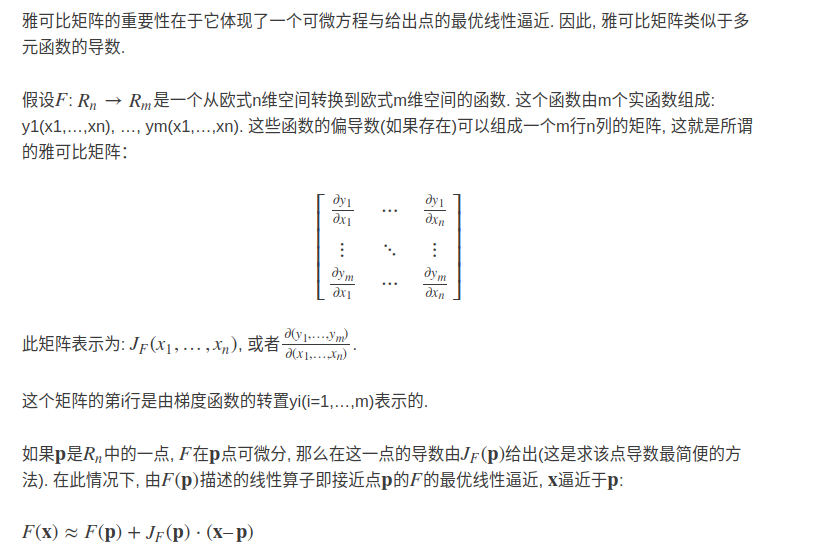
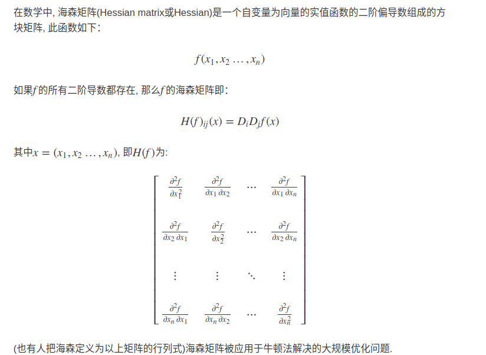
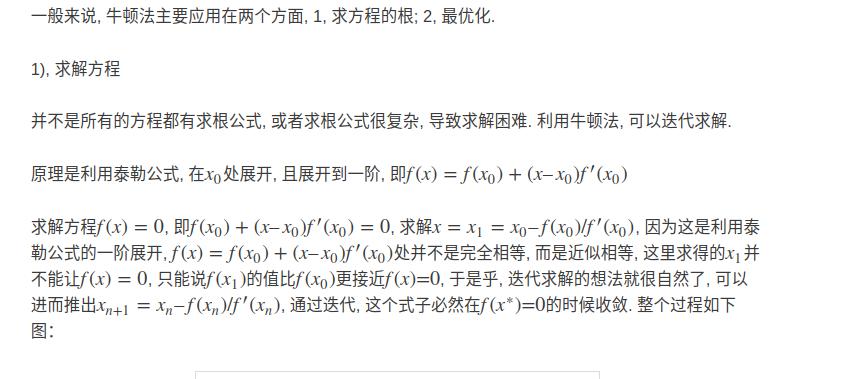
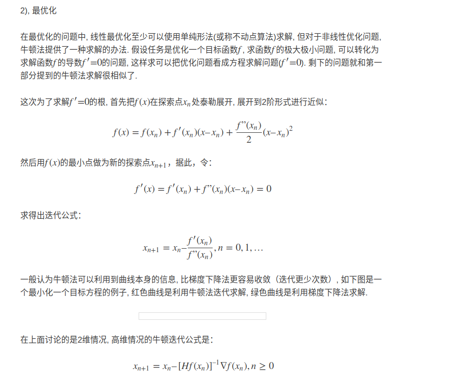

### Jacobian矩阵和Hessian矩阵

**雅可比矩阵**

**雅可比行列式**

如果m = n, 那么*F*F是从n维空间到n维空间的函数, 且它的雅可比矩阵是一个方块矩阵. 于是我们可以取它的行列式, 称为雅可比行列式.

在某个给定点的雅可比行列式提供了 在接近该点时的表现的重要信息. 例如, 如果连续可微函数*F*F在**p**p点的雅可比行列式不是零, 那么它在该点附近具有反函数. 这称为反函数定理. 更进一步, 如果**p**p点的雅可比行列式是正数, 则*F*F在**p**p点的取向不变；如果是负数, 则*F*F的取向相反. 而从雅可比行列式的绝对值, 就可以知道函数*F*F在**p**p点的缩放因子；这就是为什么它出现在换元积分法中.

对于取向问题可以这么理解, 例如一个物体在平面上匀速运动, 如果施加一个正方向的力*F*F, 即取向相同, 则加速运动, 类比于速度的导数加速度为正；如果施加一个反方向的力*F*F, 即取向相反, 则减速运动, 类比于速度的导数加速度为负

**2.** **海森Hessian矩阵**

**海森矩阵在牛顿法中的应用**

梯度下降法更新公式:$x^{(k+1)}=x^k-\lambda *\nabla{f(x^k)}$

牛顿法下降公式:$x^{(k+1)}=x^k-\lambda*(H^k)^{-1}\nabla{f(x^k)}$

