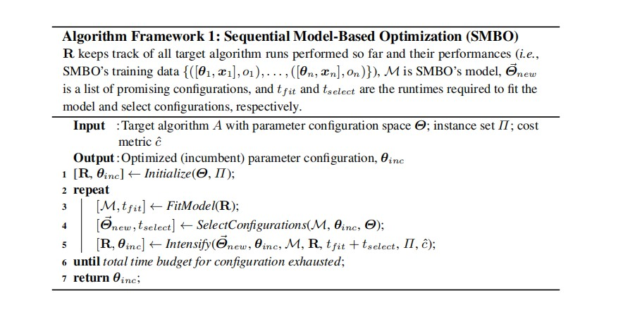
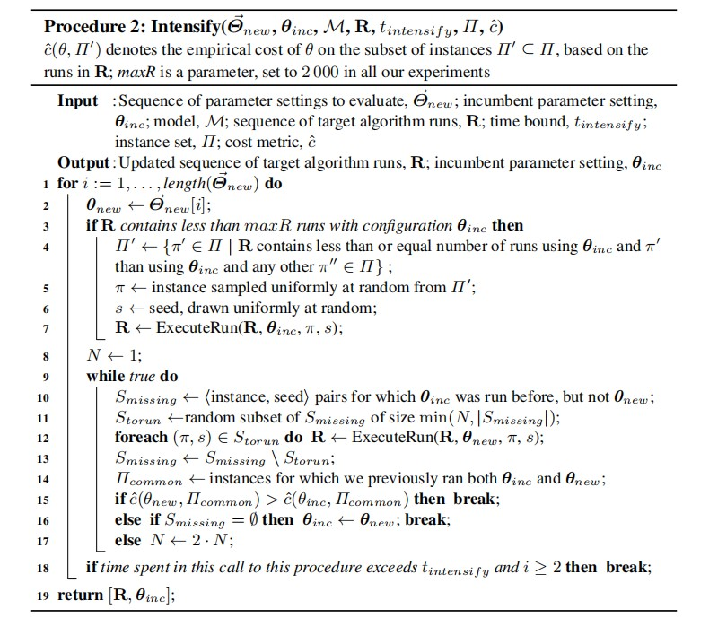
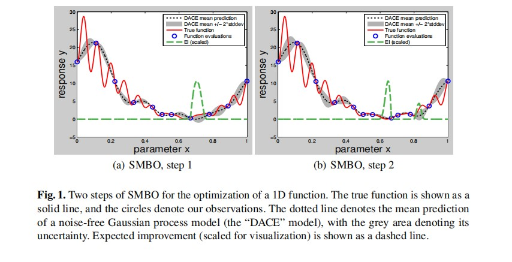

# 

# 一维高斯函数

多元高斯分布
$$
f_x(x_1,x_2,...,x_n)=\frac{1}{\sqrt{(2\pi)^k|\Sigma|}}exp(-\frac{1}{2}(x-\mu)^T\Sigma^{-1}(x-u)
$$

其中u的公式如下:

​	
$$
\mu = \frac{1}{m}\sum_i^n{x^{i}}
$$
u为每一行的样本均值

计算协方差矩阵
$$
\Sigma = \frac{1}{m}\sum_i^n(x^{i}-\mu)(x^{i}-\mu)^T=\frac{1}{m}(X-\mu)^T(X-\mu)
$$

# 1. 什么是高斯过程

随机过程就是一组随机变量，如果这组随机变量符合高斯分布，这组随机变量就是高斯过程。

# 2. 高斯过程的作用

高斯过程（GP）是一种强大的模型，它可以被用来表示函数的分布情况。当前，机器学习的常见做法是把函数参数化，然后用产生的参数建模来规避分布表示（如线性回归的权重）。但GP不同，它直接对函数建模生成非参数模型。由此产生的一个突出优势就是它不仅能模拟任何黑盒函数，还能模拟不确定性。这种对不确定性的量化是十分重要的，如当我们被允许请求更多数据时，依靠高斯过程，我们能探索最不可能实现高效训练的数据区域。结合贝叶斯概率算法,可以实现通过先验概率，推导未知后验输入变量的后验概率。由果推因的概率。

假定一个没有噪声的高斯回归

- 假设有一个隐藏函数：f：ℝ→ℝ，我们要对它建模；
- x=$[x_1,x_2,x_3,....,x_n]^T$  ,y=$[y_1,y_2,y_3,....,y_n]^T$，其中$y_i = f(x_i)$；
- 我们要计算函数$f$在某些未知输入$x^*$上的值

多元高斯分布的两个重要参数：一个是均值函数m(x)，另一个是协方差函数K(x,x*),高斯分布的均值和方差是向量和矩阵(意思就是多维高斯分布的均值和方差是确定的值)，而高斯过程的均值和方差则分别是均值函数和协方差函数.

现在用多元高斯分布对p(y|x)建模

K=κ(x,x)，均值函数m(x)=0. p(y|x)是一个先验分布，表示在输入任意x后我们期望得到的输出y，之后，我们导入一些输入为x的训练数据，并输出y=f(x)。接着，我们设有一些新输入x∗，需要计算y∗=f(x∗)

将所有的y和y*建立联合分布

其中，K=κ(x,x)， K∗=κ(x,x∗)， K∗∗=κ(x∗,x∗)，均值函数为0。

现在，模型成了p(y,y∗|x,x∗)，而我们需要的是y∗。

y*的均值和方差估计公式:
$$
\hat y_*=K_*K^{-1}y 
$$

$$
Var(y_*)= K_{**}-K_*K^{-1}K_*^T
$$

这样就可以把分布的均值最为新样本的y，同时还能求出预测的范围。

这就是基于先验分布和观察值计算出的关于y∗的后验分布。一个GP**可以被mean和covariance function共同唯一决定**。covariance function的作用是**捕捉了不同输入点之间的关系，并且反映在了之后样本的位置上。这样的话，就可以做到，利用点与点之间关系，来从输入的训练数据预测未知点的值.**

# SMBO

smbo算法首先使用一些初始化的模型参数来运行算法A，产生一些观测点。然后在以下三个步骤进行迭代直达到指定迭代次数或者运行时间

**Step**

1. 使用产生的观测点拟合一个response surface model （比如GP模型）
2. 使用response surface model来选出一些有用的参数(结合AF function)
3. 使用这些参数来训练model 产生新的样本点，然后重新拟合
4. 重复2-3步骤直到算法停机

smbo算法只能处理连续参数，但是像树模型等有离散参数的smbo是无法处理的。所以有了SMAC算法来解决离散类型的超参数。SMAC将RF引入smbo算法中来处理离散类型的特征，之前的GP使用以下核函数来计算两组参数之间的similarity。

$$
k(\theta_i,\theta_j)=exp\left[  \sum_{l=1}^d(-\lambda_l)\cdot(\theta_{i,l}-\theta_{j,l})^2  \right]
$$
λ1, . . . , λd 为核参数

对于类别型特征，计算两个参数之间的Hamming distance，若两个参数相同则为1，否则为0
$$
k_{cat}(\theta_i,\theta_j)=exp\left[  \sum_{l=1}^d(-\lambda_l)\cdot[1-\delta(\theta_{i,l},\theta_{j,l})]  \right]
$$
 δ 是一个 Kronecker delta function (ones if its two arguments are identical and zero otherwise)

**对于混合类型**
$$
K_{mixed}(\theta_i,\theta_j)=exp\left[ \sum_{l\in P_{cont}}(-\lambda_l)\cdot(\theta_{i,l}-\theta_{j,l})^2+
\sum_{l \in P_{cat}}(-\lambda_l)\cdot[1-\delta(\theta_{i,l},\theta_{j,l})
\right]
$$

# 贝叶斯优化

在最优化问题中，大多情况都是求一个函数极值得过程。那么如何求极值呢？如果目标函数形式已知且可以求导的话，那么**基于梯度的优化**就是一个求极值得好方法。但是大多数问题的目标函数形式未知且是非凸的那么久不能使用基于梯度的优化，因此贝叶斯优化就被用来解决这个问题。

## 思路

假设我们不知道函数的具体表达形式，现在我们要求给定一个X，可以计算出相应的y。通过之前对GP的介绍，我们可以知道可以使用GP回归来解决。因此贝叶斯优化的第一步就是通过高斯过程回归。基本步骤如下:

1. 建立代理模型的目标函数（Prior Function/先验函数）
2. 找到在代理上表现最佳的超参数（利用EI值，根据Acquisition Function得出EI）
3. 将这些超参数应用于真正的目标函数
4. 更新包含新结果的代理模型
5. 重复步骤2-4，直到达到最大迭代次数或时间

## acquisition function

acquisiton function  是一个权衡探索(exploration)(方差)和开发(exploritation)的函数。最简单的AF函数就是均值加上n倍的方差。更复杂的还有Expected improvement，Entropy search等等

上图，标记*号的点就是AF函数取得最大值对应的参数索引。

一般用的比较多的的AF函数为Expected improvement ，公式如下：
$$
E_{Ml}[I_{c_{min}}(\lambda)] = \int_{-\infty}^{c_{min}}max\{c_{min}-c,0\}\cdot{p_{M_l}(c|\lambda)}dc
$$

在SMAC算法中，上式近似于下式:
$$
E_{Ml}[I_{c_{min}}(\lambda)] =\sigma_{\lambda}\cdot[\mu\cdot\Phi(\mu)+\varphi(\mu)]
$$
其中u=（cmin-uλ）\σλ，ϕ and Φ为关于u的标准正态分布的概率密度函数以及累计分布函数.

# Reference

[Bayesian Optimization](<http://codewithzhangyi.com/2018/07/31/Auto%20Hyperparameter%20Tuning%20-%20Bayesian%20Optimization/>)

[机器学习中的高斯过程](<https://blog.csdn.net/lj6052317/article/details/78772494>)

[贝叶斯优化 一种更好的调参方法](<https://zhuanlan.zhihu.com/p/29779000>)