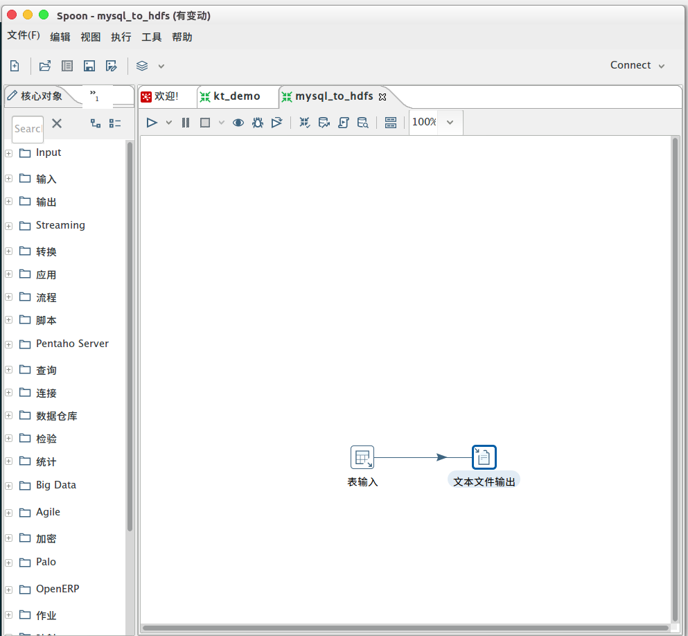
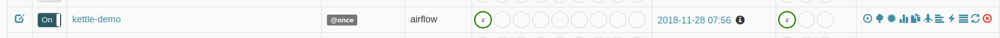
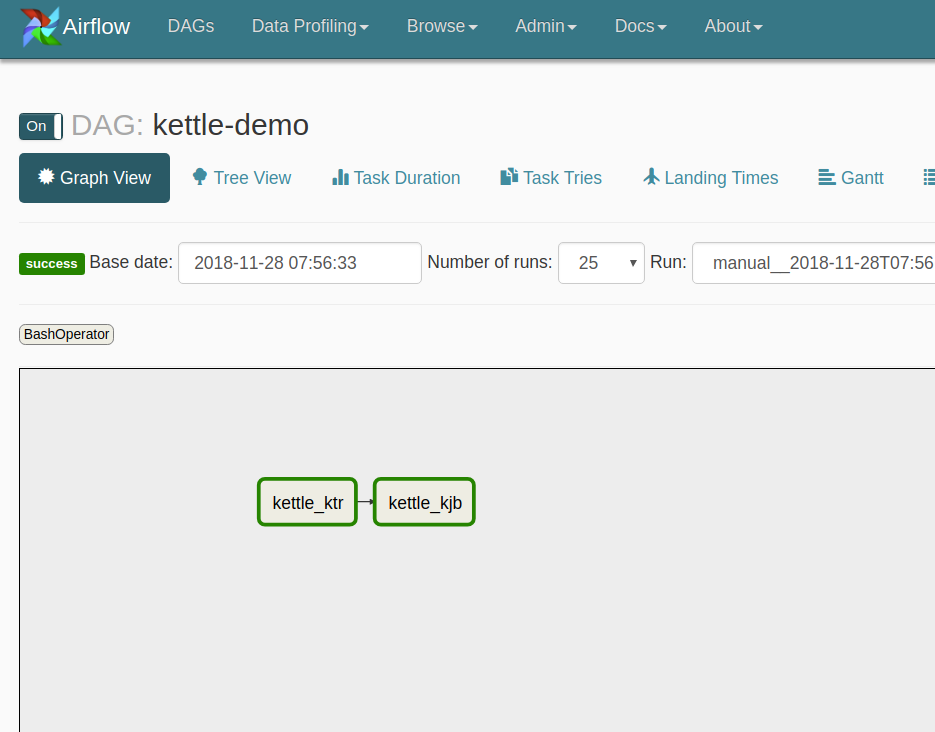

### airflow 调kettle  demo


1 在kettle中配置好转换和作业流程,生成ktr,kjb文件



2 在kjb,ktr文件上传到192.192.0.27 `deploy`下kjb,ktr文件夹下

```bash
总用量 4
drwxrwxr-x. 19 airflow airflow 4096 11月 23 13:55 data-integration
drwxrwxr-x.  3 airflow airflow   42 11月 23 11:37 kjb
drwxrwxr-x.  3 airflow airflow   42 11月 27 10:16 ktr

```
3 设置airflow `DAG`建立task

```python
#!/usr/bin/env python
# -*- coding: utf-8 -*-
# @Author  : xuyinghao

from  airflow import  DAG
from  airflow.operators.bash_operator import BashOperator
from  datetime import  datetime ,timedelta
from airflow.utils.dates import  days_ago
from  airflow.settings import Session
from  airflow.models import Variable

default_args = {
    'owner':'airflow',
    'start_date':days_ago(1),
    'retries':1,
    'email_on_failure':False,
    'email_on_retry':False,
    'retry_delay':timedelta(minutes=5)

}

tmpl_search_path = Variable.get("shell_path")


dag = DAG(
    'kettle-demo',
    default_args=default_args,
    schedule_interval="@once",
    template_searchpath=tmpl_search_path,
    max_active_runs=1
)
t1 = BashOperator(task_id='kettle_ktr',
                  bash_command='kettle_ktr.sh',
                  dag=dag,
                  )
				  

t2 = BashOperator(task_id='kettle_kjb',
                  bash_command='kettle_kjb.sh',
                  dag=dag,
                  )
t1 >> t2
airflow
```
4 将kettle 脚本执行文件放在`/home/airflow/airflow/bash`目录下

```bash
-rw-rw-r--. 1 airflow airflow 345 11月 28 15:37 kettle_kjb.sh
-rw-rw-r--. 1 airflow airflow 342 11月 28 15:37 kettle_ktr.sh


```

在浏览器总访问`http://192.192.0.27:8080/admin/` 可以看到DAG






